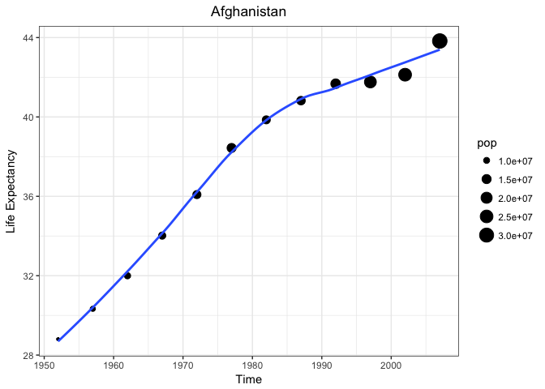
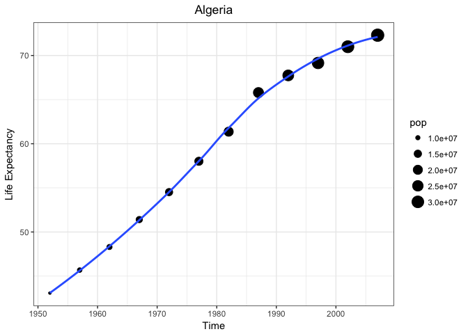

# Purrr - Wickham
Miguel Arias  
9/13/2017  


## Cwickmham Purrr-Tutorial

### Chapter 1 - map


Includes objects: sw_films, sw_people, sw_vehicles, sw_starships, sw_planets & sw_species

How many elements are in sw_people

```r
length(sw_people)
```

```
## [1] 87
```

Who is the first person in sw_people?

```r
sw_people[[1]] # Luke Skywalker
```

```
## $name
## [1] "Luke Skywalker"
## 
## $height
## [1] "172"
## 
## $mass
## [1] "77"
## 
## $hair_color
## [1] "blond"
## 
## $skin_color
## [1] "fair"
## 
## $eye_color
## [1] "blue"
## 
## $birth_year
## [1] "19BBY"
## 
## $gender
## [1] "male"
## 
## $homeworld
## [1] "http://swapi.co/api/planets/1/"
## 
## $films
## [1] "http://swapi.co/api/films/6/" "http://swapi.co/api/films/3/"
## [3] "http://swapi.co/api/films/2/" "http://swapi.co/api/films/1/"
## [5] "http://swapi.co/api/films/7/"
## 
## $species
## [1] "http://swapi.co/api/species/1/"
## 
## $vehicles
## [1] "http://swapi.co/api/vehicles/14/" "http://swapi.co/api/vehicles/30/"
## 
## $starships
## [1] "http://swapi.co/api/starships/12/" "http://swapi.co/api/starships/22/"
## 
## $created
## [1] "2014-12-09T13:50:51.644000Z"
## 
## $edited
## [1] "2014-12-20T21:17:56.891000Z"
## 
## $url
## [1] "http://swapi.co/api/people/1/"
```

To obtain the first person and it's name:

```r
sw_people[[1]][1]
```

```
## $name
## [1] "Luke Skywalker"
```

```r
# A list inside a list
sw_people[1]
```

```
## [[1]]
## [[1]]$name
## [1] "Luke Skywalker"
## 
## [[1]]$height
## [1] "172"
## 
## [[1]]$mass
## [1] "77"
## 
## [[1]]$hair_color
## [1] "blond"
## 
## [[1]]$skin_color
## [1] "fair"
## 
## [[1]]$eye_color
## [1] "blue"
## 
## [[1]]$birth_year
## [1] "19BBY"
## 
## [[1]]$gender
## [1] "male"
## 
## [[1]]$homeworld
## [1] "http://swapi.co/api/planets/1/"
## 
## [[1]]$films
## [1] "http://swapi.co/api/films/6/" "http://swapi.co/api/films/3/"
## [3] "http://swapi.co/api/films/2/" "http://swapi.co/api/films/1/"
## [5] "http://swapi.co/api/films/7/"
## 
## [[1]]$species
## [1] "http://swapi.co/api/species/1/"
## 
## [[1]]$vehicles
## [1] "http://swapi.co/api/vehicles/14/" "http://swapi.co/api/vehicles/30/"
## 
## [[1]]$starships
## [1] "http://swapi.co/api/starships/12/" "http://swapi.co/api/starships/22/"
## 
## [[1]]$created
## [1] "2014-12-09T13:50:51.644000Z"
## 
## [[1]]$edited
## [1] "2014-12-20T21:17:56.891000Z"
## 
## [[1]]$url
## [1] "http://swapi.co/api/people/1/"
```

```r
# A list, dropped one level of hierarchy
sw_people[[1]]
```

```
## $name
## [1] "Luke Skywalker"
## 
## $height
## [1] "172"
## 
## $mass
## [1] "77"
## 
## $hair_color
## [1] "blond"
## 
## $skin_color
## [1] "fair"
## 
## $eye_color
## [1] "blue"
## 
## $birth_year
## [1] "19BBY"
## 
## $gender
## [1] "male"
## 
## $homeworld
## [1] "http://swapi.co/api/planets/1/"
## 
## $films
## [1] "http://swapi.co/api/films/6/" "http://swapi.co/api/films/3/"
## [3] "http://swapi.co/api/films/2/" "http://swapi.co/api/films/1/"
## [5] "http://swapi.co/api/films/7/"
## 
## $species
## [1] "http://swapi.co/api/species/1/"
## 
## $vehicles
## [1] "http://swapi.co/api/vehicles/14/" "http://swapi.co/api/vehicles/30/"
## 
## $starships
## [1] "http://swapi.co/api/starships/12/" "http://swapi.co/api/starships/22/"
## 
## $created
## [1] "2014-12-09T13:50:51.644000Z"
## 
## $edited
## [1] "2014-12-20T21:17:56.891000Z"
## 
## $url
## [1] "http://swapi.co/api/people/1/"
```

### map()

`map( .x, .f, ...)` for each element of `.x` do `.f`.

* `.x`: a vector, a list, a data frame (for each column)
* `.f`: 

How many starships has each character been on?

1. Do it for one element

```r
luke <- sw_people[[1]]
length(luke$starships)
```

```
## [1] 2
```

2. Turn it into a recipe

```r
# ~ length( .x$starships)
```

3. Use `map()` to do it for all elements

```r
starships <- map(sw_people, ~length(.x$starships))
print(starships[0:5])
```

```
## [[1]]
## [1] 2
## 
## [[2]]
## [1] 0
## 
## [[3]]
## [1] 0
## 
## [[4]]
## [1] 1
## 
## [[5]]
## [1] 0
```

For later

```r
planet_lookup <- map_chr(sw_planets, "name") %>%
  set_names(map_chr(sw_planets, "url"))
planet_lookup
```

```
##  http://swapi.co/api/planets/2/  http://swapi.co/api/planets/3/ 
##                      "Alderaan"                      "Yavin IV" 
##  http://swapi.co/api/planets/4/  http://swapi.co/api/planets/5/ 
##                          "Hoth"                       "Dagobah" 
##  http://swapi.co/api/planets/6/  http://swapi.co/api/planets/7/ 
##                        "Bespin"                         "Endor" 
##  http://swapi.co/api/planets/8/  http://swapi.co/api/planets/9/ 
##                         "Naboo"                     "Coruscant" 
## http://swapi.co/api/planets/10/ http://swapi.co/api/planets/11/ 
##                        "Kamino"                      "Geonosis" 
## http://swapi.co/api/planets/12/ http://swapi.co/api/planets/13/ 
##                        "Utapau"                      "Mustafar" 
## http://swapi.co/api/planets/14/ http://swapi.co/api/planets/15/ 
##                      "Kashyyyk"                   "Polis Massa" 
## http://swapi.co/api/planets/16/ http://swapi.co/api/planets/17/ 
##                       "Mygeeto"                       "Felucia" 
## http://swapi.co/api/planets/18/ http://swapi.co/api/planets/19/ 
##                "Cato Neimoidia"                     "Saleucami" 
## http://swapi.co/api/planets/20/ http://swapi.co/api/planets/21/ 
##                       "Stewjon"                        "Eriadu" 
## http://swapi.co/api/planets/22/ http://swapi.co/api/planets/23/ 
##                      "Corellia"                         "Rodia" 
## http://swapi.co/api/planets/24/ http://swapi.co/api/planets/25/ 
##                     "Nal Hutta"                     "Dantooine" 
## http://swapi.co/api/planets/26/ http://swapi.co/api/planets/27/ 
##                    "Bestine IV"                   "Ord Mantell" 
## http://swapi.co/api/planets/28/ http://swapi.co/api/planets/29/ 
##                       "unknown"                     "Trandosha" 
## http://swapi.co/api/planets/30/ http://swapi.co/api/planets/31/ 
##                       "Socorro"                      "Mon Cala" 
## http://swapi.co/api/planets/32/ http://swapi.co/api/planets/33/ 
##                     "Chandrila"                       "Sullust" 
## http://swapi.co/api/planets/34/ http://swapi.co/api/planets/35/ 
##                      "Toydaria"                     "Malastare" 
## http://swapi.co/api/planets/36/ http://swapi.co/api/planets/37/ 
##                      "Dathomir"                        "Ryloth" 
## http://swapi.co/api/planets/38/ http://swapi.co/api/planets/39/ 
##                   "Aleen Minor"                       "Vulpter" 
## http://swapi.co/api/planets/40/ http://swapi.co/api/planets/41/ 
##                       "Troiken"                          "Tund" 
## http://swapi.co/api/planets/42/ http://swapi.co/api/planets/43/ 
##                    "Haruun Kal"                         "Cerea" 
## http://swapi.co/api/planets/44/ http://swapi.co/api/planets/45/ 
##                   "Glee Anselm"                      "Iridonia" 
## http://swapi.co/api/planets/46/ http://swapi.co/api/planets/47/ 
##                       "Tholoth"                       "Iktotch" 
## http://swapi.co/api/planets/48/ http://swapi.co/api/planets/49/ 
##                       "Quermia"                         "Dorin" 
## http://swapi.co/api/planets/50/ http://swapi.co/api/planets/51/ 
##                      "Champala"                        "Mirial" 
## http://swapi.co/api/planets/52/ http://swapi.co/api/planets/53/ 
##                       "Serenno"                  "Concord Dawn" 
## http://swapi.co/api/planets/54/ http://swapi.co/api/planets/55/ 
##                         "Zolan"                          "Ojom" 
## http://swapi.co/api/planets/56/ http://swapi.co/api/planets/57/ 
##                         "Skako"                    "Muunilinst" 
## http://swapi.co/api/planets/58/ http://swapi.co/api/planets/59/ 
##                         "Shili"                         "Kalee" 
## http://swapi.co/api/planets/60/  http://swapi.co/api/planets/1/ 
##                        "Umbara"                      "Tatooine" 
## http://swapi.co/api/planets/61/ 
##                         "Jakku"
```

```r
# save(planet_lookup, file = "Purrr/data/planet_lookup.rda", compress = FALSE)
```

Find the name of each characters home world

```r
luke$homeworld
```

```
## [1] "http://swapi.co/api/planets/1/"
```

```r
planet_lookup[luke$homeworld]
```

```
## http://swapi.co/api/planets/1/ 
##                     "Tatooine"
```

```r
map(sw_people, ~ planet_lookup[.x$homeworld])
```

```
## [[1]]
## http://swapi.co/api/planets/1/ 
##                     "Tatooine" 
## 
## [[2]]
## http://swapi.co/api/planets/1/ 
##                     "Tatooine" 
## 
## [[3]]
## http://swapi.co/api/planets/8/ 
##                        "Naboo" 
## 
## [[4]]
## http://swapi.co/api/planets/1/ 
##                     "Tatooine" 
## 
## [[5]]
## http://swapi.co/api/planets/2/ 
##                     "Alderaan" 
## 
## [[6]]
## http://swapi.co/api/planets/1/ 
##                     "Tatooine" 
## 
## [[7]]
## http://swapi.co/api/planets/1/ 
##                     "Tatooine" 
## 
## [[8]]
## http://swapi.co/api/planets/1/ 
##                     "Tatooine" 
## 
## [[9]]
## http://swapi.co/api/planets/1/ 
##                     "Tatooine" 
## 
## [[10]]
## http://swapi.co/api/planets/20/ 
##                       "Stewjon" 
## 
## [[11]]
## http://swapi.co/api/planets/1/ 
##                     "Tatooine" 
## 
## [[12]]
## http://swapi.co/api/planets/21/ 
##                        "Eriadu" 
## 
## [[13]]
## http://swapi.co/api/planets/14/ 
##                      "Kashyyyk" 
## 
## [[14]]
## http://swapi.co/api/planets/22/ 
##                      "Corellia" 
## 
## [[15]]
## http://swapi.co/api/planets/23/ 
##                         "Rodia" 
## 
## [[16]]
## http://swapi.co/api/planets/24/ 
##                     "Nal Hutta" 
## 
## [[17]]
## http://swapi.co/api/planets/22/ 
##                      "Corellia" 
## 
## [[18]]
## http://swapi.co/api/planets/26/ 
##                    "Bestine IV" 
## 
## [[19]]
## http://swapi.co/api/planets/28/ 
##                       "unknown" 
## 
## [[20]]
## http://swapi.co/api/planets/8/ 
##                        "Naboo" 
## 
## [[21]]
## http://swapi.co/api/planets/10/ 
##                        "Kamino" 
## 
## [[22]]
## http://swapi.co/api/planets/28/ 
##                       "unknown" 
## 
## [[23]]
## http://swapi.co/api/planets/29/ 
##                     "Trandosha" 
## 
## [[24]]
## http://swapi.co/api/planets/30/ 
##                       "Socorro" 
## 
## [[25]]
## http://swapi.co/api/planets/6/ 
##                       "Bespin" 
## 
## [[26]]
## http://swapi.co/api/planets/31/ 
##                      "Mon Cala" 
## 
## [[27]]
## http://swapi.co/api/planets/32/ 
##                     "Chandrila" 
## 
## [[28]]
## http://swapi.co/api/planets/28/ 
##                       "unknown" 
## 
## [[29]]
## http://swapi.co/api/planets/7/ 
##                        "Endor" 
## 
## [[30]]
## http://swapi.co/api/planets/33/ 
##                       "Sullust" 
## 
## [[31]]
## http://swapi.co/api/planets/28/ 
##                       "unknown" 
## 
## [[32]]
## http://swapi.co/api/planets/18/ 
##                "Cato Neimoidia" 
## 
## [[33]]
## http://swapi.co/api/planets/9/ 
##                    "Coruscant" 
## 
## [[34]]
## http://swapi.co/api/planets/8/ 
##                        "Naboo" 
## 
## [[35]]
## http://swapi.co/api/planets/8/ 
##                        "Naboo" 
## 
## [[36]]
## http://swapi.co/api/planets/8/ 
##                        "Naboo" 
## 
## [[37]]
## http://swapi.co/api/planets/8/ 
##                        "Naboo" 
## 
## [[38]]
## http://swapi.co/api/planets/34/ 
##                      "Toydaria" 
## 
## [[39]]
## http://swapi.co/api/planets/35/ 
##                     "Malastare" 
## 
## [[40]]
## http://swapi.co/api/planets/8/ 
##                        "Naboo" 
## 
## [[41]]
## http://swapi.co/api/planets/1/ 
##                     "Tatooine" 
## 
## [[42]]
## http://swapi.co/api/planets/36/ 
##                      "Dathomir" 
## 
## [[43]]
## http://swapi.co/api/planets/37/ 
##                        "Ryloth" 
## 
## [[44]]
## http://swapi.co/api/planets/37/ 
##                        "Ryloth" 
## 
## [[45]]
## http://swapi.co/api/planets/39/ 
##                       "Vulpter" 
## 
## [[46]]
## http://swapi.co/api/planets/40/ 
##                       "Troiken" 
## 
## [[47]]
## http://swapi.co/api/planets/41/ 
##                          "Tund" 
## 
## [[48]]
## http://swapi.co/api/planets/42/ 
##                    "Haruun Kal" 
## 
## [[49]]
## http://swapi.co/api/planets/43/ 
##                         "Cerea" 
## 
## [[50]]
## http://swapi.co/api/planets/44/ 
##                   "Glee Anselm" 
## 
## [[51]]
## http://swapi.co/api/planets/45/ 
##                      "Iridonia" 
## 
## [[52]]
## http://swapi.co/api/planets/9/ 
##                    "Coruscant" 
## 
## [[53]]
## http://swapi.co/api/planets/47/ 
##                       "Iktotch" 
## 
## [[54]]
## http://swapi.co/api/planets/48/ 
##                       "Quermia" 
## 
## [[55]]
## http://swapi.co/api/planets/49/ 
##                         "Dorin" 
## 
## [[56]]
## http://swapi.co/api/planets/50/ 
##                      "Champala" 
## 
## [[57]]
## http://swapi.co/api/planets/8/ 
##                        "Naboo" 
## 
## [[58]]
## http://swapi.co/api/planets/8/ 
##                        "Naboo" 
## 
## [[59]]
## http://swapi.co/api/planets/1/ 
##                     "Tatooine" 
## 
## [[60]]
## http://swapi.co/api/planets/11/ 
##                      "Geonosis" 
## 
## [[61]]
## http://swapi.co/api/planets/51/ 
##                        "Mirial" 
## 
## [[62]]
## http://swapi.co/api/planets/51/ 
##                        "Mirial" 
## 
## [[63]]
## http://swapi.co/api/planets/8/ 
##                        "Naboo" 
## 
## [[64]]
## http://swapi.co/api/planets/52/ 
##                       "Serenno" 
## 
## [[65]]
## http://swapi.co/api/planets/2/ 
##                     "Alderaan" 
## 
## [[66]]
## http://swapi.co/api/planets/53/ 
##                  "Concord Dawn" 
## 
## [[67]]
## http://swapi.co/api/planets/54/ 
##                         "Zolan" 
## 
## [[68]]
## http://swapi.co/api/planets/55/ 
##                          "Ojom" 
## 
## [[69]]
## http://swapi.co/api/planets/10/ 
##                        "Kamino" 
## 
## [[70]]
## http://swapi.co/api/planets/10/ 
##                        "Kamino" 
## 
## [[71]]
## http://swapi.co/api/planets/9/ 
##                    "Coruscant" 
## 
## [[72]]
## http://swapi.co/api/planets/38/ 
##                   "Aleen Minor" 
## 
## [[73]]
## http://swapi.co/api/planets/28/ 
##                       "unknown" 
## 
## [[74]]
## http://swapi.co/api/planets/56/ 
##                         "Skako" 
## 
## [[75]]
## http://swapi.co/api/planets/57/ 
##                    "Muunilinst" 
## 
## [[76]]
## http://swapi.co/api/planets/58/ 
##                         "Shili" 
## 
## [[77]]
## http://swapi.co/api/planets/59/ 
##                         "Kalee" 
## 
## [[78]]
## http://swapi.co/api/planets/14/ 
##                      "Kashyyyk" 
## 
## [[79]]
## http://swapi.co/api/planets/2/ 
##                     "Alderaan" 
## 
## [[80]]
## http://swapi.co/api/planets/60/ 
##                        "Umbara" 
## 
## [[81]]
## http://swapi.co/api/planets/12/ 
##                        "Utapau" 
## 
## [[82]]
## http://swapi.co/api/planets/28/ 
##                       "unknown" 
## 
## [[83]]
## http://swapi.co/api/planets/28/ 
##                       "unknown" 
## 
## [[84]]
## http://swapi.co/api/planets/28/ 
##                       "unknown" 
## 
## [[85]]
## http://swapi.co/api/planets/28/ 
##                       "unknown" 
## 
## [[86]]
## http://swapi.co/api/planets/28/ 
##                       "unknown" 
## 
## [[87]]
## http://swapi.co/api/planets/8/ 
##                        "Naboo"
```

### ROADmap()

`map()` always returns a list:

* Other types of output
+ `map_lgl()`: logical vector
+ `map_int()`: integer vector
+ `map_dbl()`: double vector
+ `map_chr()`: character vector
+ `walk()`: when you want nothing at all, use a funciton for its side effects


```r
# names can be useful
sw_people <- sw_people %>%
  set_names(map_chr(sw_people, "name"))
```

**REPLACE** `map()` with the appropriately typed function

```r
# How many starships has each character been in?
map_int(sw_people, ~ length(.x[["starships"]]))
```

```
##        Luke Skywalker                 C-3PO                 R2-D2 
##                     2                     0                     0 
##           Darth Vader           Leia Organa             Owen Lars 
##                     1                     0                     0 
##    Beru Whitesun lars                 R5-D4     Biggs Darklighter 
##                     0                     0                     1 
##        Obi-Wan Kenobi      Anakin Skywalker        Wilhuff Tarkin 
##                     5                     3                     0 
##             Chewbacca              Han Solo                Greedo 
##                     2                     2                     0 
## Jabba Desilijic Tiure        Wedge Antilles      Jek Tono Porkins 
##                     0                     1                     1 
##                  Yoda             Palpatine             Boba Fett 
##                     0                     0                     1 
##                 IG-88                 Bossk      Lando Calrissian 
##                     0                     0                     1 
##                 Lobot                Ackbar            Mon Mothma 
##                     0                     0                     0 
##          Arvel Crynyd Wicket Systri Warrick             Nien Nunb 
##                     1                     0                     1 
##          Qui-Gon Jinn           Nute Gunray         Finis Valorum 
##                     0                     0                     0 
##         Jar Jar Binks          Roos Tarpals            Rugor Nass 
##                     0                     0                     0 
##              Ric Olié                 Watto               Sebulba 
##                     1                     0                     0 
##         Quarsh Panaka        Shmi Skywalker            Darth Maul 
##                     0                     0                     1 
##           Bib Fortuna           Ayla Secura              Dud Bolt 
##                     0                     0                     0 
##               Gasgano        Ben Quadinaros            Mace Windu 
##                     0                     0                     0 
##          Ki-Adi-Mundi             Kit Fisto             Eeth Koth 
##                     0                     0                     0 
##            Adi Gallia           Saesee Tiin           Yarael Poof 
##                     0                     0                     0 
##              Plo Koon            Mas Amedda          Gregar Typho 
##                     1                     0                     1 
##                 Cordé           Cliegg Lars     Poggle the Lesser 
##                     0                     0                     0 
##       Luminara Unduli         Barriss Offee                 Dormé 
##                     0                     0                     0 
##                 Dooku   Bail Prestor Organa            Jango Fett 
##                     0                     0                     0 
##            Zam Wesell       Dexter Jettster               Lama Su 
##                     0                     0                     0 
##               Taun We            Jocasta Nu         Ratts Tyerell 
##                     0                     0                     0 
##                R4-P17            Wat Tambor              San Hill 
##                     0                     0                     0 
##              Shaak Ti              Grievous               Tarfful 
##                     0                     1                     0 
##       Raymus Antilles             Sly Moore            Tion Medon 
##                     0                     0                     0 
##                  Finn                   Rey           Poe Dameron 
##                     0                     0                     1 
##                   BB8        Captain Phasma         Padmé Amidala 
##                     0                     0                     3
```

```r
# What color is each character's hair?
map_chr(sw_people, ~.x[["hair_color"]])
```

```
##        Luke Skywalker                 C-3PO                 R2-D2 
##               "blond"                 "n/a"                 "n/a" 
##           Darth Vader           Leia Organa             Owen Lars 
##                "none"               "brown"         "brown, grey" 
##    Beru Whitesun lars                 R5-D4     Biggs Darklighter 
##               "brown"                 "n/a"               "black" 
##        Obi-Wan Kenobi      Anakin Skywalker        Wilhuff Tarkin 
##       "auburn, white"               "blond"        "auburn, grey" 
##             Chewbacca              Han Solo                Greedo 
##               "brown"               "brown"                 "n/a" 
## Jabba Desilijic Tiure        Wedge Antilles      Jek Tono Porkins 
##                 "n/a"               "brown"               "brown" 
##                  Yoda             Palpatine             Boba Fett 
##               "white"                "grey"               "black" 
##                 IG-88                 Bossk      Lando Calrissian 
##                "none"                "none"               "black" 
##                 Lobot                Ackbar            Mon Mothma 
##                "none"                "none"              "auburn" 
##          Arvel Crynyd Wicket Systri Warrick             Nien Nunb 
##               "brown"               "brown"                "none" 
##          Qui-Gon Jinn           Nute Gunray         Finis Valorum 
##               "brown"                "none"               "blond" 
##         Jar Jar Binks          Roos Tarpals            Rugor Nass 
##                "none"                "none"                "none" 
##              Ric Olié                 Watto               Sebulba 
##               "brown"               "black"                "none" 
##         Quarsh Panaka        Shmi Skywalker            Darth Maul 
##               "black"               "black"                "none" 
##           Bib Fortuna           Ayla Secura              Dud Bolt 
##                "none"                "none"                "none" 
##               Gasgano        Ben Quadinaros            Mace Windu 
##                "none"                "none"                "none" 
##          Ki-Adi-Mundi             Kit Fisto             Eeth Koth 
##               "white"                "none"               "black" 
##            Adi Gallia           Saesee Tiin           Yarael Poof 
##                "none"                "none"                "none" 
##              Plo Koon            Mas Amedda          Gregar Typho 
##                "none"                "none"               "black" 
##                 Cordé           Cliegg Lars     Poggle the Lesser 
##               "brown"               "brown"                "none" 
##       Luminara Unduli         Barriss Offee                 Dormé 
##               "black"               "black"               "brown" 
##                 Dooku   Bail Prestor Organa            Jango Fett 
##               "white"               "black"               "black" 
##            Zam Wesell       Dexter Jettster               Lama Su 
##              "blonde"                "none"                "none" 
##               Taun We            Jocasta Nu         Ratts Tyerell 
##                "none"               "white"                "none" 
##                R4-P17            Wat Tambor              San Hill 
##                "none"                "none"                "none" 
##              Shaak Ti              Grievous               Tarfful 
##                "none"                "none"               "brown" 
##       Raymus Antilles             Sly Moore            Tion Medon 
##               "brown"                "none"                "none" 
##                  Finn                   Rey           Poe Dameron 
##               "black"               "brown"               "brown" 
##                   BB8        Captain Phasma         Padmé Amidala 
##                "none"             "unknown"               "brown"
```

```r
# Is the character male?
map_lgl(sw_people, ~.x[["gender"]] == "male")
```

```
##        Luke Skywalker                 C-3PO                 R2-D2 
##                  TRUE                 FALSE                 FALSE 
##           Darth Vader           Leia Organa             Owen Lars 
##                  TRUE                 FALSE                  TRUE 
##    Beru Whitesun lars                 R5-D4     Biggs Darklighter 
##                 FALSE                 FALSE                  TRUE 
##        Obi-Wan Kenobi      Anakin Skywalker        Wilhuff Tarkin 
##                  TRUE                  TRUE                  TRUE 
##             Chewbacca              Han Solo                Greedo 
##                  TRUE                  TRUE                  TRUE 
## Jabba Desilijic Tiure        Wedge Antilles      Jek Tono Porkins 
##                 FALSE                  TRUE                  TRUE 
##                  Yoda             Palpatine             Boba Fett 
##                  TRUE                  TRUE                  TRUE 
##                 IG-88                 Bossk      Lando Calrissian 
##                 FALSE                  TRUE                  TRUE 
##                 Lobot                Ackbar            Mon Mothma 
##                  TRUE                  TRUE                 FALSE 
##          Arvel Crynyd Wicket Systri Warrick             Nien Nunb 
##                  TRUE                  TRUE                  TRUE 
##          Qui-Gon Jinn           Nute Gunray         Finis Valorum 
##                  TRUE                  TRUE                  TRUE 
##         Jar Jar Binks          Roos Tarpals            Rugor Nass 
##                  TRUE                  TRUE                  TRUE 
##              Ric Olié                 Watto               Sebulba 
##                  TRUE                  TRUE                  TRUE 
##         Quarsh Panaka        Shmi Skywalker            Darth Maul 
##                  TRUE                 FALSE                  TRUE 
##           Bib Fortuna           Ayla Secura              Dud Bolt 
##                  TRUE                 FALSE                  TRUE 
##               Gasgano        Ben Quadinaros            Mace Windu 
##                  TRUE                  TRUE                  TRUE 
##          Ki-Adi-Mundi             Kit Fisto             Eeth Koth 
##                  TRUE                  TRUE                  TRUE 
##            Adi Gallia           Saesee Tiin           Yarael Poof 
##                 FALSE                  TRUE                  TRUE 
##              Plo Koon            Mas Amedda          Gregar Typho 
##                  TRUE                  TRUE                  TRUE 
##                 Cordé           Cliegg Lars     Poggle the Lesser 
##                 FALSE                  TRUE                  TRUE 
##       Luminara Unduli         Barriss Offee                 Dormé 
##                 FALSE                 FALSE                 FALSE 
##                 Dooku   Bail Prestor Organa            Jango Fett 
##                  TRUE                  TRUE                  TRUE 
##            Zam Wesell       Dexter Jettster               Lama Su 
##                 FALSE                  TRUE                  TRUE 
##               Taun We            Jocasta Nu         Ratts Tyerell 
##                 FALSE                 FALSE                  TRUE 
##                R4-P17            Wat Tambor              San Hill 
##                 FALSE                  TRUE                  TRUE 
##              Shaak Ti              Grievous               Tarfful 
##                 FALSE                  TRUE                  TRUE 
##       Raymus Antilles             Sly Moore            Tion Medon 
##                  TRUE                 FALSE                  TRUE 
##                  Finn                   Rey           Poe Dameron 
##                  TRUE                 FALSE                  TRUE 
##                   BB8        Captain Phasma         Padmé Amidala 
##                 FALSE                 FALSE                 FALSE
```

```r
# How heavy is each character?
map_chr(sw_people, ~ .x[["mass"]]) %>% # Want is as a number
  readr::parse_number(na = "unknown")
```

```
##  [1]   77.0   75.0   32.0  136.0   49.0  120.0   75.0   32.0   84.0   77.0
## [11]   84.0     NA  112.0   80.0   74.0 1358.0   77.0  110.0   17.0   75.0
## [21]   78.2  140.0  113.0   79.0   79.0   83.0     NA     NA   20.0   68.0
## [31]   89.0   90.0     NA   66.0   82.0     NA     NA     NA   40.0     NA
## [41]     NA   80.0     NA   55.0   45.0     NA   65.0   84.0   82.0   87.0
## [51]     NA   50.0     NA     NA   80.0     NA   85.0     NA     NA   80.0
## [61]   56.2   50.0     NA   80.0     NA   79.0   55.0  102.0   88.0     NA
## [71]     NA   15.0     NA   48.0     NA   57.0  159.0  136.0   79.0   48.0
## [81]   80.0     NA     NA     NA     NA     NA   45.0
```

* Other ways of specifying `.f`
+ `.f` can be a formula: `map(.x, .f = ~ DO SOMETHING WITH .x)`
+ `.f` can be a string or integer:
`map(.x, .f = "some_name")`
`map(.x, ~ .x[["some_name"]])`
+ `.f` can be a function:
`map(.x, .f = some_function, ...)`
`map(.x, ~ some_function(.x, ...))`

### Star Wars Challenges

1. Which film (see `sw_films`) has the most characters?

```r
# Set names of the films
# sw_films1 <- sw_films %>%
#   set_names(map_chr(sw_films, "name"))

# For the first film
length(sw_films[[1]]$characters) 
```

```
## [1] 18
```

```r
# Number of characters for all films
map_int(sw_films, ~length(.x$characters)) %>%
  set_names(map_chr(sw_films, "title")) %>% # Add "titles"
  sort(decreasing = TRUE)
```

```
##    Attack of the Clones      The Phantom Menace     Revenge of the Sith 
##                      40                      34                      34 
##      Return of the Jedi              A New Hope The Empire Strikes Back 
##                      20                      18                      16 
##       The Force Awakens 
##                      11
```

```r
# Cwickham version - Shorter (more understandable)
map(sw_films, "characters") %>%
  map_int(length) %>%
  set_names(map_chr(sw_films, "title")) %>%
  sort(decreasing = TRUE)
```

```
##    Attack of the Clones      The Phantom Menace     Revenge of the Sith 
##                      40                      34                      34 
##      Return of the Jedi              A New Hope The Empire Strikes Back 
##                      20                      18                      16 
##       The Force Awakens 
##                      11
```

2. Which `sw_species` has the most possible eye colors?

```r
# Do it for one
sapply(gregexpr("\\W+", sw_species[[1]]$eye_colors), length) + 1
```

```
## [1] 2
```

```r
# Do it for all
map_dbl(sw_species, ~ sapply(gregexpr("\\W+", .x$eye_colors), length) + 1) %>%
  set_names(map_chr(sw_species, "name")) %>%
  sort(decreasing = TRUE)
```

```
##       Mirialan        Togruta        Wookiee          Human        Twi'lek 
##              6              6              6              6              4 
## Yoda's species           Hutt     Trandoshan   Mon Calamari           Ewok 
##              3              2              2              2              2 
##      Sullustan      Neimodian         Gungan      Toydarian            Dug 
##              2              2              2              2              2 
##         Aleena     Vulptereen          Xexto          Toong         Cerean 
##              2              2              2              2              2 
##       Nautolan         Zabrak     Tholothian       Iktotchi       Quermian 
##              2              2              2              2              2 
##        Kel Dor       Chagrian      Geonosian       Clawdite       Besalisk 
##              2              2              2              2              2 
##       Kaminoan        Skakoan           Muun        Kaleesh         Pau'an 
##              2              2              2              2              2 
##          Droid         Rodian 
##              2              2
```

```r
# CWickham Version - No need for sapply
map_chr(sw_species, "eye_colors") %>%
  strsplit(", ") %>%
  map_int(length) %>%
  set_names(map_chr(sw_species, "name")) %>%
  sort(decreasing = TRUE)
```

```
##       Mirialan        Togruta        Wookiee          Human        Twi'lek 
##              6              6              6              6              4 
## Yoda's species           Hutt     Trandoshan           Ewok      Neimodian 
##              3              2              2              2              2 
##            Dug         Zabrak     Tholothian        Kel Dor      Geonosian 
##              2              2              2              2              2 
##   Mon Calamari      Sullustan         Gungan      Toydarian         Aleena 
##              1              1              1              1              1 
##     Vulptereen          Xexto          Toong         Cerean       Nautolan 
##              1              1              1              1              1 
##       Iktotchi       Quermian       Chagrian       Clawdite       Besalisk 
##              1              1              1              1              1 
##       Kaminoan        Skakoan           Muun        Kaleesh         Pau'an 
##              1              1              1              1              1 
##          Droid         Rodian 
##              1              1
```

3. Which `sw_planets` do we know the least about (i.e. have the most `"unknown"` entries)?

```r
# For one (Checks if there are unknown[NA] values)
map_lgl(sw_planets[[61]], ~ "unknown" %in% .x) %>%
  sum()
```

```
## [1] 7
```

```r
# For all
map_int(sw_planets,
        ~ map_lgl(.x, ~ "unknown" %in% .x) %>% sum()) %>%
  set_names(map_chr(sw_planets, "name")) %>%
  sort(decreasing = TRUE)
```

```
##    Aleen Minor        Tholoth        Quermia          Zolan         Umbara 
##              8              8              8              8              8 
##        Troiken         Mirial        Serenno   Concord Dawn          Jakku 
##              7              7              7              7              7 
##        unknown       Iridonia          Shili        Stewjon           Ojom 
##              6              5              5              4              4 
##           Tund        Iktotch          Dorin      Saleucami       Champala 
##              3              3              3              2              2 
##          Skako           Hoth        Dagobah      Coruscant        Mygeeto 
##              2              1              1              1              1 
##        Felucia Cato Neimoidia         Eriadu      Nal Hutta      Dantooine 
##              1              1              1              1              1 
##     Bestine IV      Trandosha        Socorro       Toydaria      Malastare 
##              1              1              1              1              1 
##       Dathomir        Vulpter     Haruun Kal          Cerea          Kalee 
##              1              1              1              1              1 
##       Alderaan       Yavin IV         Bespin          Endor          Naboo 
##              0              0              0              0              0 
##         Kamino       Geonosis         Utapau       Mustafar       Kashyyyk 
##              0              0              0              0              0 
##    Polis Massa       Corellia          Rodia    Ord Mantell       Mon Cala 
##              0              0              0              0              0 
##      Chandrila        Sullust         Ryloth    Glee Anselm     Muunilinst 
##              0              0              0              0              0 
##       Tatooine 
##              0
```

### Iteration functions

`map2(.x, .y, .f, ...)`

`map2_xxx()` works the same way as `map_xxx()`.

* For each function, which two arguments might be useful to iterate over?
+ `download.file()`: for each url download to `destflie`. `walk2()`, `map2_int()`.
+ `rnorm()`: for each n generate a Normal sample with `mean` (or `sd`).
+ `lm()` for each data fit a model (`formula`)
+ `predict.lm()` for each model(object), generate predictions at data (`newdata`)
+ `readr::write_csv()` for each data frame (x) save to path. Similar for `ggplot::ggsave()` for each `plot` save to `filename`. `walk2()`

1. Use `map2()`. For each country in `gap_split_small` create a ggplot of life expectancy through time with a title.


```r
# Data
gap_split_small <- gap_split[1:10]
countries <- names(gap_split_small)

# Do it for one
ggplot(data = gap_split_small[[1]], 
       mapping = aes(x = year, y = lifeExp)) +
  geom_point(aes(size = pop)) +
  geom_smooth(se = FALSE) +
  labs(
    title = countries[[1]],
    x = "Time",
    y = "Life Expectancy"
  ) +
  theme_bw()+
  theme(plot.title = element_text(hjust = 0.5))
```

```
## `geom_smooth()` using method = 'loess'
```

<!-- -->

```r
# Create a function for Life Expectancy over time
countries_lifexp <- function(data, name) {
  ggplot(data, aes(year, lifeExp)) +
       geom_point(aes(size=pop)) +
       geom_smooth(se = FALSE) +
       labs(
         title = name,
         x = "Time",
         y = "Life Expectancy"
       ) +
       theme_bw() + 
       theme(plot.title = element_text(hjust = 0.5))
}

# For all the countires
plots <- map2(gap_split_small, countries, ~countries_lifexp(.x, .y))

plots[[3]]
```

```
## `geom_smooth()` using method = 'loess'
```

<!-- -->

```r
# In order to print all plots:

# walk(plots, print)
```

### Purrr and list columns

**Data** should be in a data frame as soon as it makes sense!
Data frame: **cases** in rows, **variables** in columns

#### Purr can help turn lists into tibbles


```r
library(tidyverse)
library(repurrrsive)
# A useful lookup table -----------------------------------------------
film_number_lookup <- map_chr(sw_films, "url") %>%
  map(~ stringr::str_split_fixed(.x, "/", 7)[, 6])  %>%
  as.numeric() %>%
  set_names(map_chr(sw_films, "url"))

# Use purrr to turn list into table
people_tbl <- tibble(
  name    = sw_people %>% map_chr("name"),
  films   = sw_people %>% map("films"), # results in list column
  height  = sw_people %>% map_chr("height") %>%
    readr::parse_number(na = "unknown"), # needs some parsing
  species = sw_people %>% map_chr("species", .null = NA_character_) # isn't in every element
)

# Turning parts of our list to a tibble ---------------------------------
people_tbl$films
```

```
## $`Luke Skywalker`
## [1] "http://swapi.co/api/films/6/" "http://swapi.co/api/films/3/"
## [3] "http://swapi.co/api/films/2/" "http://swapi.co/api/films/1/"
## [5] "http://swapi.co/api/films/7/"
## 
## $`C-3PO`
## [1] "http://swapi.co/api/films/5/" "http://swapi.co/api/films/4/"
## [3] "http://swapi.co/api/films/6/" "http://swapi.co/api/films/3/"
## [5] "http://swapi.co/api/films/2/" "http://swapi.co/api/films/1/"
## 
## $`R2-D2`
## [1] "http://swapi.co/api/films/5/" "http://swapi.co/api/films/4/"
## [3] "http://swapi.co/api/films/6/" "http://swapi.co/api/films/3/"
## [5] "http://swapi.co/api/films/2/" "http://swapi.co/api/films/1/"
## [7] "http://swapi.co/api/films/7/"
## 
## $`Darth Vader`
## [1] "http://swapi.co/api/films/6/" "http://swapi.co/api/films/3/"
## [3] "http://swapi.co/api/films/2/" "http://swapi.co/api/films/1/"
## 
## $`Leia Organa`
## [1] "http://swapi.co/api/films/6/" "http://swapi.co/api/films/3/"
## [3] "http://swapi.co/api/films/2/" "http://swapi.co/api/films/1/"
## [5] "http://swapi.co/api/films/7/"
## 
## $`Owen Lars`
## [1] "http://swapi.co/api/films/5/" "http://swapi.co/api/films/6/"
## [3] "http://swapi.co/api/films/1/"
## 
## $`Beru Whitesun lars`
## [1] "http://swapi.co/api/films/5/" "http://swapi.co/api/films/6/"
## [3] "http://swapi.co/api/films/1/"
## 
## $`R5-D4`
## [1] "http://swapi.co/api/films/1/"
## 
## $`Biggs Darklighter`
## [1] "http://swapi.co/api/films/1/"
## 
## $`Obi-Wan Kenobi`
## [1] "http://swapi.co/api/films/5/" "http://swapi.co/api/films/4/"
## [3] "http://swapi.co/api/films/6/" "http://swapi.co/api/films/3/"
## [5] "http://swapi.co/api/films/2/" "http://swapi.co/api/films/1/"
## 
## $`Anakin Skywalker`
## [1] "http://swapi.co/api/films/5/" "http://swapi.co/api/films/4/"
## [3] "http://swapi.co/api/films/6/"
## 
## $`Wilhuff Tarkin`
## [1] "http://swapi.co/api/films/6/" "http://swapi.co/api/films/1/"
## 
## $Chewbacca
## [1] "http://swapi.co/api/films/6/" "http://swapi.co/api/films/3/"
## [3] "http://swapi.co/api/films/2/" "http://swapi.co/api/films/1/"
## [5] "http://swapi.co/api/films/7/"
## 
## $`Han Solo`
## [1] "http://swapi.co/api/films/3/" "http://swapi.co/api/films/2/"
## [3] "http://swapi.co/api/films/1/" "http://swapi.co/api/films/7/"
## 
## $Greedo
## [1] "http://swapi.co/api/films/1/"
## 
## $`Jabba Desilijic Tiure`
## [1] "http://swapi.co/api/films/4/" "http://swapi.co/api/films/3/"
## [3] "http://swapi.co/api/films/1/"
## 
## $`Wedge Antilles`
## [1] "http://swapi.co/api/films/3/" "http://swapi.co/api/films/2/"
## [3] "http://swapi.co/api/films/1/"
## 
## $`Jek Tono Porkins`
## [1] "http://swapi.co/api/films/1/"
## 
## $Yoda
## [1] "http://swapi.co/api/films/5/" "http://swapi.co/api/films/4/"
## [3] "http://swapi.co/api/films/6/" "http://swapi.co/api/films/3/"
## [5] "http://swapi.co/api/films/2/"
## 
## $Palpatine
## [1] "http://swapi.co/api/films/5/" "http://swapi.co/api/films/4/"
## [3] "http://swapi.co/api/films/6/" "http://swapi.co/api/films/3/"
## [5] "http://swapi.co/api/films/2/"
## 
## $`Boba Fett`
## [1] "http://swapi.co/api/films/5/" "http://swapi.co/api/films/3/"
## [3] "http://swapi.co/api/films/2/"
## 
## $`IG-88`
## [1] "http://swapi.co/api/films/2/"
## 
## $Bossk
## [1] "http://swapi.co/api/films/2/"
## 
## $`Lando Calrissian`
## [1] "http://swapi.co/api/films/3/" "http://swapi.co/api/films/2/"
## 
## $Lobot
## [1] "http://swapi.co/api/films/2/"
## 
## $Ackbar
## [1] "http://swapi.co/api/films/3/" "http://swapi.co/api/films/7/"
## 
## $`Mon Mothma`
## [1] "http://swapi.co/api/films/3/"
## 
## $`Arvel Crynyd`
## [1] "http://swapi.co/api/films/3/"
## 
## $`Wicket Systri Warrick`
## [1] "http://swapi.co/api/films/3/"
## 
## $`Nien Nunb`
## [1] "http://swapi.co/api/films/3/"
## 
## $`Qui-Gon Jinn`
## [1] "http://swapi.co/api/films/4/"
## 
## $`Nute Gunray`
## [1] "http://swapi.co/api/films/5/" "http://swapi.co/api/films/4/"
## [3] "http://swapi.co/api/films/6/"
## 
## $`Finis Valorum`
## [1] "http://swapi.co/api/films/4/"
## 
## $`Jar Jar Binks`
## [1] "http://swapi.co/api/films/5/" "http://swapi.co/api/films/4/"
## 
## $`Roos Tarpals`
## [1] "http://swapi.co/api/films/4/"
## 
## $`Rugor Nass`
## [1] "http://swapi.co/api/films/4/"
## 
## $`Ric Olié`
## [1] "http://swapi.co/api/films/4/"
## 
## $Watto
## [1] "http://swapi.co/api/films/5/" "http://swapi.co/api/films/4/"
## 
## $Sebulba
## [1] "http://swapi.co/api/films/4/"
## 
## $`Quarsh Panaka`
## [1] "http://swapi.co/api/films/4/"
## 
## $`Shmi Skywalker`
## [1] "http://swapi.co/api/films/5/" "http://swapi.co/api/films/4/"
## 
## $`Darth Maul`
## [1] "http://swapi.co/api/films/4/"
## 
## $`Bib Fortuna`
## [1] "http://swapi.co/api/films/3/"
## 
## $`Ayla Secura`
## [1] "http://swapi.co/api/films/5/" "http://swapi.co/api/films/4/"
## [3] "http://swapi.co/api/films/6/"
## 
## $`Dud Bolt`
## [1] "http://swapi.co/api/films/4/"
## 
## $Gasgano
## [1] "http://swapi.co/api/films/4/"
## 
## $`Ben Quadinaros`
## [1] "http://swapi.co/api/films/4/"
## 
## $`Mace Windu`
## [1] "http://swapi.co/api/films/5/" "http://swapi.co/api/films/4/"
## [3] "http://swapi.co/api/films/6/"
## 
## $`Ki-Adi-Mundi`
## [1] "http://swapi.co/api/films/5/" "http://swapi.co/api/films/4/"
## [3] "http://swapi.co/api/films/6/"
## 
## $`Kit Fisto`
## [1] "http://swapi.co/api/films/5/" "http://swapi.co/api/films/4/"
## [3] "http://swapi.co/api/films/6/"
## 
## $`Eeth Koth`
## [1] "http://swapi.co/api/films/4/" "http://swapi.co/api/films/6/"
## 
## $`Adi Gallia`
## [1] "http://swapi.co/api/films/4/" "http://swapi.co/api/films/6/"
## 
## $`Saesee Tiin`
## [1] "http://swapi.co/api/films/4/" "http://swapi.co/api/films/6/"
## 
## $`Yarael Poof`
## [1] "http://swapi.co/api/films/4/"
## 
## $`Plo Koon`
## [1] "http://swapi.co/api/films/5/" "http://swapi.co/api/films/4/"
## [3] "http://swapi.co/api/films/6/"
## 
## $`Mas Amedda`
## [1] "http://swapi.co/api/films/5/" "http://swapi.co/api/films/4/"
## 
## $`Gregar Typho`
## [1] "http://swapi.co/api/films/5/"
## 
## $Cordé
## [1] "http://swapi.co/api/films/5/"
## 
## $`Cliegg Lars`
## [1] "http://swapi.co/api/films/5/"
## 
## $`Poggle the Lesser`
## [1] "http://swapi.co/api/films/5/" "http://swapi.co/api/films/6/"
## 
## $`Luminara Unduli`
## [1] "http://swapi.co/api/films/5/" "http://swapi.co/api/films/6/"
## 
## $`Barriss Offee`
## [1] "http://swapi.co/api/films/5/"
## 
## $Dormé
## [1] "http://swapi.co/api/films/5/"
## 
## $Dooku
## [1] "http://swapi.co/api/films/5/" "http://swapi.co/api/films/6/"
## 
## $`Bail Prestor Organa`
## [1] "http://swapi.co/api/films/5/" "http://swapi.co/api/films/6/"
## 
## $`Jango Fett`
## [1] "http://swapi.co/api/films/5/"
## 
## $`Zam Wesell`
## [1] "http://swapi.co/api/films/5/"
## 
## $`Dexter Jettster`
## [1] "http://swapi.co/api/films/5/"
## 
## $`Lama Su`
## [1] "http://swapi.co/api/films/5/"
## 
## $`Taun We`
## [1] "http://swapi.co/api/films/5/"
## 
## $`Jocasta Nu`
## [1] "http://swapi.co/api/films/5/"
## 
## $`Ratts Tyerell`
## [1] "http://swapi.co/api/films/4/"
## 
## $`R4-P17`
## [1] "http://swapi.co/api/films/5/" "http://swapi.co/api/films/6/"
## 
## $`Wat Tambor`
## [1] "http://swapi.co/api/films/5/"
## 
## $`San Hill`
## [1] "http://swapi.co/api/films/5/"
## 
## $`Shaak Ti`
## [1] "http://swapi.co/api/films/5/" "http://swapi.co/api/films/6/"
## 
## $Grievous
## [1] "http://swapi.co/api/films/6/"
## 
## $Tarfful
## [1] "http://swapi.co/api/films/6/"
## 
## $`Raymus Antilles`
## [1] "http://swapi.co/api/films/6/" "http://swapi.co/api/films/1/"
## 
## $`Sly Moore`
## [1] "http://swapi.co/api/films/5/" "http://swapi.co/api/films/6/"
## 
## $`Tion Medon`
## [1] "http://swapi.co/api/films/6/"
## 
## $Finn
## [1] "http://swapi.co/api/films/7/"
## 
## $Rey
## [1] "http://swapi.co/api/films/7/"
## 
## $`Poe Dameron`
## [1] "http://swapi.co/api/films/7/"
## 
## $BB8
## [1] "http://swapi.co/api/films/7/"
## 
## $`Captain Phasma`
## [1] "http://swapi.co/api/films/7/"
## 
## $`Padmé Amidala`
## [1] "http://swapi.co/api/films/5/" "http://swapi.co/api/films/4/"
## [3] "http://swapi.co/api/films/6/"
```

```r
# Use map with mutate to manipulate list columns
people_tbl <- people_tbl %>%
  mutate(
    film_numbers = map(films,
      ~ film_number_lookup[.x]),
    n_films = map_int(films, length)
  )

people_tbl %>% dplyr::select(name, film_numbers, n_films)
```

```
## # A tibble: 87 x 3
##                  name film_numbers n_films
##                 <chr>       <list>   <int>
##  1     Luke Skywalker    <dbl [5]>       5
##  2              C-3PO    <dbl [6]>       6
##  3              R2-D2    <dbl [7]>       7
##  4        Darth Vader    <dbl [4]>       4
##  5        Leia Organa    <dbl [5]>       5
##  6          Owen Lars    <dbl [3]>       3
##  7 Beru Whitesun lars    <dbl [3]>       3
##  8              R5-D4    <dbl [1]>       1
##  9  Biggs Darklighter    <dbl [1]>       1
## 10     Obi-Wan Kenobi    <dbl [6]>       6
## # ... with 77 more rows
```

Create a new character column that collapses the film numbers into a single string,

e.g. for Luke: "6,3,2,1,7"


```r
# Apply paste0 function to create character vector
people_tbl <- people_tbl %>%
  mutate(films_squashed = map_chr(film_numbers, paste0,
                                  collapse = ", "))

people_tbl %>% dplyr::select(name, n_films, films_squashed)
```

```
## # A tibble: 87 x 3
##                  name n_films      films_squashed
##                 <chr>   <int>               <chr>
##  1     Luke Skywalker       5       6, 3, 2, 1, 7
##  2              C-3PO       6    5, 4, 6, 3, 2, 1
##  3              R2-D2       7 5, 4, 6, 3, 2, 1, 7
##  4        Darth Vader       4          6, 3, 2, 1
##  5        Leia Organa       5       6, 3, 2, 1, 7
##  6          Owen Lars       3             5, 6, 1
##  7 Beru Whitesun lars       3             5, 6, 1
##  8              R5-D4       1                   1
##  9  Biggs Darklighter       1                   1
## 10     Obi-Wan Kenobi       6    5, 4, 6, 3, 2, 1
## # ... with 77 more rows
```

### Other features of purrr

* `pmap( .l, .f, ...)`: to each element of each vector in `.l`, apply `.f`.
* `invoke_map(.f, .x, ...)`: for each function in `.f`, apply it to `.x`

### Lists and functions

`purrr` provides a pile of functions to make working with them easier
**Functions**: `safely()`, `possibly()`, `partial()`.
**Lists**: `transpose()`, `accumulate()`, `reduce()`, `every()`, `order_by()`.

