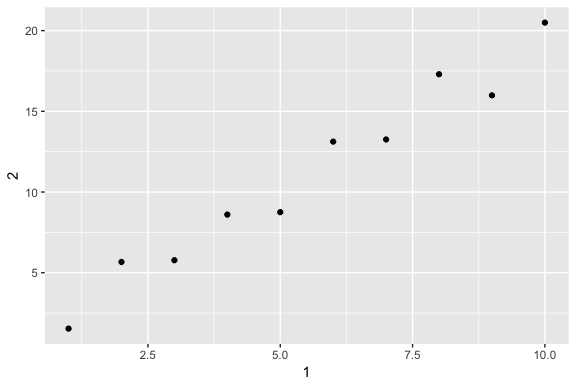

# Chapter 10
Miguel Arias  
9/5/2017  


# Tibbles


In order to coerce a data frame into a tibble. You can do that with `as_tibble()`:


```r
as_tibble(iris)
```

```
## # A tibble: 150 x 5
##    Sepal.Length Sepal.Width Petal.Length Petal.Width Species
##           <dbl>       <dbl>        <dbl>       <dbl>  <fctr>
##  1          5.1         3.5          1.4         0.2  setosa
##  2          4.9         3.0          1.4         0.2  setosa
##  3          4.7         3.2          1.3         0.2  setosa
##  4          4.6         3.1          1.5         0.2  setosa
##  5          5.0         3.6          1.4         0.2  setosa
##  6          5.4         3.9          1.7         0.4  setosa
##  7          4.6         3.4          1.4         0.3  setosa
##  8          5.0         3.4          1.5         0.2  setosa
##  9          4.4         2.9          1.4         0.2  setosa
## 10          4.9         3.1          1.5         0.1  setosa
## # ... with 140 more rows
```

Can create a new tibble from individual vectors with `tibble()`.


```r
tibble(
  x = 1:5,
  y = 1,
  z = x ^ 2 + y
)
```

```
## # A tibble: 5 x 3
##       x     y     z
##   <int> <dbl> <dbl>
## 1     1     1     2
## 2     2     1     5
## 3     3     1    10
## 4     4     1    17
## 5     5     1    26
```

Another way to create a tibble is with `tribble()`.


```r
tribble(
  ~x, ~y, ~z,
  #--|--|----
  "a", 2, 3.6,
  "b", 1, 8.5
)
```

```
## # A tibble: 2 x 3
##       x     y     z
##   <chr> <dbl> <dbl>
## 1     a     2   3.6
## 2     b     1   8.5
```

The comment line `#--|--|----` is useful to make it really clear where the header is.

## 10.3 Tibbles vs. data frame

**Printing**

Tibbles have a refined print method that shows only the first 10 rows, and all the columns that fit on screen. In addition to its name, each column reports its type, a nice feature borrowed from `str()`:


```r
tibble(
  a = lubridate::now() + runif(1e3) * 86400,
  b = lubridate::today() + runif(1e3) * 30,
  c = 1:1e3,
  d = runif(1e3),
  e = sample(letters, 1e3, replace = TRUE)
)
```

```
## # A tibble: 1,000 x 5
##                      a          b     c            d     e
##                 <dttm>     <date> <int>        <dbl> <chr>
##  1 2017-09-06 03:47:51 2017-09-10     1 0.3988071864     a
##  2 2017-09-06 00:36:49 2017-09-26     2 0.8493169530     v
##  3 2017-09-06 08:30:19 2017-09-18     3 0.1531572512     e
##  4 2017-09-06 13:53:25 2017-09-19     4 0.9234022459     y
##  5 2017-09-06 04:15:15 2017-10-01     5 0.0002495563     l
##  6 2017-09-06 01:00:13 2017-09-11     6 0.2569637916     b
##  7 2017-09-06 14:36:22 2017-09-17     7 0.3317251208     r
##  8 2017-09-06 02:37:55 2017-09-12     8 0.2296799202     v
##  9 2017-09-06 09:56:19 2017-09-29     9 0.7442304345     f
## 10 2017-09-05 15:40:24 2017-09-08    10 0.5482173287     c
## # ... with 990 more rows
```

You can explictly `print()` the data frame and control the number of rows(`n`) and the `width` of the display. `width = Inf` displays all columns:


```r
nycflights13::flights %>%
  print(n = 10, width = Inf)
```

### 10.3.2 Subsetting

If you want to pull out a single variable, you need some new tools, `$` and `[[`. `[[` can extract by name or position; `$` only extracts by name but is a little less typing.


```r
df <- tibble(
  x = runif(5),
  y = rnorm(5)
)

# Extract by name
df$x
```

```
## [1] 0.480954788 0.722401480 0.008968436 0.118850383 0.910623627
```

```r
df[["x"]]
```

```
## [1] 0.480954788 0.722401480 0.008968436 0.118850383 0.910623627
```

```r
# Extract by position
df[[1]]
```

```
## [1] 0.480954788 0.722401480 0.008968436 0.118850383 0.910623627
```

Can be used in a pipe. Only need to use the special placeholder `.`:

```r
df %>% .$x
```

```
## [1] 0.480954788 0.722401480 0.008968436 0.118850383 0.910623627
```

```r
df %>% .[["x"]]
```

```
## [1] 0.480954788 0.722401480 0.008968436 0.118850383 0.910623627
```

Some older functions don't work with tibbles. Need to use `as.data.frame()`


```r
#class(as.data.frame(tb))
```

## 10.5 Exercises

1. How can you tell if an object is a tibble?

A data frame will print the entire contents. A tibble will only print (by default) the first 10 rows and as many columns as will fit in the console.

2. Compare and contrast the following operations on a `data.frame` and equivalent tibble. What is different? Why might the default data frame behaviours cause you frustration?


```r
# on a data frame
df <- data.frame(abc = 1, xyz = "a")
df$x
```

```
## [1] a
## Levels: a
```

```r
df[, "xyz"]
```

```
## [1] a
## Levels: a
```

```r
df[, c("abc", "xyz")]
```

```
##   abc xyz
## 1   1   a
```

```r
# on a tibble
df <- tibble(abc = 1, xyz = "a")
df$x
```

```
## Warning: Unknown or uninitialised column: 'x'.
```

```
## NULL
```

```r
df[, "xyz"]
```

```
## # A tibble: 1 x 1
##     xyz
##   <chr>
## 1     a
```

```r
df[, c("abc", "xyz")]
```

```
## # A tibble: 1 x 2
##     abc   xyz
##   <dbl> <chr>
## 1     1     a
```

* Tibbles never do partial matching; data frames do.
* Subsetting tibbles using `[[` will always return a tibble; subsetting data frames using `[[` can potentially return a vector.

3. If you have the name of a variable stored in an object, e.g. `var <- "mpg"`, how can you extract the reference variable from a tibble?


```r
var <- "hwy"
mpg[[var]]
```

```
##   [1] 29 29 31 30 26 26 27 26 25 28 27 25 25 25 25 24 25 23 20 15 20 17 17
##  [24] 26 23 26 25 24 19 14 15 17 27 30 26 29 26 24 24 22 22 24 24 17 22 21
##  [47] 23 23 19 18 17 17 19 19 12 17 15 17 17 12 17 16 18 15 16 12 17 17 16
##  [70] 12 15 16 17 15 17 17 18 17 19 17 19 19 17 17 17 16 16 17 15 17 26 25
##  [93] 26 24 21 22 23 22 20 33 32 32 29 32 34 36 36 29 26 27 30 31 26 26 28
## [116] 26 29 28 27 24 24 24 22 19 20 17 12 19 18 14 15 18 18 15 17 16 18 17
## [139] 19 19 17 29 27 31 32 27 26 26 25 25 17 17 20 18 26 26 27 28 25 25 24
## [162] 27 25 26 23 26 26 26 26 25 27 25 27 20 20 19 17 20 17 29 27 31 31 26
## [185] 26 28 27 29 31 31 26 26 27 30 33 35 37 35 15 18 20 20 22 17 19 18 20
## [208] 29 26 29 29 24 44 29 26 29 29 29 29 23 24 44 41 29 26 28 29 29 29 28
## [231] 29 26 26 26
```

4. Practice referring to non-systematic names in the following data frame by:


```r
annoying <- tibble(
  `1` = 1:10,
  `2` = `1` * 2 + rnorm(length(`1`))
)

# 1  Extracting the variable called `1`.
annoying %>% .$`1`
```

```
##  [1]  1  2  3  4  5  6  7  8  9 10
```

```r
# 2 Plotting a scatterplot of `1` vs `2`.
ggplot(annoying, aes(`1`, `2`)) +
  geom_point()
```

<!-- -->

```r
# 3 Creating a new column called `3` which is `2` divided by `1`
(annoying <- mutate(annoying, `3` = `2` / `1`))
```

```
## # A tibble: 10 x 3
##      `1`       `2`      `3`
##    <int>     <dbl>    <dbl>
##  1     1  1.536895 1.536895
##  2     2  5.667825 2.833913
##  3     3  5.774184 1.924728
##  4     4  8.601101 2.150275
##  5     5  8.752076 1.750415
##  6     6 13.123186 2.187198
##  7     7 13.255485 1.893641
##  8     8 17.296540 2.162067
##  9     9 15.990511 1.776723
## 10    10 20.496298 2.049630
```

```r
# 4 Renaming the columns to `one`, `two` and `three`
rename(annoying,
       one = `1`,
       two = `2`,
       three = `3`)
```

```
## # A tibble: 10 x 3
##      one       two    three
##    <int>     <dbl>    <dbl>
##  1     1  1.536895 1.536895
##  2     2  5.667825 2.833913
##  3     3  5.774184 1.924728
##  4     4  8.601101 2.150275
##  5     5  8.752076 1.750415
##  6     6 13.123186 2.187198
##  7     7 13.255485 1.893641
##  8     8 17.296540 2.162067
##  9     9 15.990511 1.776723
## 10    10 20.496298 2.049630
```

5. What does `tibble::enframe()` do? When might you use it?

`enframe()` is a helper function that converts named atomic vectors or lists to two-column data frames. You might use it if you have data stored in a named vector and you want to add it to a data frame and preserve both the name attribute and the actual value.

6. What option control how many additional column names are printed at the footer of a tibble?

`getOption("tibble.max_extra_cols")`
