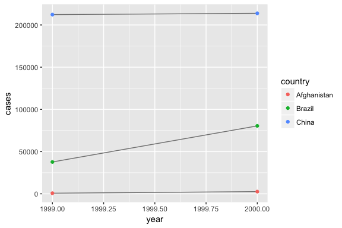

# Chapter 12
Miguel Arias  
9/5/2017  


# Tidy data


```
## Loading tidyverse: ggplot2
## Loading tidyverse: tibble
## Loading tidyverse: tidyr
## Loading tidyverse: readr
## Loading tidyverse: purrr
## Loading tidyverse: dplyr
```

```
## Conflicts with tidy packages ----------------------------------------------
```

```
## filter(): dplyr, stats
## lag():    dplyr, stats
```

Examples of data organised in four different ways.


```r
table1
```

```
## # A tibble: 6 x 4
##       country  year  cases population
##         <chr> <int>  <int>      <int>
## 1 Afghanistan  1999    745   19987071
## 2 Afghanistan  2000   2666   20595360
## 3      Brazil  1999  37737  172006362
## 4      Brazil  2000  80488  174504898
## 5       China  1999 212258 1272915272
## 6       China  2000 213766 1280428583
```

```r
table2
```

```
## # A tibble: 12 x 4
##        country  year       type      count
##          <chr> <int>      <chr>      <int>
##  1 Afghanistan  1999      cases        745
##  2 Afghanistan  1999 population   19987071
##  3 Afghanistan  2000      cases       2666
##  4 Afghanistan  2000 population   20595360
##  5      Brazil  1999      cases      37737
##  6      Brazil  1999 population  172006362
##  7      Brazil  2000      cases      80488
##  8      Brazil  2000 population  174504898
##  9       China  1999      cases     212258
## 10       China  1999 population 1272915272
## 11       China  2000      cases     213766
## 12       China  2000 population 1280428583
```

```r
table3
```

```
## # A tibble: 6 x 3
##       country  year              rate
## *       <chr> <int>             <chr>
## 1 Afghanistan  1999      745/19987071
## 2 Afghanistan  2000     2666/20595360
## 3      Brazil  1999   37737/172006362
## 4      Brazil  2000   80488/174504898
## 5       China  1999 212258/1272915272
## 6       China  2000 213766/1280428583
```

```r
table4a
```

```
## # A tibble: 3 x 3
##       country `1999` `2000`
## *       <chr>  <int>  <int>
## 1 Afghanistan    745   2666
## 2      Brazil  37737  80488
## 3       China 212258 213766
```

```r
table4b
```

```
## # A tibble: 3 x 3
##       country     `1999`     `2000`
## *       <chr>      <int>      <int>
## 1 Afghanistan   19987071   20595360
## 2      Brazil  172006362  174504898
## 3       China 1272915272 1280428583
```

All representations of the same underlying data, but they are not equally easy to use. There are three interrelated rules which make a dataset tidy:

1. Each variable must have its own column
2. Each observation must have its own row
3. Each value must have its own cell

These rules lead to an even simpler set of practical instructions:

1. Put each dataset in a tibble.
2. Put each variable in a column.

In this example, only `table1` is tidy.

Tidy data facilitates transforming it.


```r
# Compute rate per 10,000
table1 %>%
  mutate(rate = cases / population * 10000)
```

```
## # A tibble: 6 x 5
##       country  year  cases population     rate
##         <chr> <int>  <int>      <int>    <dbl>
## 1 Afghanistan  1999    745   19987071 0.372741
## 2 Afghanistan  2000   2666   20595360 1.294466
## 3      Brazil  1999  37737  172006362 2.193930
## 4      Brazil  2000  80488  174504898 4.612363
## 5       China  1999 212258 1272915272 1.667495
## 6       China  2000 213766 1280428583 1.669488
```

```r
# Compute cases per year
table1 %>%
  count(year, wt = cases)
```

```
## # A tibble: 2 x 2
##    year      n
##   <int>  <int>
## 1  1999 250740
## 2  2000 296920
```

```r
# Visualise changes over time
library(ggplot2)
ggplot(table1, aes(year, cases)) + 
  geom_line(aes(group = country), colour = "grey50") + 
  geom_point(aes(colour = country))
```

<!-- -->

## 12.3 Spreading and gathering

**Gather()**


```r
table4a
```

```
## # A tibble: 3 x 3
##       country `1999` `2000`
## *       <chr>  <int>  <int>
## 1 Afghanistan    745   2666
## 2      Brazil  37737  80488
## 3       China 212258 213766
```

Need to `gather()` the columns into a new pair of variables.


```r
table4a %>%
  gather(`1999`, `2000`, key = "year", value = "cases")
```

```
## # A tibble: 6 x 3
##       country  year  cases
##         <chr> <chr>  <int>
## 1 Afghanistan  1999    745
## 2      Brazil  1999  37737
## 3       China  1999 212258
## 4 Afghanistan  2000   2666
## 5      Brazil  2000  80488
## 6       China  2000 213766
```


```r
table4b %>%
  gather(`1999`, `2000`, key = "year", value = "population")
```

```
## # A tibble: 6 x 3
##       country  year population
##         <chr> <chr>      <int>
## 1 Afghanistan  1999   19987071
## 2      Brazil  1999  172006362
## 3       China  1999 1272915272
## 4 Afghanistan  2000   20595360
## 5      Brazil  2000  174504898
## 6       China  2000 1280428583
```

To combine the tidied versions of `table4a` and `table4b` into a single tibble, we need to use `dplyr::left_join()`.


```r
tidy4a <- table4a %>% 
  gather(`1999`, `2000`, key = "year", value = "cases")
tidy4b <- table4b %>% 
  gather(`1999`, `2000`, key = "year", value = "population")
left_join(tidy4a, tidy4b)
```

```
## Joining, by = c("country", "year")
```

```
## # A tibble: 6 x 4
##       country  year  cases population
##         <chr> <chr>  <int>      <int>
## 1 Afghanistan  1999    745   19987071
## 2      Brazil  1999  37737  172006362
## 3       China  1999 212258 1272915272
## 4 Afghanistan  2000   2666   20595360
## 5      Brazil  2000  80488  174504898
## 6       China  2000 213766 1280428583
```

Now the data is tidy!

**Spread()**

Spreading is the opposite of gathering. For example, in `table2`: an observation is a country in a year, but each observation is spread across two rows.


```r
table2
```

```
## # A tibble: 12 x 4
##        country  year       type      count
##          <chr> <int>      <chr>      <int>
##  1 Afghanistan  1999      cases        745
##  2 Afghanistan  1999 population   19987071
##  3 Afghanistan  2000      cases       2666
##  4 Afghanistan  2000 population   20595360
##  5      Brazil  1999      cases      37737
##  6      Brazil  1999 population  172006362
##  7      Brazil  2000      cases      80488
##  8      Brazil  2000 population  174504898
##  9       China  1999      cases     212258
## 10       China  1999 population 1272915272
## 11       China  2000      cases     213766
## 12       China  2000 population 1280428583
```

To tidy this up, we first analyse the represenation in similar way to `gather()`. This time, however, we only need two parameters:

* The column that contains variables names, the `key` column. Here, it's `type`.
* The column that contains values forms multiple variables, the `value` column. Here it's `count`.


```r
spread(table2, key = type, value = count)
```

```
## # A tibble: 6 x 4
##       country  year  cases population
## *       <chr> <int>  <int>      <int>
## 1 Afghanistan  1999    745   19987071
## 2 Afghanistan  2000   2666   20595360
## 3      Brazil  1999  37737  172006362
## 4      Brazil  2000  80488  174504898
## 5       China  1999 212258 1272915272
## 6       China  2000 213766 1280428583
```

The functions `spread` and `gather` are not perfectly symmetrical because column type information is not transferred between them. The `convert` argument tries to convert character vectors to the appropriate type. Need to set `convert = TRUE`.

## 12.4 Separating and uniting

**Separate**

`separate()` pulls apart one column into multiple columns.


```r
table3 %>%
  separate(rate, into = c("cases", "population"))
```

```
## # A tibble: 6 x 4
##       country  year  cases population
## *       <chr> <int>  <chr>      <chr>
## 1 Afghanistan  1999    745   19987071
## 2 Afghanistan  2000   2666   20595360
## 3      Brazil  1999  37737  172006362
## 4      Brazil  2000  80488  174504898
## 5       China  1999 212258 1272915272
## 6       China  2000 213766 1280428583
```

Can determine what makes the separationg with 

`sep = "/"`, or whatever the separator is.

By using `convert = TRUE`, `separate()` converts the data into better types.

**Unite**

`unite()` is the inverse of separate.

Can be used to rejoin data.


```r
table5 %>%
  unite(new, century, year, sep = "")
```

```
## # A tibble: 6 x 3
##       country   new              rate
## *       <chr> <chr>             <chr>
## 1 Afghanistan  1999      745/19987071
## 2 Afghanistan  2000     2666/20595360
## 3      Brazil  1999   37737/172006362
## 4      Brazil  2000   80488/174504898
## 5       China  1999 212258/1272915272
## 6       China  2000 213766/1280428583
```

## 12.5 Missing values

**Explicitly** flagged with `NA`
**Implicitly** not present in the data


```r
stocks <- tibble(
  year   = c(2015, 2015, 2015, 2015, 2016, 2016, 2016),
  qtr    = c(   1,    2,    3,    4,    2,    3,    4),
  return = c(1.88, 0.59, 0.35,   NA, 0.92, 0.17, 2.66)
)

# The way that a data set is represented can make implicit values explicit.

stocks %>% 
  spread(year, return)
```

```
## # A tibble: 4 x 3
##     qtr `2015` `2016`
## * <dbl>  <dbl>  <dbl>
## 1     1   1.88     NA
## 2     2   0.59   0.92
## 3     3   0.35   0.17
## 4     4     NA   2.66
```

```r
# Because they might not be important. You can set na.rm = TRUE in gather().

stocks %>% 
  spread(year, return) %>% 
  gather(year, return, `2015`:`2016`, na.rm = TRUE)
```

```
## # A tibble: 6 x 3
##     qtr  year return
## * <dbl> <chr>  <dbl>
## 1     1  2015   1.88
## 2     2  2015   0.59
## 3     3  2015   0.35
## 4     2  2016   0.92
## 5     3  2016   0.17
## 6     4  2016   2.66
```

```r
# Another tool to make missing values explicit is complete()
stocks %>%
  complete(year, qtr)
```

```
## # A tibble: 8 x 3
##    year   qtr return
##   <dbl> <dbl>  <dbl>
## 1  2015     1   1.88
## 2  2015     2   0.59
## 3  2015     3   0.35
## 4  2015     4     NA
## 5  2016     1     NA
## 6  2016     2   0.92
## 7  2016     3   0.17
## 8  2016     4   2.66
```

## 12.6 Case Study

Dataset:


```r
who
```

```
## # A tibble: 7,240 x 60
##        country  iso2  iso3  year new_sp_m014 new_sp_m1524 new_sp_m2534
##          <chr> <chr> <chr> <int>       <int>        <int>        <int>
##  1 Afghanistan    AF   AFG  1980          NA           NA           NA
##  2 Afghanistan    AF   AFG  1981          NA           NA           NA
##  3 Afghanistan    AF   AFG  1982          NA           NA           NA
##  4 Afghanistan    AF   AFG  1983          NA           NA           NA
##  5 Afghanistan    AF   AFG  1984          NA           NA           NA
##  6 Afghanistan    AF   AFG  1985          NA           NA           NA
##  7 Afghanistan    AF   AFG  1986          NA           NA           NA
##  8 Afghanistan    AF   AFG  1987          NA           NA           NA
##  9 Afghanistan    AF   AFG  1988          NA           NA           NA
## 10 Afghanistan    AF   AFG  1989          NA           NA           NA
## # ... with 7,230 more rows, and 53 more variables: new_sp_m3544 <int>,
## #   new_sp_m4554 <int>, new_sp_m5564 <int>, new_sp_m65 <int>,
## #   new_sp_f014 <int>, new_sp_f1524 <int>, new_sp_f2534 <int>,
## #   new_sp_f3544 <int>, new_sp_f4554 <int>, new_sp_f5564 <int>,
## #   new_sp_f65 <int>, new_sn_m014 <int>, new_sn_m1524 <int>,
## #   new_sn_m2534 <int>, new_sn_m3544 <int>, new_sn_m4554 <int>,
## #   new_sn_m5564 <int>, new_sn_m65 <int>, new_sn_f014 <int>,
## #   new_sn_f1524 <int>, new_sn_f2534 <int>, new_sn_f3544 <int>,
## #   new_sn_f4554 <int>, new_sn_f5564 <int>, new_sn_f65 <int>,
## #   new_ep_m014 <int>, new_ep_m1524 <int>, new_ep_m2534 <int>,
## #   new_ep_m3544 <int>, new_ep_m4554 <int>, new_ep_m5564 <int>,
## #   new_ep_m65 <int>, new_ep_f014 <int>, new_ep_f1524 <int>,
## #   new_ep_f2534 <int>, new_ep_f3544 <int>, new_ep_f4554 <int>,
## #   new_ep_f5564 <int>, new_ep_f65 <int>, newrel_m014 <int>,
## #   newrel_m1524 <int>, newrel_m2534 <int>, newrel_m3544 <int>,
## #   newrel_m4554 <int>, newrel_m5564 <int>, newrel_m65 <int>,
## #   newrel_f014 <int>, newrel_f1524 <int>, newrel_f2534 <int>,
## #   newrel_f3544 <int>, newrel_f4554 <int>, newrel_f5564 <int>,
## #   newrel_f65 <int>
```

The best place to start is almost always to gather the columns that are not variables. 

* It looks like `country`, `iso2`, and `iso3` are three variables that redundantly specify the country.
* `year` is also clearly also a variable.
* We don't know what all the other columns are yet, but given the structure in the variable names (e.g. `new_sp_m014`, `new_ep_m014`, `new_ep_f014`) these are likely to be values, not variables.

Need to gather all the columns from `new_sp_m014` to `newrel_f65`. Give them the generic name `"key"` and use the variable `cases`. There are a lot of missing values, so for now we'll use `na.rm` so we can focus on the values that are present.


```r
who1 <- who %>%
  gather(new_sp_m014:newrel_f65, key = "key", value = "cases", na.rm = TRUE)
who1
```

```
## # A tibble: 76,046 x 6
##        country  iso2  iso3  year         key cases
##  *       <chr> <chr> <chr> <int>       <chr> <int>
##  1 Afghanistan    AF   AFG  1997 new_sp_m014     0
##  2 Afghanistan    AF   AFG  1998 new_sp_m014    30
##  3 Afghanistan    AF   AFG  1999 new_sp_m014     8
##  4 Afghanistan    AF   AFG  2000 new_sp_m014    52
##  5 Afghanistan    AF   AFG  2001 new_sp_m014   129
##  6 Afghanistan    AF   AFG  2002 new_sp_m014    90
##  7 Afghanistan    AF   AFG  2003 new_sp_m014   127
##  8 Afghanistan    AF   AFG  2004 new_sp_m014   139
##  9 Afghanistan    AF   AFG  2005 new_sp_m014   151
## 10 Afghanistan    AF   AFG  2006 new_sp_m014   193
## # ... with 76,036 more rows
```

1. The first three letters of each column denote whether the column contains new or old cases of TB.
2. The next two letters describe the type of TB:
* `rel` stands for cases of relapse
* `ep` stands for cases of extrapulmonary TB
* `sn` stands for cases of pulmonary TB that could not be diagnosed by a pulmonary smear (negative)
* `sp` stands for cases of pulmonary TB that could not be diagnosed by a pulmonary smear (positive)
3. The sixth letter gives the sex of TB patiens.
4. The remaining numbers gives the age group.

Need to make a minor fix to the format of the column names as the names are inconsistent with `new_rel` we have `newrel`.


```r
who2 <- who1 %>%
  mutate(key = stringr::str_replace(key, "newrel", "new_rel"))
who2
```

```
## # A tibble: 76,046 x 6
##        country  iso2  iso3  year         key cases
##          <chr> <chr> <chr> <int>       <chr> <int>
##  1 Afghanistan    AF   AFG  1997 new_sp_m014     0
##  2 Afghanistan    AF   AFG  1998 new_sp_m014    30
##  3 Afghanistan    AF   AFG  1999 new_sp_m014     8
##  4 Afghanistan    AF   AFG  2000 new_sp_m014    52
##  5 Afghanistan    AF   AFG  2001 new_sp_m014   129
##  6 Afghanistan    AF   AFG  2002 new_sp_m014    90
##  7 Afghanistan    AF   AFG  2003 new_sp_m014   127
##  8 Afghanistan    AF   AFG  2004 new_sp_m014   139
##  9 Afghanistan    AF   AFG  2005 new_sp_m014   151
## 10 Afghanistan    AF   AFG  2006 new_sp_m014   193
## # ... with 76,036 more rows
```

Now we can separate the values in each code with two passes of `separate()`.


```r
who3 <- who2 %>%
  separate(key, c("new", "type", "sexage"), sep = "_")
who3
```

```
## # A tibble: 76,046 x 8
##        country  iso2  iso3  year   new  type sexage cases
##  *       <chr> <chr> <chr> <int> <chr> <chr>  <chr> <int>
##  1 Afghanistan    AF   AFG  1997   new    sp   m014     0
##  2 Afghanistan    AF   AFG  1998   new    sp   m014    30
##  3 Afghanistan    AF   AFG  1999   new    sp   m014     8
##  4 Afghanistan    AF   AFG  2000   new    sp   m014    52
##  5 Afghanistan    AF   AFG  2001   new    sp   m014   129
##  6 Afghanistan    AF   AFG  2002   new    sp   m014    90
##  7 Afghanistan    AF   AFG  2003   new    sp   m014   127
##  8 Afghanistan    AF   AFG  2004   new    sp   m014   139
##  9 Afghanistan    AF   AFG  2005   new    sp   m014   151
## 10 Afghanistan    AF   AFG  2006   new    sp   m014   193
## # ... with 76,036 more rows
```

```r
# Might as well drop the new column because it's constant.

who3 %>%
  count(new)
```

```
## # A tibble: 1 x 2
##     new     n
##   <chr> <int>
## 1   new 76046
```

```r
who4 <- who3 %>%
  select(-new, -iso2, -iso3)
```

Next, separate `sexage` into `sex` and `age`.


```r
who5 <- who4 %>%
  separate(sexage, c("sex", "age"), sep = 1)
who5
```

```
## # A tibble: 76,046 x 6
##        country  year  type   sex   age cases
##  *       <chr> <int> <chr> <chr> <chr> <int>
##  1 Afghanistan  1997    sp     m   014     0
##  2 Afghanistan  1998    sp     m   014    30
##  3 Afghanistan  1999    sp     m   014     8
##  4 Afghanistan  2000    sp     m   014    52
##  5 Afghanistan  2001    sp     m   014   129
##  6 Afghanistan  2002    sp     m   014    90
##  7 Afghanistan  2003    sp     m   014   127
##  8 Afghanistan  2004    sp     m   014   139
##  9 Afghanistan  2005    sp     m   014   151
## 10 Afghanistan  2006    sp     m   014   193
## # ... with 76,036 more rows
```

Here's the code altogether:


```r
who %>%
  gather(code, value, new_sp_m014:newrel_f65, na.rm = TRUE) %>% 
  mutate(code = stringr::str_replace(code, "newrel", "new_rel")) %>%
  separate(code, c("new", "var", "sexage")) %>% 
  select(-new, -iso2, -iso3) %>% 
  separate(sexage, c("sex", "age"), sep = 1)
```

```
## # A tibble: 76,046 x 6
##        country  year   var   sex   age value
##  *       <chr> <int> <chr> <chr> <chr> <int>
##  1 Afghanistan  1997    sp     m   014     0
##  2 Afghanistan  1998    sp     m   014    30
##  3 Afghanistan  1999    sp     m   014     8
##  4 Afghanistan  2000    sp     m   014    52
##  5 Afghanistan  2001    sp     m   014   129
##  6 Afghanistan  2002    sp     m   014    90
##  7 Afghanistan  2003    sp     m   014   127
##  8 Afghanistan  2004    sp     m   014   139
##  9 Afghanistan  2005    sp     m   014   151
## 10 Afghanistan  2006    sp     m   014   193
## # ... with 76,036 more rows
```

How to confirm redundancy of `iso2` and `iso3`?


```r
select(who3, country, iso2, iso3) %>%
  distinct() %>%
  group_by(country) %>%
  filter(n() > 1)
```

```
## # A tibble: 0 x 3
## # Groups:   country [0]
## # ... with 3 variables: country <chr>, iso2 <chr>, iso3 <chr>
```
