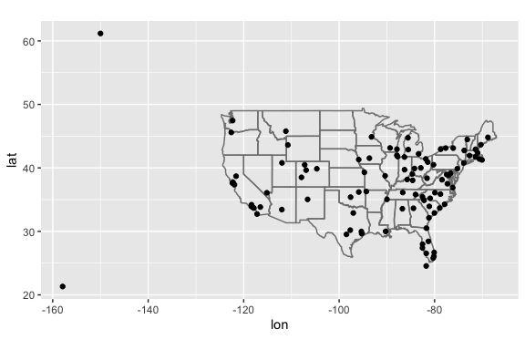
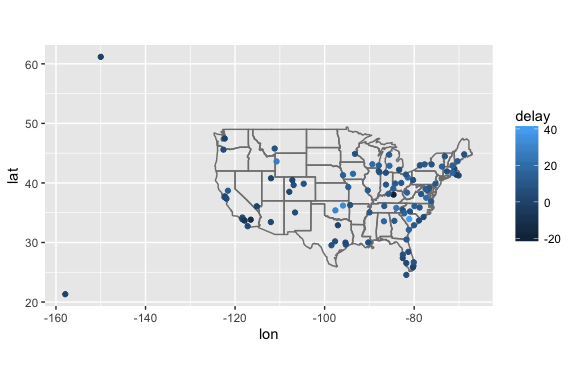
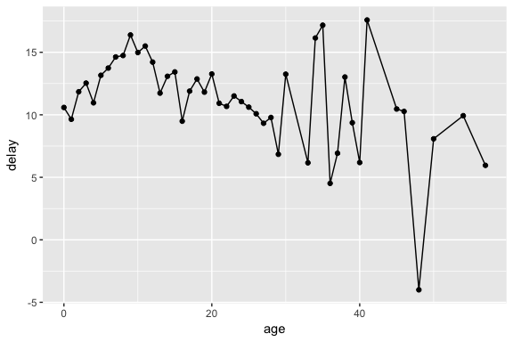

# Chapter 13
Miguel Arias  
9/5/2017  


# Relational data


```
## Loading tidyverse: ggplot2
## Loading tidyverse: tibble
## Loading tidyverse: tidyr
## Loading tidyverse: readr
## Loading tidyverse: purrr
## Loading tidyverse: dplyr
```

```
## Conflicts with tidy packages ----------------------------------------------
```

```
## filter(): dplyr, stats
## lag():    dplyr, stats
```

Multiple tables of data are called **relational data** because it is the relations, not just the individual datasets, that are important.

Relational data verbs:

* **Mutating joins**, add new variables to one data from from matching observations in another
* **Filtering joins**, filter observations from one data frame based on whether or not they match an observation in the other table.
* **Set operations**, treat observations as if they were set elements.

## 13.2 nycflights13

The nycflights13 package contains four tibbles that are related to the `flights` table.

* `airlines` lets you loop up the full carrier name from its abbreviated code.

```r
airlines
```

```
## # A tibble: 16 x 2
##    carrier                        name
##      <chr>                       <chr>
##  1      9E           Endeavor Air Inc.
##  2      AA      American Airlines Inc.
##  3      AS        Alaska Airlines Inc.
##  4      B6             JetBlue Airways
##  5      DL        Delta Air Lines Inc.
##  6      EV    ExpressJet Airlines Inc.
##  7      F9      Frontier Airlines Inc.
##  8      FL AirTran Airways Corporation
##  9      HA      Hawaiian Airlines Inc.
## 10      MQ                   Envoy Air
## 11      OO       SkyWest Airlines Inc.
## 12      UA       United Air Lines Inc.
## 13      US             US Airways Inc.
## 14      VX              Virgin America
## 15      WN      Southwest Airlines Co.
## 16      YV          Mesa Airlines Inc.
```

* `airports` gives information about each airport, identified by the `faa` airport code:

```r
airports
```

```
## # A tibble: 1,458 x 8
##      faa                           name      lat        lon   alt    tz
##    <chr>                          <chr>    <dbl>      <dbl> <int> <dbl>
##  1   04G              Lansdowne Airport 41.13047  -80.61958  1044    -5
##  2   06A  Moton Field Municipal Airport 32.46057  -85.68003   264    -6
##  3   06C            Schaumburg Regional 41.98934  -88.10124   801    -6
##  4   06N                Randall Airport 41.43191  -74.39156   523    -5
##  5   09J          Jekyll Island Airport 31.07447  -81.42778    11    -5
##  6   0A9 Elizabethton Municipal Airport 36.37122  -82.17342  1593    -5
##  7   0G6        Williams County Airport 41.46731  -84.50678   730    -5
##  8   0G7  Finger Lakes Regional Airport 42.88356  -76.78123   492    -5
##  9   0P2   Shoestring Aviation Airfield 39.79482  -76.64719  1000    -5
## 10   0S9          Jefferson County Intl 48.05381 -122.81064   108    -8
## # ... with 1,448 more rows, and 2 more variables: dst <chr>, tzone <chr>
```

* `planes` gives information about each plane, identified by its `tailnum`

```r
planes
```

```
## # A tibble: 3,322 x 9
##    tailnum  year                    type     manufacturer     model
##      <chr> <int>                   <chr>            <chr>     <chr>
##  1  N10156  2004 Fixed wing multi engine          EMBRAER EMB-145XR
##  2  N102UW  1998 Fixed wing multi engine AIRBUS INDUSTRIE  A320-214
##  3  N103US  1999 Fixed wing multi engine AIRBUS INDUSTRIE  A320-214
##  4  N104UW  1999 Fixed wing multi engine AIRBUS INDUSTRIE  A320-214
##  5  N10575  2002 Fixed wing multi engine          EMBRAER EMB-145LR
##  6  N105UW  1999 Fixed wing multi engine AIRBUS INDUSTRIE  A320-214
##  7  N107US  1999 Fixed wing multi engine AIRBUS INDUSTRIE  A320-214
##  8  N108UW  1999 Fixed wing multi engine AIRBUS INDUSTRIE  A320-214
##  9  N109UW  1999 Fixed wing multi engine AIRBUS INDUSTRIE  A320-214
## 10  N110UW  1999 Fixed wing multi engine AIRBUS INDUSTRIE  A320-214
## # ... with 3,312 more rows, and 4 more variables: engines <int>,
## #   seats <int>, speed <int>, engine <chr>
```

* `weather` gives the weather at each NYC airport for each hour

```r
weather
```

```
## # A tibble: 26,130 x 15
##    origin  year month   day  hour  temp  dewp humid wind_dir wind_speed
##     <chr> <dbl> <dbl> <int> <int> <dbl> <dbl> <dbl>    <dbl>      <dbl>
##  1    EWR  2013     1     1     0 37.04 21.92 53.97      230   10.35702
##  2    EWR  2013     1     1     1 37.04 21.92 53.97      230   13.80936
##  3    EWR  2013     1     1     2 37.94 21.92 52.09      230   12.65858
##  4    EWR  2013     1     1     3 37.94 23.00 54.51      230   13.80936
##  5    EWR  2013     1     1     4 37.94 24.08 57.04      240   14.96014
##  6    EWR  2013     1     1     6 39.02 26.06 59.37      270   10.35702
##  7    EWR  2013     1     1     7 39.02 26.96 61.63      250    8.05546
##  8    EWR  2013     1     1     8 39.02 28.04 64.43      240   11.50780
##  9    EWR  2013     1     1     9 39.92 28.04 62.21      250   12.65858
## 10    EWR  2013     1     1    10 39.02 28.04 64.43      260   12.65858
## # ... with 26,120 more rows, and 5 more variables: wind_gust <dbl>,
## #   precip <dbl>, pressure <dbl>, visib <dbl>, time_hour <dttm>
```

## 13.3 Keys

Two types of keys:
1. A **primary key** uniquely identifies an observation in its own table. For example, `planes$tailnum` is a primary key because it uniquely identifies each plane in the `planes` table.
2. A **foreign key** uniquely identifies an observation in another table. For example, the `flights$tailnum` is a foreign key because it appears in the `flights` table where it matches each flight to a unique plane.

Good practice to verify primary keys:

```r
planes %>%
  count(tailnum) %>%
  filter(n > 1)
```

```
## # A tibble: 0 x 2
## # ... with 2 variables: tailnum <chr>, n <int>
```

```r
weather %>%
  count(year, month, day, hour, origin) %>%
  filter(n > 1)
```

```
## # A tibble: 0 x 6
## # ... with 6 variables: year <dbl>, month <dbl>, day <int>, hour <int>,
## #   origin <chr>, n <int>
```

### 13.3.1 Exercises

1. Add a surrogate key to flights

Add the column `flight_id` as a surrogate key.


```r
flights %>%
  arrange(year, month, day, sched_dep_time, carrier, flight) %>%
  mutate(flight_id = row_number()) %>%
  glimpse()
```

```
## Observations: 336,776
## Variables: 20
## $ year           <int> 2013, 2013, 2013, 2013, 2013, 2013, 2013, 2013,...
## $ month          <int> 1, 1, 1, 1, 1, 1, 1, 1, 1, 1, 1, 1, 1, 1, 1, 1,...
## $ day            <int> 1, 1, 1, 1, 1, 1, 1, 1, 1, 1, 1, 1, 1, 1, 1, 1,...
## $ dep_time       <int> 517, 533, 542, 544, 554, 559, 558, 559, 558, 55...
## $ sched_dep_time <int> 515, 529, 540, 545, 558, 559, 600, 600, 600, 60...
## $ dep_delay      <dbl> 2, 4, 2, -1, -4, 0, -2, -1, -2, -2, -3, NA, 1, ...
## $ arr_time       <int> 830, 850, 923, 1004, 740, 702, 753, 941, 849, 8...
## $ sched_arr_time <int> 819, 830, 850, 1022, 728, 706, 745, 910, 851, 8...
## $ arr_delay      <dbl> 11, 20, 33, -18, 12, -4, 8, 31, -2, -3, -8, NA,...
## $ carrier        <chr> "UA", "UA", "AA", "B6", "UA", "B6", "AA", "AA",...
## $ flight         <int> 1545, 1714, 1141, 725, 1696, 1806, 301, 707, 49...
## $ tailnum        <chr> "N14228", "N24211", "N619AA", "N804JB", "N39463...
## $ origin         <chr> "EWR", "LGA", "JFK", "JFK", "EWR", "JFK", "LGA"...
## $ dest           <chr> "IAH", "IAH", "MIA", "BQN", "ORD", "BOS", "ORD"...
## $ air_time       <dbl> 227, 227, 160, 183, 150, 44, 138, 257, 149, 158...
## $ distance       <dbl> 1400, 1416, 1089, 1576, 719, 187, 733, 1389, 10...
## $ hour           <dbl> 5, 5, 5, 5, 5, 5, 6, 6, 6, 6, 6, 6, 6, 6, 6, 6,...
## $ minute         <dbl> 15, 29, 40, 45, 58, 59, 0, 0, 0, 0, 0, 0, 0, 0,...
## $ time_hour      <dttm> 2013-01-01 05:00:00, 2013-01-01 05:00:00, 2013...
## $ flight_id      <int> 1, 2, 3, 4, 5, 6, 7, 8, 9, 10, 11, 12, 13, 14, ...
```

## 13.4 Mutating Joins

Like `mutate()`, the join functions add variables to the right, so if you have a lot of variables already, the new variables won't get printed.


```r
flights2 <- flights %>%
  select(year:day, hour, origin, dest, tailnum, carrier)
flights2
```

```
## # A tibble: 336,776 x 8
##     year month   day  hour origin  dest tailnum carrier
##    <int> <int> <int> <dbl>  <chr> <chr>   <chr>   <chr>
##  1  2013     1     1     5    EWR   IAH  N14228      UA
##  2  2013     1     1     5    LGA   IAH  N24211      UA
##  3  2013     1     1     5    JFK   MIA  N619AA      AA
##  4  2013     1     1     5    JFK   BQN  N804JB      B6
##  5  2013     1     1     6    LGA   ATL  N668DN      DL
##  6  2013     1     1     5    EWR   ORD  N39463      UA
##  7  2013     1     1     6    EWR   FLL  N516JB      B6
##  8  2013     1     1     6    LGA   IAD  N829AS      EV
##  9  2013     1     1     6    JFK   MCO  N593JB      B6
## 10  2013     1     1     6    LGA   ORD  N3ALAA      AA
## # ... with 336,766 more rows
```

```r
# If you want to add the full airline name to flights2
# Can combine the airlines and flights2 data frames with left_join()
flights2 %>%
  select(-origin, -dest) %>%
  left_join(airlines, by = "carrier")
```

```
## # A tibble: 336,776 x 7
##     year month   day  hour tailnum carrier                     name
##    <int> <int> <int> <dbl>   <chr>   <chr>                    <chr>
##  1  2013     1     1     5  N14228      UA    United Air Lines Inc.
##  2  2013     1     1     5  N24211      UA    United Air Lines Inc.
##  3  2013     1     1     5  N619AA      AA   American Airlines Inc.
##  4  2013     1     1     5  N804JB      B6          JetBlue Airways
##  5  2013     1     1     6  N668DN      DL     Delta Air Lines Inc.
##  6  2013     1     1     5  N39463      UA    United Air Lines Inc.
##  7  2013     1     1     6  N516JB      B6          JetBlue Airways
##  8  2013     1     1     6  N829AS      EV ExpressJet Airlines Inc.
##  9  2013     1     1     6  N593JB      B6          JetBlue Airways
## 10  2013     1     1     6  N3ALAA      AA   American Airlines Inc.
## # ... with 336,766 more rows
```

**Types**


```r
x <- tribble(
  ~key, ~val_x,
     1, "x1",
     2, "x2",
     3, "x3"
)
y <- tribble(
  ~key, ~val_y,
     1, "y1",
     2, "y2",
     4, "y3"
)
```

* `inner_join()`: matches pairs of observations whenever their keys are equal.

```r
x %>%
  inner_join(y, by = "key")
```

```
## # A tibble: 2 x 3
##     key val_x val_y
##   <dbl> <chr> <chr>
## 1     1    x1    y1
## 2     2    x2    y2
```

* `left_join()` keeps all observations of `x`
* `right_join()` keeps all observations of `y`
* `full_join()` keeps all observations in `x` and `y`.

### 13.4.5 Defining the key columns

* The default, `by = NULL`, uses all variables that appear in both tables, the so called **natural** join. For example, the flights and weather tables match on their common variables: `year`, `month`, `day`, `hour`, and `origin`.

```r
flights2 %>%
  left_join(weather)
```

```
## Joining, by = c("year", "month", "day", "hour", "origin")
```

```
## # A tibble: 336,776 x 18
##     year month   day  hour origin  dest tailnum carrier  temp  dewp humid
##    <dbl> <dbl> <int> <dbl>  <chr> <chr>   <chr>   <chr> <dbl> <dbl> <dbl>
##  1  2013     1     1     5    EWR   IAH  N14228      UA    NA    NA    NA
##  2  2013     1     1     5    LGA   IAH  N24211      UA    NA    NA    NA
##  3  2013     1     1     5    JFK   MIA  N619AA      AA    NA    NA    NA
##  4  2013     1     1     5    JFK   BQN  N804JB      B6    NA    NA    NA
##  5  2013     1     1     6    LGA   ATL  N668DN      DL 39.92 26.06 57.33
##  6  2013     1     1     5    EWR   ORD  N39463      UA    NA    NA    NA
##  7  2013     1     1     6    EWR   FLL  N516JB      B6 39.02 26.06 59.37
##  8  2013     1     1     6    LGA   IAD  N829AS      EV 39.92 26.06 57.33
##  9  2013     1     1     6    JFK   MCO  N593JB      B6 39.02 26.06 59.37
## 10  2013     1     1     6    LGA   ORD  N3ALAA      AA 39.92 26.06 57.33
## # ... with 336,766 more rows, and 7 more variables: wind_dir <dbl>,
## #   wind_speed <dbl>, wind_gust <dbl>, precip <dbl>, pressure <dbl>,
## #   visib <dbl>, time_hour <dttm>
```

* A character vector, `by = "x"`.

```r
flights2 %>%
  left_join(planes, by = "tailnum")
```

```
## # A tibble: 336,776 x 16
##    year.x month   day  hour origin  dest tailnum carrier year.y
##     <int> <int> <int> <dbl>  <chr> <chr>   <chr>   <chr>  <int>
##  1   2013     1     1     5    EWR   IAH  N14228      UA   1999
##  2   2013     1     1     5    LGA   IAH  N24211      UA   1998
##  3   2013     1     1     5    JFK   MIA  N619AA      AA   1990
##  4   2013     1     1     5    JFK   BQN  N804JB      B6   2012
##  5   2013     1     1     6    LGA   ATL  N668DN      DL   1991
##  6   2013     1     1     5    EWR   ORD  N39463      UA   2012
##  7   2013     1     1     6    EWR   FLL  N516JB      B6   2000
##  8   2013     1     1     6    LGA   IAD  N829AS      EV   1998
##  9   2013     1     1     6    JFK   MCO  N593JB      B6   2004
## 10   2013     1     1     6    LGA   ORD  N3ALAA      AA     NA
## # ... with 336,766 more rows, and 7 more variables: type <chr>,
## #   manufacturer <chr>, model <chr>, engines <int>, seats <int>,
## #   speed <int>, engine <chr>
```

* A named character vector: `by = c("a" = "b")`. Matches variable `a` in table `x` to variable `b` in table `y`.


```r
flights2 %>%
  left_join(airports, c("dest" = "faa"))
```

```
## # A tibble: 336,776 x 15
##     year month   day  hour origin  dest tailnum carrier
##    <int> <int> <int> <dbl>  <chr> <chr>   <chr>   <chr>
##  1  2013     1     1     5    EWR   IAH  N14228      UA
##  2  2013     1     1     5    LGA   IAH  N24211      UA
##  3  2013     1     1     5    JFK   MIA  N619AA      AA
##  4  2013     1     1     5    JFK   BQN  N804JB      B6
##  5  2013     1     1     6    LGA   ATL  N668DN      DL
##  6  2013     1     1     5    EWR   ORD  N39463      UA
##  7  2013     1     1     6    EWR   FLL  N516JB      B6
##  8  2013     1     1     6    LGA   IAD  N829AS      EV
##  9  2013     1     1     6    JFK   MCO  N593JB      B6
## 10  2013     1     1     6    LGA   ORD  N3ALAA      AA
## # ... with 336,766 more rows, and 7 more variables: name <chr>, lat <dbl>,
## #   lon <dbl>, alt <int>, tz <dbl>, dst <chr>, tzone <chr>
```

### 13.4.6 Exercises

1. Compute the average delay by destination, then join on the airports data frame so you can show the spatial distribution of delays.


```r
library(purrr)
airports %>%
  semi_join(flights, c("faa" = "dest")) %>%
  ggplot(aes(lon, lat)) +
  borders("state") +
  geom_point() + 
  coord_quickmap()
```

```
## 
## Attaching package: 'maps'
```

```
## The following object is masked from 'package:purrr':
## 
##     map
```

<!-- -->


```r
avg_dest_delays <-
  flights %>%
  group_by(dest) %>%
  # arrival delay NA's are cancelled flights
  summarise(delay = mean(arr_delay, na.rm = TRUE)) %>%
  inner_join(airports, by = c(dest = "faa"))

avg_dest_delays %>%
  ggplot(aes(lon, lat, colour = delay)) +
    borders("state") +
    geom_point() + 
    coord_quickmap()
```

<!-- -->

2. Add the location of the origin and destination (i.e. the lat and lon) to flights


```r
flights %>%
  left_join(airports, by = c(dest = "faa")) %>%
  left_join(airports, by = c(origin = "faa")) %>%
  head()
```

```
## # A tibble: 6 x 33
##    year month   day dep_time sched_dep_time dep_delay arr_time
##   <int> <int> <int>    <int>          <int>     <dbl>    <int>
## 1  2013     1     1      517            515         2      830
## 2  2013     1     1      533            529         4      850
## 3  2013     1     1      542            540         2      923
## 4  2013     1     1      544            545        -1     1004
## 5  2013     1     1      554            600        -6      812
## 6  2013     1     1      554            558        -4      740
## # ... with 26 more variables: sched_arr_time <int>, arr_delay <dbl>,
## #   carrier <chr>, flight <int>, tailnum <chr>, origin <chr>, dest <chr>,
## #   air_time <dbl>, distance <dbl>, hour <dbl>, minute <dbl>,
## #   time_hour <dttm>, name.x <chr>, lat.x <dbl>, lon.x <dbl>, alt.x <int>,
## #   tz.x <dbl>, dst.x <chr>, tzone.x <chr>, name.y <chr>, lat.y <dbl>,
## #   lon.y <dbl>, alt.y <int>, tz.y <dbl>, dst.y <chr>, tzone.y <chr>
```

3. Is there a relationship between the age of a plane and its delays?


```r
plane_ages <-
  planes %>%
  mutate(age = 2013 - year) %>%
  select(tailnum, age)

flights %>%
  inner_join(plane_ages, by = "tailnum") %>%
  group_by(age) %>%
  filter(!is.na(dep_delay)) %>%
  summarise(delay = mean(dep_delay)) %>%
  ggplot(aes(x = age, y = delay)) +
  geom_point()+
  geom_line()
```

```
## Warning: Removed 1 rows containing missing values (geom_point).
```

```
## Warning: Removed 1 rows containing missing values (geom_path).
```

<!-- -->

## 13.5 Filtering joins

* `semi_join`: keeps all obs in `x` with a match in `y`. Useful for matching filtered summary tables back to the original rows.
* `anti_join`: drops all obs in `x` with a match in `y`. Useful for diagnosing mismatches.

For example, when connecting `flights` and `planes`, you might be interested to know that there are many `flights` that don't have a match in `planes`:

```r
flights %>%
  anti_join(planes, by = "tailnum") %>%
  count(tailnum, sort = TRUE)
```

```
## # A tibble: 722 x 2
##    tailnum     n
##      <chr> <int>
##  1    <NA>  2512
##  2  N725MQ   575
##  3  N722MQ   513
##  4  N723MQ   507
##  5  N713MQ   483
##  6  N735MQ   396
##  7  N0EGMQ   371
##  8  N534MQ   364
##  9  N542MQ   363
## 10  N531MQ   349
## # ... with 712 more rows
```

### 13.5.1 Exercises

2. Filter flights to only show flights with planes that have flown at least 100 flights


```r
planes_gt100 <- 
  filter(flights) %>%
  group_by(tailnum) %>%
  count() %>%
  filter(n > 100)

flights %>%
  semi_join(planes_gt100, by = "tailnum")
```

```
## # A tibble: 229,202 x 19
##     year month   day dep_time sched_dep_time dep_delay arr_time
##    <int> <int> <int>    <int>          <int>     <dbl>    <int>
##  1  2013     1     1     1604           1510        54     1817
##  2  2013     1     1     2100           2100         0     2307
##  3  2013     1     2      827            835        -8     1059
##  4  2013     1     2     2014           2020        -6     2256
##  5  2013     1     4     1621           1625        -4     1853
##  6  2013     1     5      834            835        -1     1050
##  7  2013     1     6      832            835        -3     1101
##  8  2013     1     6     2051           2100        -9     2241
##  9  2013     1     7      826            835        -9     1057
## 10  2013     1     7     1444           1445        -1     1659
## # ... with 229,192 more rows, and 12 more variables: sched_arr_time <int>,
## #   arr_delay <dbl>, carrier <chr>, flight <int>, tailnum <chr>,
## #   origin <chr>, dest <chr>, air_time <dbl>, distance <dbl>, hour <dbl>,
## #   minute <dbl>, time_hour <dttm>
```

4. What does` anti_join(flights, airports, by = c("dest" = "faa"))` tell you? What does `anti_join(airports, flights, by = c("faa" = "dest"))` tell you?

`anti_join(flights, airports, by = c("dest" = "faa"))` are flights that go to an airport that is not in FAA list of destinations, likely foreign airports.

`anti_join(airports, flights, by = c("faa" = "dest"))` are US airports that don’t have a flight in the data, meaning that there were no flights to that aiport from New York in 2013.
  
## 13.7 Set operations

The final type of two-table verb are the set operations
* `intersect(x,y)`: return only observations in both `x` and `y`
* `union(x, y)`: return unique observations in `x` and `y`
* `setdiff(x, y)`: return observations in `x`, but not in `y`.
