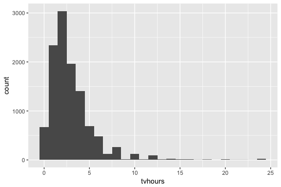

# Chapter 15
Miguel Arias  
9/5/2017  


## Factors


### 15.2 Creating factors

To create a factor you must start by creating a list of the valid **levels**:


```r
x1 <- c("Dec", "Apr", "Jan", "Mar")
month_levels <- c(
  "Jan", "Feb", "Mar", "Apr", "May", "Jun",
  "Jul", "Aug", "Sep", "Oct", "Nov", "Dec"
)
```

Now can create a factor:

```r
y1 <- factor(x1, levels = month_levels)
y1
```

```
## [1] Dec Apr Jan Mar
## Levels: Jan Feb Mar Apr May Jun Jul Aug Sep Oct Nov Dec
```

```r
sort(y1)
```

```
## [1] Jan Mar Apr Dec
## Levels: Jan Feb Mar Apr May Jun Jul Aug Sep Oct Nov Dec
```

The levels are needed, because if you omit them. They'll be taken from the data in alphabetical order:

```r
factor(x1)
```

```
## [1] Dec Apr Jan Mar
## Levels: Apr Dec Jan Mar
```

Sometimes prefer order of levels to match order of first appearance in data. Can do it by setting levels to `unique(x)`, or after the fact, with `fct_inorder()`:


```r
f1 <- factor(x1, levels = unique(x1))
f1
```

```
## [1] Dec Apr Jan Mar
## Levels: Dec Apr Jan Mar
```

```r
f2 <- x1 %>% factor() %>% fct_inorder()
f2
```

```
## [1] Dec Apr Jan Mar
## Levels: Dec Apr Jan Mar
```

If ever need to access the set of valid levels (`levels()`):

```r
levels(f2)
```

```
## [1] "Dec" "Apr" "Jan" "Mar"
```

### 15.3 General Social Survey


```r
gss_cat
```

```
## # A tibble: 21,483 x 9
##     year       marital   age   race        rincome            partyid
##    <int>        <fctr> <int> <fctr>         <fctr>             <fctr>
##  1  2000 Never married    26  White  $8000 to 9999       Ind,near rep
##  2  2000      Divorced    48  White  $8000 to 9999 Not str republican
##  3  2000       Widowed    67  White Not applicable        Independent
##  4  2000 Never married    39  White Not applicable       Ind,near rep
##  5  2000      Divorced    25  White Not applicable   Not str democrat
##  6  2000       Married    25  White $20000 - 24999    Strong democrat
##  7  2000 Never married    36  White $25000 or more Not str republican
##  8  2000      Divorced    44  White  $7000 to 7999       Ind,near dem
##  9  2000       Married    44  White $25000 or more   Not str democrat
## 10  2000       Married    47  White $25000 or more  Strong republican
## # ... with 21,473 more rows, and 3 more variables: relig <fctr>,
## #   denom <fctr>, tvhours <int>
```

When factors are stored in a tibble, you can't see their levels so easily. One way to see them is with `count()`:


```r
gss_cat %>%
  count(race)
```

```
## # A tibble: 3 x 2
##     race     n
##   <fctr> <int>
## 1  Other  1959
## 2  Black  3129
## 3  White 16395
```

```r
# Or with a bar chart
ggplot(gss_cat, aes(race)) +
  geom_bar()
```

<!-- -->

```r
# By default, ggplot2 drops empty levels. Can force to display them with:
ggplot(gss_cat, aes(race)) +
  geom_bar() +
  scale_x_discrete(drop = FALSE)
```

<!-- -->

#### 15.3.1 Exercise

1. Explore the distribution of `rincome` (reported income). What makes the default bar chart hard to understand? How could you improve the plot?


```r
rincome_plot <-
  gss_cat %>%
  ggplot(aes(rincome)) +
  geom_bar()
rincome_plot
```

<!-- -->

The labels are too close to read. Could change the angle of the labels or use `coord_flip`.


```r
rincome_plot +
  theme(axis.text.x = element_text(angle = 90))
```

<!-- -->

```r
rincome_plot +
  coord_flip()
```

<!-- -->

2. What is the most common `relig` in this survey? What's the most common `partyid`?


```r
gss_cat %>%
  count(relig) %>%
  arrange(-n) %>%
  head(1)
```

```
## # A tibble: 1 x 2
##        relig     n
##       <fctr> <int>
## 1 Protestant 10846
```

```r
gss_cat %>%
  count(partyid) %>%
  arrange(-n) %>%
  head(1)
```

```
## # A tibble: 1 x 2
##       partyid     n
##        <fctr> <int>
## 1 Independent  4119
```

3. Which `relig` does `denom` (denomination) apply to? How can you find out with a table? How can you find out with a visualisation?


```r
levels(gss_cat$denom)
```

```
##  [1] "No answer"            "Don't know"           "No denomination"     
##  [4] "Other"                "Episcopal"            "Presbyterian-dk wh"  
##  [7] "Presbyterian, merged" "Other presbyterian"   "United pres ch in us"
## [10] "Presbyterian c in us" "Lutheran-dk which"    "Evangelical luth"    
## [13] "Other lutheran"       "Wi evan luth synod"   "Lutheran-mo synod"   
## [16] "Luth ch in america"   "Am lutheran"          "Methodist-dk which"  
## [19] "Other methodist"      "United methodist"     "Afr meth ep zion"    
## [22] "Afr meth episcopal"   "Baptist-dk which"     "Other baptists"      
## [25] "Southern baptist"     "Nat bapt conv usa"    "Nat bapt conv of am" 
## [28] "Am bapt ch in usa"    "Am baptist asso"      "Not applicable"
```

```r
# Denom refers to "Protestant"
gss_cat %>%
  filter(!denom %in% c("No answer", "Other", "Don't know", "Not applicable",
                       "No denomination")) %>%
  count(relig)
```

```
## # A tibble: 1 x 2
##        relig     n
##       <fctr> <int>
## 1 Protestant  7025
```

```r
# Can see it clearly in a scatterplot
gss_cat %>%
  count(relig, denom) %>%
  ggplot(aes(x = relig, y = denom, size = n)) +
  geom_point() +
  theme(axis.text.x = element_text(angle = 90))
```

<!-- -->

### 15.4 Modifying factor order

Often useful to change the order of the factor levels in a visualisation. For example, imagine you want to explore the average number of hours spent watching TV per day across religions:


```r
relig_summary <- gss_cat %>%
  group_by(relig) %>%
  summarise(
    age = mean(age, na.rm = TRUE),
    tvhours = mean(tvhours, na.rm = TRUE),
    n = n()
  )

ggplot(relig_summary, aes(tvhours, relig)) + geom_point()
```

<!-- -->

```r
# Here can use fct_reorder
# f, the factor whose levels you want to modify
# x, a numeric vector that you want to use to reoder the levels
ggplot(relig_summary, aes(tvhours, fct_reorder(relig, tvhours))) +
  geom_point()
```

<!-- -->

```r
# By reordering religion it is easier to see who watches more TV
```

As the transformations become more complicated. Better to move them out of `aes()` and into a separate `mutate()` step. Can rewrite the plot above as:


```r
relig_summary %>%
  mutate(relig = fct_reorder(relig, tvhours)) %>%
  ggplot(aes(tvhours, relig)) +
    geom_point()
```

<!-- -->

**Only use `fct_reorder()` for factors that are arbitrarily ordered**

Can use `fct_relevel()`, as it takes a factor (`f`) and then any number of levels that you want to move to the front of the line.


```r
rincome_summary <- gss_cat %>%
  group_by(rincome) %>%
  summarise(
    age = mean(age, na.rm = TRUE),
    tvhours = mean(tvhours, na.rm = TRUE),
    n = n()
  )
ggplot(rincome_summary, aes(age, fct_reorder(rincome, age))) + geom_point()
```

<!-- -->

```r
# Here fct_reorder does not make much sense
# Better to use fct_relevel
ggplot(rincome_summary, aes(age, fct_relevel(rincome, "Not applicable"))) +
  geom_point()
```

<!-- -->

`fct_reorder2()` reorders the factor by the `y` values associated with the largest `x` values. This makes the plot easier to read because the line colours line up with the legend.


```r
by_age <- gss_cat %>%
  filter(!is.na(age)) %>%
  group_by(age, marital) %>%
  count() %>%
  mutate(prop = n / sum(n))

ggplot(by_age, aes(age, prop, colour = marital)) +
  geom_line(na.rm = TRUE)
```

<!-- -->

```r
ggplot(by_age, aes(age, prop, colour = fct_reorder2(marital, age, prop))) +
  geom_line() +
  labs(colour = "marital")
```

<!-- -->

For bar plots, can use `fct_infreq()` to order levels in increasing frequency (doesn't need variables). May want to combine it with `fct_rev()`


```r
gss_cat %>%
  mutate(marital = marital %>% fct_infreq() %>% fct_rev()) %>%
  ggplot(aes(marital)) +
    geom_bar()
```

<!-- -->

#### 15.4.1 Exercises

1. There are some suspiciously high numbers in `tvhours`. Is the `mean` a good summary?


```r
summary(gss_cat[["tvhours"]])
```

```
##    Min. 1st Qu.  Median    Mean 3rd Qu.    Max.    NA's 
##   0.000   1.000   2.000   2.981   4.000  24.000   10146
```

```r
gss_cat %>%
  filter(!is.na(tvhours)) %>%
  ggplot(aes(x = tvhours)) +
  geom_histogram(binwidth = 1)
```

<!-- -->

2. For each factor in `gss_cat` identify whether the order of the levels is arbitrary or principled.


```r
# Prints the names of all the factors
keep(gss_cat, is.factor) %>% names()
```

```
## [1] "marital" "race"    "rincome" "partyid" "relig"   "denom"
```

Six categorical values: `marital`, `race`, `rincome`, `partyid`, `relig`, `denom`.

3. Why did moving "Not applicable" to the front of the levels move it to the bootom of the plot?

Because it gives the level "Not applicable" an integer value of 1.

### 15.5 Moifying factor levels

`fct_recode()` will leave levels that aren't explicitly mentioned as is, and will warn you if you accidentally refer to a level that doesn't exist.


```r
gss_cat %>%
  mutate(partyid = fct_recode(partyid,
    "Republican, strong"    = "Strong republican",
    "Republican, weak"      = "Not str republican",
    "Independent, near rep" = "Ind,near rep",
    "Independent, near dem" = "Ind,near dem",
    "Democrat, weak"        = "Not str democrat",
    "Democrat, strong"      = "Strong democrat",
    "Other"                 = "No answer",
    "Other"                 = "Don't know",
    "Other"                 = "Other party"
  )) %>%
  count(partyid)
```

```
## # A tibble: 8 x 2
##                 partyid     n
##                  <fctr> <int>
## 1                 Other   548
## 2    Republican, strong  2314
## 3      Republican, weak  3032
## 4 Independent, near rep  1791
## 5           Independent  4119
## 6 Independent, near dem  2499
## 7        Democrat, weak  3690
## 8      Democrat, strong  3490
```

* `fct_collapse()` is a useful variant of `fct_recode()`. For each new variable, can provide a vector of old levles.
* `fct_lump()` allows you to lump together all the small groups to make a plot or table simpler.
- Can use `n` parameter to specify how many groups (excluding other) you want to keep.

#### 15.5.1 Exercises

1. How have the proportions of people identifying as Democrat, Republican, and Independent changed over time?

Need to combine the multiple levels into Democrat, Republican, and Independent

```r
levels(gss_cat$partyid)
```

```
##  [1] "No answer"          "Don't know"         "Other party"       
##  [4] "Strong republican"  "Not str republican" "Ind,near rep"      
##  [7] "Independent"        "Ind,near dem"       "Not str democrat"  
## [10] "Strong democrat"
```

```r
gss_cat %>% 
  mutate(partyid = 
           fct_collapse(partyid,
                        other = c("No answer", "Don't know", "Other party"),
                        rep = c("Strong republican", "Not str republican"),
                        ind = c("Ind,near rep", "Independent", "Ind,near dem"),
                        dem = c("Not str democrat", "Strong democrat"))) %>%
  count(year, partyid)  %>%
  group_by(year) %>%
  mutate(p = n / sum(n)) %>%
  ggplot(aes(x = year, y = p,
             colour = fct_reorder2(partyid, year, p))) +
  geom_point() +
  geom_line() +
  labs(colour = "Party ID.")
```

<!-- -->

2. How could you collapse `rincome` into a small set of categories?

Group all the non-response into one category, and then group other categories into a smaller number.


```r
levels(gss_cat$rincome)
```

```
##  [1] "No answer"      "Don't know"     "Refused"        "$25000 or more"
##  [5] "$20000 - 24999" "$15000 - 19999" "$10000 - 14999" "$8000 to 9999" 
##  [9] "$7000 to 7999"  "$6000 to 6999"  "$5000 to 5999"  "$4000 to 4999" 
## [13] "$3000 to 3999"  "$1000 to 2999"  "Lt $1000"       "Not applicable"
```

```r
library("stringr")
gss_cat %>%
  mutate(rincome =
           fct_collapse(
             rincome,
             `Unknown` = c("No answer", "Don't know", "Refused", "Not applicable"),
             `Lt $5000` = c("Lt $1000", str_c("$", c("1000", "3000", "4000"),
                                              " to ", c("2999", "3999", "4999"))),
             `$5000 to 10000` = str_c("$", c("5000", "6000", "7000", "8000"),
                                      " to ", c("5999", "6999", "7999", "9999"))
           )) %>%
  ggplot(aes(x = rincome)) +
  geom_bar() + 
  coord_flip()
```

<!-- -->

