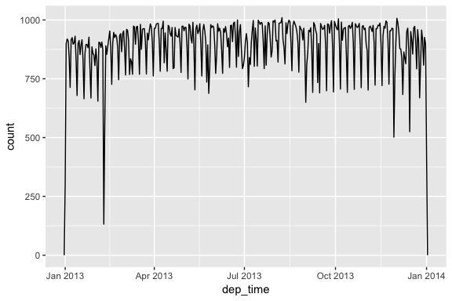
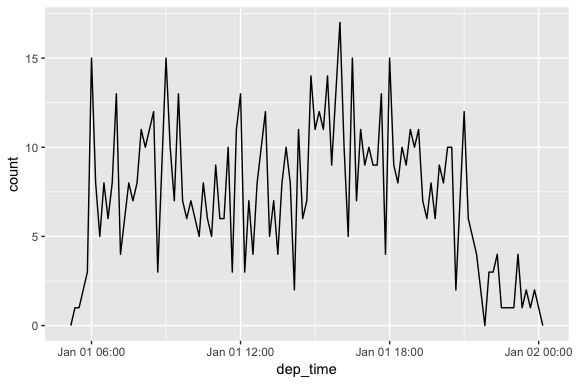
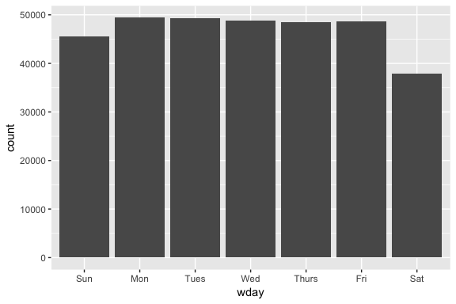
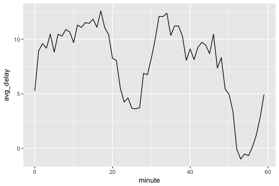
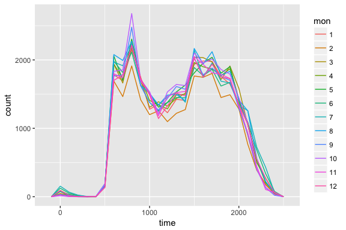
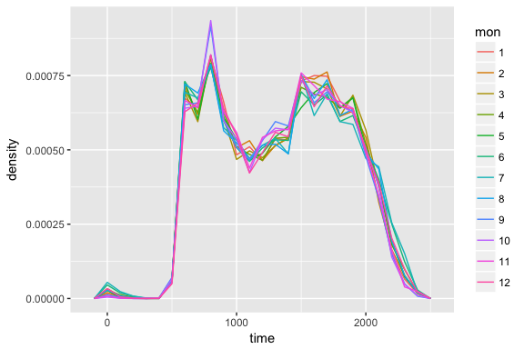
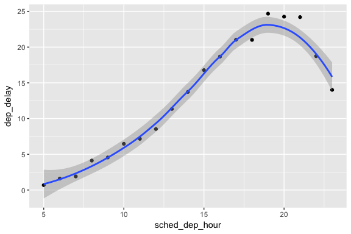
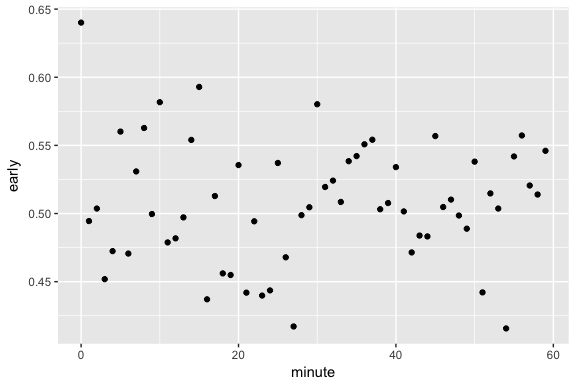
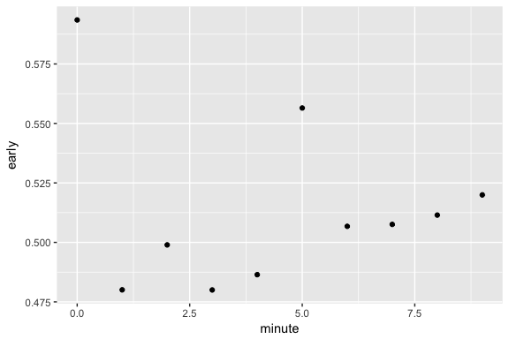

# Chapter 16
Miguel Arias  
9/5/2017  


## Dates and times


### 16.2 Creating date/times

Three types of date/time data
1. A **date**. Tibbles print this as `<date>`
2. A **time** within a day. Tibbles print this as `<time>`
3. A **date-time** is a date plus a time. Tibbles print this as `<dttm>`.

To get current date or date-time:

```r
today()
```

```
## [1] "2017-09-05"
```

```r
now()
```

```
## [1] "2017-09-05 17:51:13 EDT"
```

#### 16.2.1 From strings


```r
ymd("2017-01-31")
```

```
## [1] "2017-01-31"
```

```r
mdy("January 31st, 2017")
```

```
## [1] "2017-01-31"
```

```r
dmy("31-Jan-2017")
```

```
## [1] "2017-01-31"
```

```r
# ymd() and the ones above create dates. Can add an "_"
# and one or more of "h", "m", and "s" to add time
ymd_hms("2017-01-31 20:11:59")
```

```
## [1] "2017-01-31 20:11:59 UTC"
```

```r
mdy_hm("01/31/2017 08:01")
```

```
## [1] "2017-01-31 08:01:00 UTC"
```

#### 16.2.2 From individual components


```r
flights %>% 
  select(year, month, day, hour, minute)
```

```
## # A tibble: 336,776 x 5
##     year month   day  hour minute
##    <int> <int> <int> <dbl>  <dbl>
##  1  2013     1     1     5     15
##  2  2013     1     1     5     29
##  3  2013     1     1     5     40
##  4  2013     1     1     5     45
##  5  2013     1     1     6      0
##  6  2013     1     1     5     58
##  7  2013     1     1     6      0
##  8  2013     1     1     6      0
##  9  2013     1     1     6      0
## 10  2013     1     1     6      0
## # ... with 336,766 more rows
```

To create a date/time from this input, use `make_date()` or `make_datetime()`.


```r
flights %>% 
  select(year, month, day, hour, minute) %>% 
  mutate(departure = make_datetime(year, month, day, hour, minute))
```

```
## # A tibble: 336,776 x 6
##     year month   day  hour minute           departure
##    <int> <int> <int> <dbl>  <dbl>              <dttm>
##  1  2013     1     1     5     15 2013-01-01 05:15:00
##  2  2013     1     1     5     29 2013-01-01 05:29:00
##  3  2013     1     1     5     40 2013-01-01 05:40:00
##  4  2013     1     1     5     45 2013-01-01 05:45:00
##  5  2013     1     1     6      0 2013-01-01 06:00:00
##  6  2013     1     1     5     58 2013-01-01 05:58:00
##  7  2013     1     1     6      0 2013-01-01 06:00:00
##  8  2013     1     1     6      0 2013-01-01 06:00:00
##  9  2013     1     1     6      0 2013-01-01 06:00:00
## 10  2013     1     1     6      0 2013-01-01 06:00:00
## # ... with 336,766 more rows
```

Let's do the same for each time column in `flights`

```r
make_datetime_100 <- function(year, month, day, time) {
  make_datetime(year, month, day, time %/% 100, time %% 100)
}

flights_dt <- flights %>% 
  filter(!is.na(dep_time), !is.na(arr_time)) %>% 
  mutate(
    dep_time = make_datetime_100(year, month, day, dep_time),
    arr_time = make_datetime_100(year, month, day, arr_time),
    sched_dep_time = make_datetime_100(year, month, day, sched_dep_time),
    sched_arr_time = make_datetime_100(year, month, day, sched_arr_time)
  ) %>% 
  select(origin, dest, ends_with("delay"), ends_with("time"))
```

Now we can visualize the distribution of departure time across the year:


```r
flights_dt %>% 
  ggplot(aes(dep_time)) + 
  geom_freqpoly(binwidth = 86400) # 86400 seconds = 1
```

<!-- -->

```r
# Or within a single day:
flights_dt %>% 
  filter(dep_time < ymd(20130102)) %>% 
  ggplot(aes(dep_time)) + 
  geom_freqpoly(binwidth = 600) # 600 s = 10 minutes
```

<!-- -->

Mqy want to switch between date and date-time:
* `as_datetime()`
* `as_date()`

#### 16.2.4 Exercises

1. What happens if you parse a string that conatins invalid dates?


```r
ymd(c("2010-10-10", "bananas"))
```

```
## Warning: 1 failed to parse.
```

```
## [1] "2010-10-10" NA
```

It parses the valid dates and returns the invalid ones as `NA` and produces a warning message.

2. What does the `tzone` argument to `today()` do? Why is it important?

It is a character vector that specifies the time zone that should be used for the date. It's important since the value of `today()` can vary depending on the time-zone specified.

3. Use the appropriate lubridate function to parse each of the following dates:


```r
d1 <- "January 1, 2010"
mdy(d1)
```

```
## [1] "2010-01-01"
```

```r
d2 <- "2015-Mar-07"
ymd(d2)
```

```
## [1] "2015-03-07"
```

```r
d3 <- "06-Jun-2017"
dmy(d3)
```

```
## [1] "2017-06-06"
```

```r
d4 <- c("August 19 (2015)", "July 1 (2015)")
mdy(d4)
```

```
## [1] "2015-08-19" "2015-07-01"
```

```r
d5 <- "12/30/14" # Dec 30, 2014
mdy(d5)
```

```
## [1] "2014-12-30"
```

### 16.3 Date-time components

Components:
* `year()`
* `month()`
* `mday()`: day of the month
* `yday()`: day of the year
* `wday()`: day of the week
* `hour()`
* `minute()`
* `second()`


```r
datetime <- ymd_hms("2016-07-08 12:34:56")
year(datetime)
```

```
## [1] 2016
```

```r
month(datetime)
```

```
## [1] 7
```

```r
month(datetime, label = TRUE)
```

```
## [1] Jul
## 12 Levels: Jan < Feb < Mar < Apr < May < Jun < Jul < Aug < Sep < ... < Dec
```

```r
mday(datetime)
```

```
## [1] 8
```

```r
yday(datetime)
```

```
## [1] 190
```

```r
wday(datetime)
```

```
## [1] 6
```

```r
wday(datetime, label = TRUE)
```

```
## [1] Fri
## Levels: Sun < Mon < Tues < Wed < Thurs < Fri < Sat
```

Can use `wday()` too see what time during the week there are more departures.


```r
flights_dt %>%
  mutate(wday = wday(dep_time, label = TRUE)) %>%
  ggplot(aes(wday)) + 
  geom_bar()
```

<!-- -->

By looking at flights avg dep delay by minute within the hour we can see at what time flights are more delayed:

```r
flights_dt %>% 
  mutate(minute = minute(dep_time)) %>% 
  group_by(minute) %>% 
  summarise(
    avg_delay = mean(arr_delay, na.rm = TRUE),
    n = n()) %>% 
  ggplot(aes(minute, avg_delay)) +
    geom_line()
```

<!-- -->

#### 16.3.2 Rounding

* `floor_date()`: rounds down
* `round_date()`: rounds to a set value
* `ceiling_date()`: rounds up

#### 16.3.4 Exercises

1. How does the distribution of flight times within a day change over the course of the year?


```r
# By month
flights_dt %>%
  mutate(time = hour(dep_time) * 100 + minute(dep_time),
         mon = as.factor(month
                         (dep_time))) %>%
  ggplot(aes(x = time, group = mon, color = mon)) +
  geom_freqpoly(binwidth = 100)
```

<!-- -->

```r
# Normalize the data (Feb has 28 days)
flights_dt %>%
  mutate(time = hour(dep_time) * 100 + minute(dep_time),
         mon = as.factor(month
                         (dep_time))) %>%
  ggplot(aes(x = time, y = ..density.., group = mon, color = mon)) +
  geom_freqpoly(binwidth = 100)
```

<!-- -->

2. Compare `dep_time`, `sched_dep_time` and `dep_delay`. Are they consistent? Explain your findings.

If they are consistent, `dep_time = sched_dep_time + dep_delay`.


```r
flights_dt %>%
  mutate(dep_time_ = sched_dep_time + dep_delay * 60) %>%
  filter(dep_time_ != dep_time) %>%
  select(dep_time_, dep_time, sched_dep_time, dep_delay)
```

```
## # A tibble: 1,205 x 4
##              dep_time_            dep_time      sched_dep_time dep_delay
##                 <dttm>              <dttm>              <dttm>     <dbl>
##  1 2013-01-02 08:48:00 2013-01-01 08:48:00 2013-01-01 18:35:00       853
##  2 2013-01-03 00:42:00 2013-01-02 00:42:00 2013-01-02 23:59:00        43
##  3 2013-01-03 01:26:00 2013-01-02 01:26:00 2013-01-02 22:50:00       156
##  4 2013-01-04 00:32:00 2013-01-03 00:32:00 2013-01-03 23:59:00        33
##  5 2013-01-04 00:50:00 2013-01-03 00:50:00 2013-01-03 21:45:00       185
##  6 2013-01-04 02:35:00 2013-01-03 02:35:00 2013-01-03 23:59:00       156
##  7 2013-01-05 00:25:00 2013-01-04 00:25:00 2013-01-04 23:59:00        26
##  8 2013-01-05 01:06:00 2013-01-04 01:06:00 2013-01-04 22:45:00       141
##  9 2013-01-06 00:14:00 2013-01-05 00:14:00 2013-01-05 23:59:00        15
## 10 2013-01-06 00:37:00 2013-01-05 00:37:00 2013-01-05 22:30:00       127
## # ... with 1,195 more rows
```

There are discrepancies. These are flights in whihc the actual departure time is on the next day relative to the scheduled departure time.

3. Compare `air_time` with the duration between the departure and arrival. Explain your findings


```r
flights_dt %>%
  mutate(flight_duration = as.numeric(arr_time - dep_time),
         air_time_mins = air_time,
         diff = flight_duration - air_time_mins) %>%
  select(origin, dest, flight_duration, air_time_mins, diff)
```

```
## # A tibble: 328,063 x 5
##    origin  dest flight_duration air_time_mins  diff
##     <chr> <chr>           <dbl>         <dbl> <dbl>
##  1    EWR   IAH             193           227   -34
##  2    LGA   IAH             197           227   -30
##  3    JFK   MIA             221           160    61
##  4    JFK   BQN             260           183    77
##  5    LGA   ATL             138           116    22
##  6    EWR   ORD             106           150   -44
##  7    EWR   FLL             198           158    40
##  8    LGA   IAD              72            53    19
##  9    JFK   MCO             161           140    21
## 10    LGA   ORD             115           138   -23
## # ... with 328,053 more rows
```

The difference can be attributed to different time zones and to the time it takes for passengers to leave the flight.

4. How does the average delay time change over the course of a day? Should you use `dep_time` or `sched_dep_time`? Why?

Use `sched_dep_time` as it is the relevant metric for someone scheduling a flight. As well, `dep_time` will always bias to later in the day since delays push flights farther up the schedule.


```r
flights_dt %>%
  mutate(sched_dep_hour = hour(sched_dep_time)) %>%
  group_by(sched_dep_hour) %>%
  summarise(dep_delay = mean(dep_delay)) %>%
  ggplot(aes(y = dep_delay, x = sched_dep_hour)) +
  geom_point() +
  geom_smooth()
```

```
## `geom_smooth()` using method = 'loess'
```

<!-- -->

5. On what day of the week should you leave if you want to minimize the change of a delay?


```r
flights_dt %>%
  mutate(dow = wday(sched_dep_time)) %>%
  group_by(dow) %>%
  summarise(dep_delay = mean(dep_delay),
            arr_delay = mean(arr_delay, na.rm = TRUE))
```

```
## # A tibble: 7 x 3
##     dow dep_delay arr_delay
##   <dbl>     <dbl>     <dbl>
## 1     1 11.495974  4.820024
## 2     2 14.734220  9.653739
## 3     3 10.591532  5.388526
## 4     4 11.699198  7.051119
## 5     5 16.064837 11.740819
## 6     6 14.660643  9.070120
## 7     7  7.620118 -1.448828
```

Sunday has the lowest avg dep delay and lowest avg delay.

7. The early departures of flights in minutes 20-30 and 50-60 is caused by scheduled flights that leave early. 


```r
flights_dt %>%
  mutate(early = dep_delay < 0,
         minute = minute(sched_dep_time)) %>%
  group_by(minute) %>%
  summarise(early = mean(early)) %>%
  ggplot(aes(x = minute, y = early)) +
  geom_point()
```

<!-- -->

```r
# But if grouped in 10 min intervals
flights_dt %>%
  mutate(early = dep_delay < 0,
         minute = minute(sched_dep_time) %% 10) %>%
  group_by(minute) %>%
  summarise(early = mean(early)) %>%
  ggplot(aes(x = minute, y = early)) +
  geom_point()
```

<!-- -->

### 16.4 Time spans

* **Durations** represent an exact number of seconds

```r
h_age <- today() - ymd(19791014)
as.duration(h_age)
```

```
## [1] "1195862400s (~37.89 years)"
```

```r
dseconds(15)
```

```
## [1] "15s"
```

```r
dminutes(10)
```

```
## [1] "600s (~10 minutes)"
```

```r
dhours(c(12, 24))
```

```
## [1] "43200s (~12 hours)" "86400s (~1 days)"
```

```r
ddays(0:5)
```

```
## [1] "0s"                "86400s (~1 days)"  "172800s (~2 days)"
## [4] "259200s (~3 days)" "345600s (~4 days)" "432000s (~5 days)"
```

```r
dweeks(3)
```

```
## [1] "1814400s (~3 weeks)"
```

```r
dyears(1)
```

```
## [1] "31536000s (~52.14 weeks)"
```

```r
# Can add and multiply them
2 * dyears(1)
```

```
## [1] "63072000s (~2 years)"
```

```r
dyears(1) + dweeks(12) + dhours(15)
```

```
## [1] "38847600s (~1.23 years)"
```

* **Periods** represent human units like weeks and months

```r
one_pm <- ymd_hms("2016-03-12 13:00:00", tz = "America/New_York")
one_pm + days(1)
```

```
## [1] "2016-03-13 13:00:00 EDT"
```

```r
seconds(15)
```

```
## [1] "15S"
```

```r
minutes(10)
```

```
## [1] "10M 0S"
```

```r
hours(c(12, 24))
```

```
## [1] "12H 0M 0S" "24H 0M 0S"
```

```r
days(7)
```

```
## [1] "7d 0H 0M 0S"
```

```r
months(1:6)
```

```
## [1] "1m 0d 0H 0M 0S" "2m 0d 0H 0M 0S" "3m 0d 0H 0M 0S" "4m 0d 0H 0M 0S"
## [5] "5m 0d 0H 0M 0S" "6m 0d 0H 0M 0S"
```

```r
weeks(3)
```

```
## [1] "21d 0H 0M 0S"
```

```r
years(1)
```

```
## [1] "1y 0m 0d 0H 0M 0S"
```

```r
# Can add and multiply periods
10 * (months(6) + days(1))
```

```
## [1] "60m 10d 0H 0M 0S"
```

```r
days(50) + hours(25) + minutes(2)
```

```
## [1] "50d 25H 2M 0S"
```

```r
# Can use periods to fix anomaliy of overnight flights
flights_dt <- flights_dt %>% 
  mutate(
    overnight = arr_time < dep_time,
    arr_time = arr_time + days(overnight * 1),
    sched_arr_time = sched_arr_time + days(overnight * 1)
  )
```

* **Intervals** represent a starting and ending point

```r
next_year <- today() + years(1)
(today() %--% next_year) / ddays(1)
```

```
## [1] 365
```

```r
# Need to use integer division to find how many periods fit into an interval
(today() %--% next_year) %/% days(1)
```

```
## Note: method with signature 'Timespan#Timespan' chosen for function '%/%',
##  target signature 'Interval#Period'.
##  "Interval#ANY", "ANY#Period" would also be valid
```

```
## [1] 365
```

#### 16.4.5 Exercises

1. Why is there no `dmonths()`?

No direct unambigous value of months in seconds:
* 31 days
* 30 days
* 28 or 29 days

2. Explain `days(overnight * 1)` to someone who has just started learning R. How does it work?

`overnight` is equal to TRUE (1) or FALSE (0). 

3. Create a vector of dates giving the first day of every month in 2015. Create a vector of dates giving the first day of every month in the current year.

A vector of the first day of the month for every month in 2015:

```r
ymd("2015-01-01") + months(0:11)
```

```
##  [1] "2015-01-01" "2015-02-01" "2015-03-01" "2015-04-01" "2015-05-01"
##  [6] "2015-06-01" "2015-07-01" "2015-08-01" "2015-09-01" "2015-10-01"
## [11] "2015-11-01" "2015-12-01"
```

To get the first day of the month of this year, first need to figure out what year it is, and get Jan 1st. Can do it by taking `today()` and truncating it to the year using `floor_date`:


```r
floor_date(today(), unit = "year") + months(0:11)
```

```
##  [1] "2017-01-01" "2017-02-01" "2017-03-01" "2017-04-01" "2017-05-01"
##  [6] "2017-06-01" "2017-07-01" "2017-08-01" "2017-09-01" "2017-10-01"
## [11] "2017-11-01" "2017-12-01"
```

4. Write a function that given your birthday (as a date), returns how old you are in years.


```r
age <- function(bday) {
  (bday %--% today()) %/% years(1)
}
age(ymd("1995-08-15"))
```

```
## [1] 22
```

5. Why can't `(today() %--% (today() + years(1)))/months(1)` work?


```r
(today() %--% (today() + years(1))) %/% months(1)
```

```
## [1] 12
```

```r
(today() %--% (today() + years(1))) / months(1)
```

```
## [1] 12
```

It appears to work.

### 16.5 Time zones


```r
Sys.timezone()
```

```
## [1] "America/Toronto"
```

In R, the time zone is an attribute of the date-time that only controls printing.


```r
(x1 <- ymd_hms("2015-06-01 12:00:00", tz = "America/New_York"))
```

```
## [1] "2015-06-01 12:00:00 EDT"
```

```r
(x2 <- ymd_hms("2015-06-01 18:00:00", tz = "Europe/Copenhagen"))
```

```
## [1] "2015-06-01 18:00:00 CEST"
```

```r
(x3 <- ymd_hms("2015-06-02 04:00:00", tz = "Pacific/Auckland"))
```

```
## [1] "2015-06-02 04:00:00 NZST"
```

```r
x4 <- c(x1, x2, x3)
```

Can change the time zone in two ways:

1. Keep the instant in time the same, and change how it's displayed. Use this when the instant is correct, but you want a more natural display.

```r
x4a <- with_tz(x4, tzone = "Australia/Lord_Howe")
```

2. Change the underlying instant in time. Use this when you have an instant that has ben labelled with the incorrect time zone, and you need to fix it.

```r
x4b <- force_tz(x4, tzone = "Australia/Lord_Howe")
```
