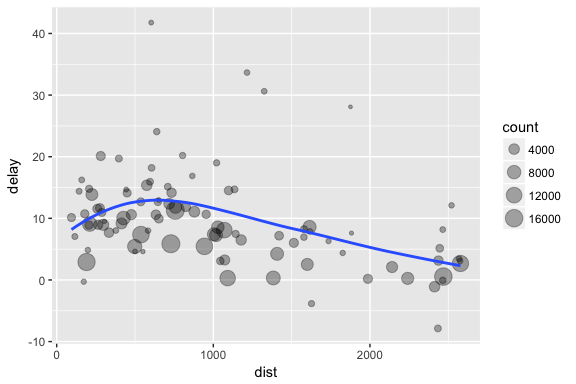
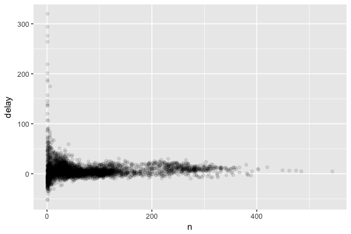
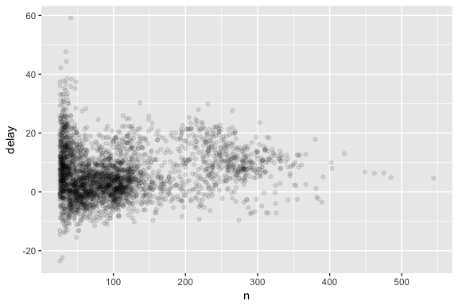
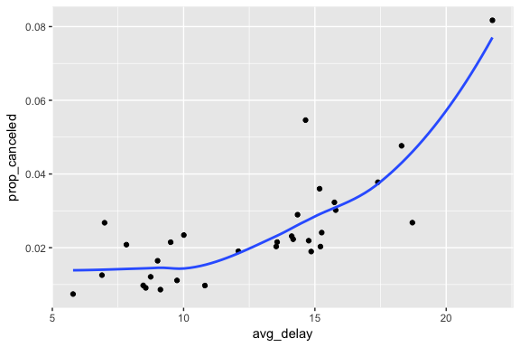
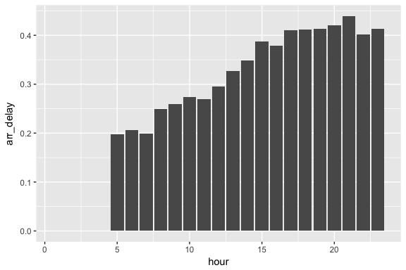
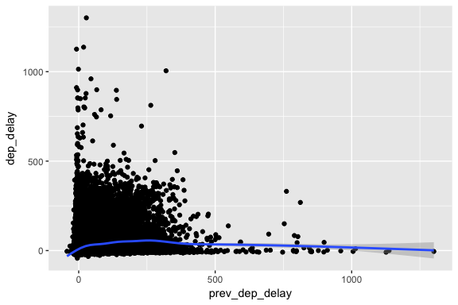

# Chapter 5
Miguel Arias  
9/5/2017  


# Data Transformation


```
## Loading tidyverse: ggplot2
## Loading tidyverse: tibble
## Loading tidyverse: tidyr
## Loading tidyverse: readr
## Loading tidyverse: purrr
## Loading tidyverse: dplyr
```

```
## Conflicts with tidy packages ----------------------------------------------
```

```
## filter(): dplyr, stats
## lag():    dplyr, stats
```

**Tibbles*: data frames, but slightly tweaked to work better in the tidyverse.

* `int`: integers
* `dbl`: doubles, or real numbers
* `chr`: character vectors, or strings
* `dttm`: date-times (a date + a time)
* `lgl`: logical, `TRUE` or `FALSE`
* `fctr`: factors, R uses it to represent categorical variables with fixed possible values
* `date`: dates

## 5.1 Dplyr basics

* `filter()`: pick observations by their values
* `arrange()`: reorder the rows
* `select()`: pick variables by their names
* `mutate()`: create new variables with functions of existing variables
* `summarise()`: collapse many values down to a single summary.

## 5.2 Filter rows with filter

Filter `flights` for the flights that happened on January 1st.


```r
jan1 <- filter(flights, month == 1, day == 1)
```

Flights on December 25 (Christmas)

```r
(dec25 <- filter(flights, month == 12, day == 25))
```

```
## # A tibble: 719 x 19
##     year month   day dep_time sched_dep_time dep_delay arr_time
##    <int> <int> <int>    <int>          <int>     <dbl>    <int>
##  1  2013    12    25      456            500        -4      649
##  2  2013    12    25      524            515         9      805
##  3  2013    12    25      542            540         2      832
##  4  2013    12    25      546            550        -4     1022
##  5  2013    12    25      556            600        -4      730
##  6  2013    12    25      557            600        -3      743
##  7  2013    12    25      557            600        -3      818
##  8  2013    12    25      559            600        -1      855
##  9  2013    12    25      559            600        -1      849
## 10  2013    12    25      600            600         0      850
## # ... with 709 more rows, and 12 more variables: sched_arr_time <int>,
## #   arr_delay <dbl>, carrier <chr>, flight <int>, tailnum <chr>,
## #   origin <chr>, dest <chr>, air_time <dbl>, distance <dbl>, hour <dbl>,
## #   minute <dbl>, time_hour <dttm>
```

### 5.2.2 Logical operators

`&` is "and", `|` is "or", and `!` is "not".

The following code finds all the flights that departed in November or December:

```r
filter(flights, month == 11 | month == 12)
```

```
## # A tibble: 55,403 x 19
##     year month   day dep_time sched_dep_time dep_delay arr_time
##    <int> <int> <int>    <int>          <int>     <dbl>    <int>
##  1  2013    11     1        5           2359         6      352
##  2  2013    11     1       35           2250       105      123
##  3  2013    11     1      455            500        -5      641
##  4  2013    11     1      539            545        -6      856
##  5  2013    11     1      542            545        -3      831
##  6  2013    11     1      549            600       -11      912
##  7  2013    11     1      550            600       -10      705
##  8  2013    11     1      554            600        -6      659
##  9  2013    11     1      554            600        -6      826
## 10  2013    11     1      554            600        -6      749
## # ... with 55,393 more rows, and 12 more variables: sched_arr_time <int>,
## #   arr_delay <dbl>, carrier <chr>, flight <int>, tailnum <chr>,
## #   origin <chr>, dest <chr>, air_time <dbl>, distance <dbl>, hour <dbl>,
## #   minute <dbl>, time_hour <dttm>
```

```r
nov_dec <- filter(flights, month %in% c(11,12))
```

Can simplify complicated subsetting by remembering De Morgan's law: `!(x &  y)` is the same as `!x | !y`, and `!(x | y)` is the same as `!x & !y`.

Find flights that weren't delayed (on arrival or departure) by more than two hours, you could use either of the following two filters:


```filter
filter(flights, !(arr_delay > 120 | dep_delay > 120))

filter(flights, arr_delay <= 120, dep_delay <= 120)
```

If you want to determine if a value is missing, use `is.na()`:


```r
x <- NA
is.na(x)
```

```
## [1] TRUE
```

### 5.2.4 Exercises

1. Find all flights that

  * Had an arrival delay of two or more hours
  

```r
library(nycflights13)
filter(flights, arr_delay >= 120)
```

```
## # A tibble: 10,200 x 19
##     year month   day dep_time sched_dep_time dep_delay arr_time
##    <int> <int> <int>    <int>          <int>     <dbl>    <int>
##  1  2013     1     1      811            630       101     1047
##  2  2013     1     1      848           1835       853     1001
##  3  2013     1     1      957            733       144     1056
##  4  2013     1     1     1114            900       134     1447
##  5  2013     1     1     1505           1310       115     1638
##  6  2013     1     1     1525           1340       105     1831
##  7  2013     1     1     1549           1445        64     1912
##  8  2013     1     1     1558           1359       119     1718
##  9  2013     1     1     1732           1630        62     2028
## 10  2013     1     1     1803           1620       103     2008
## # ... with 10,190 more rows, and 12 more variables: sched_arr_time <int>,
## #   arr_delay <dbl>, carrier <chr>, flight <int>, tailnum <chr>,
## #   origin <chr>, dest <chr>, air_time <dbl>, distance <dbl>, hour <dbl>,
## #   minute <dbl>, time_hour <dttm>
```
  
  * Flew to Houston (`IAH` or `HOU`)

```r
filter(flights, dest %in% c('IAH','HOU'))
```

```
## # A tibble: 9,313 x 19
##     year month   day dep_time sched_dep_time dep_delay arr_time
##    <int> <int> <int>    <int>          <int>     <dbl>    <int>
##  1  2013     1     1      517            515         2      830
##  2  2013     1     1      533            529         4      850
##  3  2013     1     1      623            627        -4      933
##  4  2013     1     1      728            732        -4     1041
##  5  2013     1     1      739            739         0     1104
##  6  2013     1     1      908            908         0     1228
##  7  2013     1     1     1028           1026         2     1350
##  8  2013     1     1     1044           1045        -1     1352
##  9  2013     1     1     1114            900       134     1447
## 10  2013     1     1     1205           1200         5     1503
## # ... with 9,303 more rows, and 12 more variables: sched_arr_time <int>,
## #   arr_delay <dbl>, carrier <chr>, flight <int>, tailnum <chr>,
## #   origin <chr>, dest <chr>, air_time <dbl>, distance <dbl>, hour <dbl>,
## #   minute <dbl>, time_hour <dttm>
```

```r
filter(flights, dest == "IAH" | dest == "HOU")
```

```
## # A tibble: 9,313 x 19
##     year month   day dep_time sched_dep_time dep_delay arr_time
##    <int> <int> <int>    <int>          <int>     <dbl>    <int>
##  1  2013     1     1      517            515         2      830
##  2  2013     1     1      533            529         4      850
##  3  2013     1     1      623            627        -4      933
##  4  2013     1     1      728            732        -4     1041
##  5  2013     1     1      739            739         0     1104
##  6  2013     1     1      908            908         0     1228
##  7  2013     1     1     1028           1026         2     1350
##  8  2013     1     1     1044           1045        -1     1352
##  9  2013     1     1     1114            900       134     1447
## 10  2013     1     1     1205           1200         5     1503
## # ... with 9,303 more rows, and 12 more variables: sched_arr_time <int>,
## #   arr_delay <dbl>, carrier <chr>, flight <int>, tailnum <chr>,
## #   origin <chr>, dest <chr>, air_time <dbl>, distance <dbl>, hour <dbl>,
## #   minute <dbl>, time_hour <dttm>
```

  * Were operated by United, American, or Delta

```r
filter(flights, carrier %in% c("UA","AA","DL"))
```

```
## # A tibble: 139,504 x 19
##     year month   day dep_time sched_dep_time dep_delay arr_time
##    <int> <int> <int>    <int>          <int>     <dbl>    <int>
##  1  2013     1     1      517            515         2      830
##  2  2013     1     1      533            529         4      850
##  3  2013     1     1      542            540         2      923
##  4  2013     1     1      554            600        -6      812
##  5  2013     1     1      554            558        -4      740
##  6  2013     1     1      558            600        -2      753
##  7  2013     1     1      558            600        -2      924
##  8  2013     1     1      558            600        -2      923
##  9  2013     1     1      559            600        -1      941
## 10  2013     1     1      559            600        -1      854
## # ... with 139,494 more rows, and 12 more variables: sched_arr_time <int>,
## #   arr_delay <dbl>, carrier <chr>, flight <int>, tailnum <chr>,
## #   origin <chr>, dest <chr>, air_time <dbl>, distance <dbl>, hour <dbl>,
## #   minute <dbl>, time_hour <dttm>
```

  * Departed in summer (July, August, and September)

```r
filter(flights, month %in% c(6,7,8))
```

```
## # A tibble: 86,995 x 19
##     year month   day dep_time sched_dep_time dep_delay arr_time
##    <int> <int> <int>    <int>          <int>     <dbl>    <int>
##  1  2013     6     1        2           2359         3      341
##  2  2013     6     1      451            500        -9      624
##  3  2013     6     1      506            515        -9      715
##  4  2013     6     1      534            545       -11      800
##  5  2013     6     1      538            545        -7      925
##  6  2013     6     1      539            540        -1      832
##  7  2013     6     1      546            600       -14      850
##  8  2013     6     1      551            600        -9      828
##  9  2013     6     1      552            600        -8      647
## 10  2013     6     1      553            600        -7      700
## # ... with 86,985 more rows, and 12 more variables: sched_arr_time <int>,
## #   arr_delay <dbl>, carrier <chr>, flight <int>, tailnum <chr>,
## #   origin <chr>, dest <chr>, air_time <dbl>, distance <dbl>, hour <dbl>,
## #   minute <dbl>, time_hour <dttm>
```

  * Arrived more than two hours late, but didn't leave late

```r
filter(flights, arr_delay >= 120 & dep_delay <= 0)
```

```
## # A tibble: 29 x 19
##     year month   day dep_time sched_dep_time dep_delay arr_time
##    <int> <int> <int>    <int>          <int>     <dbl>    <int>
##  1  2013     1    27     1419           1420        -1     1754
##  2  2013    10     7     1350           1350         0     1736
##  3  2013    10     7     1357           1359        -2     1858
##  4  2013    10    16      657            700        -3     1258
##  5  2013    11     1      658            700        -2     1329
##  6  2013     3    18     1844           1847        -3       39
##  7  2013     4    17     1635           1640        -5     2049
##  8  2013     4    18      558            600        -2     1149
##  9  2013     4    18      655            700        -5     1213
## 10  2013     5    22     1827           1830        -3     2217
## # ... with 19 more rows, and 12 more variables: sched_arr_time <int>,
## #   arr_delay <dbl>, carrier <chr>, flight <int>, tailnum <chr>,
## #   origin <chr>, dest <chr>, air_time <dbl>, distance <dbl>, hour <dbl>,
## #   minute <dbl>, time_hour <dttm>
```

  * Were delayed by at least an hour, but made up over 30 minutes in flight

```r
filter(flights, dep_delay >=60 & (dep_delay - arr_delay) <=60)
```

```
## # A tibble: 26,772 x 19
##     year month   day dep_time sched_dep_time dep_delay arr_time
##    <int> <int> <int>    <int>          <int>     <dbl>    <int>
##  1  2013     1     1      811            630       101     1047
##  2  2013     1     1      826            715        71     1136
##  3  2013     1     1      848           1835       853     1001
##  4  2013     1     1      957            733       144     1056
##  5  2013     1     1     1114            900       134     1447
##  6  2013     1     1     1120            944        96     1331
##  7  2013     1     1     1301           1150        71     1518
##  8  2013     1     1     1337           1220        77     1649
##  9  2013     1     1     1400           1250        70     1645
## 10  2013     1     1     1505           1310       115     1638
## # ... with 26,762 more rows, and 12 more variables: sched_arr_time <int>,
## #   arr_delay <dbl>, carrier <chr>, flight <int>, tailnum <chr>,
## #   origin <chr>, dest <chr>, air_time <dbl>, distance <dbl>, hour <dbl>,
## #   minute <dbl>, time_hour <dttm>
```

  * Departed between midnight and 6am (inclusive)

```r
filter(flights, dep_time >= 0, dep_time <= 600)
```

```
## # A tibble: 9,344 x 19
##     year month   day dep_time sched_dep_time dep_delay arr_time
##    <int> <int> <int>    <int>          <int>     <dbl>    <int>
##  1  2013     1     1      517            515         2      830
##  2  2013     1     1      533            529         4      850
##  3  2013     1     1      542            540         2      923
##  4  2013     1     1      544            545        -1     1004
##  5  2013     1     1      554            600        -6      812
##  6  2013     1     1      554            558        -4      740
##  7  2013     1     1      555            600        -5      913
##  8  2013     1     1      557            600        -3      709
##  9  2013     1     1      557            600        -3      838
## 10  2013     1     1      558            600        -2      753
## # ... with 9,334 more rows, and 12 more variables: sched_arr_time <int>,
## #   arr_delay <dbl>, carrier <chr>, flight <int>, tailnum <chr>,
## #   origin <chr>, dest <chr>, air_time <dbl>, distance <dbl>, hour <dbl>,
## #   minute <dbl>, time_hour <dttm>
```

2. Another useful dplyr filtering helper is `between()`. What does it do? Can you use it to simplify the code needed to answer the previous challenges?

It's a shorcut for `x >= left & x <= right`. It can be used to answer the previous questions in a simpler manner.

For example:


```r
filter(flights, month >= 7, month <= 9)
```

```
## # A tibble: 86,326 x 19
##     year month   day dep_time sched_dep_time dep_delay arr_time
##    <int> <int> <int>    <int>          <int>     <dbl>    <int>
##  1  2013     7     1        1           2029       212      236
##  2  2013     7     1        2           2359         3      344
##  3  2013     7     1       29           2245       104      151
##  4  2013     7     1       43           2130       193      322
##  5  2013     7     1       44           2150       174      300
##  6  2013     7     1       46           2051       235      304
##  7  2013     7     1       48           2001       287      308
##  8  2013     7     1       58           2155       183      335
##  9  2013     7     1      100           2146       194      327
## 10  2013     7     1      100           2245       135      337
## # ... with 86,316 more rows, and 12 more variables: sched_arr_time <int>,
## #   arr_delay <dbl>, carrier <chr>, flight <int>, tailnum <chr>,
## #   origin <chr>, dest <chr>, air_time <dbl>, distance <dbl>, hour <dbl>,
## #   minute <dbl>, time_hour <dttm>
```

```r
filter(flights, between(month, 7, 9))
```

```
## # A tibble: 86,326 x 19
##     year month   day dep_time sched_dep_time dep_delay arr_time
##    <int> <int> <int>    <int>          <int>     <dbl>    <int>
##  1  2013     7     1        1           2029       212      236
##  2  2013     7     1        2           2359         3      344
##  3  2013     7     1       29           2245       104      151
##  4  2013     7     1       43           2130       193      322
##  5  2013     7     1       44           2150       174      300
##  6  2013     7     1       46           2051       235      304
##  7  2013     7     1       48           2001       287      308
##  8  2013     7     1       58           2155       183      335
##  9  2013     7     1      100           2146       194      327
## 10  2013     7     1      100           2245       135      337
## # ... with 86,316 more rows, and 12 more variables: sched_arr_time <int>,
## #   arr_delay <dbl>, carrier <chr>, flight <int>, tailnum <chr>,
## #   origin <chr>, dest <chr>, air_time <dbl>, distance <dbl>, hour <dbl>,
## #   minute <dbl>, time_hour <dttm>
```

3. How many flights have a missing `dep_time`? What other variables are missing? What might these rows represent?


```r
filter(flights, is.na(dep_time))
```

```
## # A tibble: 8,255 x 19
##     year month   day dep_time sched_dep_time dep_delay arr_time
##    <int> <int> <int>    <int>          <int>     <dbl>    <int>
##  1  2013     1     1       NA           1630        NA       NA
##  2  2013     1     1       NA           1935        NA       NA
##  3  2013     1     1       NA           1500        NA       NA
##  4  2013     1     1       NA            600        NA       NA
##  5  2013     1     2       NA           1540        NA       NA
##  6  2013     1     2       NA           1620        NA       NA
##  7  2013     1     2       NA           1355        NA       NA
##  8  2013     1     2       NA           1420        NA       NA
##  9  2013     1     2       NA           1321        NA       NA
## 10  2013     1     2       NA           1545        NA       NA
## # ... with 8,245 more rows, and 12 more variables: sched_arr_time <int>,
## #   arr_delay <dbl>, carrier <chr>, flight <int>, tailnum <chr>,
## #   origin <chr>, dest <chr>, air_time <dbl>, distance <dbl>, hour <dbl>,
## #   minute <dbl>, time_hour <dttm>
```

There are 8,245 flights missing `dep_time`. There are also missing values for arrival time and departure/arrival delay. These flights were most likely cancelled.

4. Why is `NA ^ 0` not missing? Why is `NA | TRUE` not missing? Why is `FALSE & NA` not missing? Can you figure out the general rule? (`NA * 0` is a tricky counterexample)

`NA ^ 0`: by definition anything to the 0th power is 1.

`NA | TRUE`: as long as one condition is `TRUE`, the result is `TRUE`.

`FALSE & NA`: `NA` indicates the absence of a value, so the conditional expression ignores it.

## 5.3 Arrange rows with `arrange()`

`arrange()` works similarly to `filter()` except that instead of selecting rows, it changes their order.


```r
arrange(flights, year, month, day)
```

```
## # A tibble: 336,776 x 19
##     year month   day dep_time sched_dep_time dep_delay arr_time
##    <int> <int> <int>    <int>          <int>     <dbl>    <int>
##  1  2013     1     1      517            515         2      830
##  2  2013     1     1      533            529         4      850
##  3  2013     1     1      542            540         2      923
##  4  2013     1     1      544            545        -1     1004
##  5  2013     1     1      554            600        -6      812
##  6  2013     1     1      554            558        -4      740
##  7  2013     1     1      555            600        -5      913
##  8  2013     1     1      557            600        -3      709
##  9  2013     1     1      557            600        -3      838
## 10  2013     1     1      558            600        -2      753
## # ... with 336,766 more rows, and 12 more variables: sched_arr_time <int>,
## #   arr_delay <dbl>, carrier <chr>, flight <int>, tailnum <chr>,
## #   origin <chr>, dest <chr>, air_time <dbl>, distance <dbl>, hour <dbl>,
## #   minute <dbl>, time_hour <dttm>
```

Can use `desc()` to re-order by a column in descending order:


```r
arrange(flights, desc(arr_delay))
```

```
## # A tibble: 336,776 x 19
##     year month   day dep_time sched_dep_time dep_delay arr_time
##    <int> <int> <int>    <int>          <int>     <dbl>    <int>
##  1  2013     1     9      641            900      1301     1242
##  2  2013     6    15     1432           1935      1137     1607
##  3  2013     1    10     1121           1635      1126     1239
##  4  2013     9    20     1139           1845      1014     1457
##  5  2013     7    22      845           1600      1005     1044
##  6  2013     4    10     1100           1900       960     1342
##  7  2013     3    17     2321            810       911      135
##  8  2013     7    22     2257            759       898      121
##  9  2013    12     5      756           1700       896     1058
## 10  2013     5     3     1133           2055       878     1250
## # ... with 336,766 more rows, and 12 more variables: sched_arr_time <int>,
## #   arr_delay <dbl>, carrier <chr>, flight <int>, tailnum <chr>,
## #   origin <chr>, dest <chr>, air_time <dbl>, distance <dbl>, hour <dbl>,
## #   minute <dbl>, time_hour <dttm>
```

Missing values are always sorted at the end:


```r
df <- tibble(x = c(5, 2, NA))
arrange(df, x)
```

```
## # A tibble: 3 x 1
##       x
##   <dbl>
## 1     2
## 2     5
## 3    NA
```

```r
arrange(df, desc(x))
```

```
## # A tibble: 3 x 1
##       x
##   <dbl>
## 1     5
## 2     2
## 3    NA
```

### 5.3.1 Exercises

1. How could you use `arrange()` to sort all missing values to the start? (Hint: use `is.na()`).


```r
# arrange(data, !is.na(.))
```

A working example:


```r
arrange(flights, !is.na(dep_time))
```

```
## # A tibble: 336,776 x 19
##     year month   day dep_time sched_dep_time dep_delay arr_time
##    <int> <int> <int>    <int>          <int>     <dbl>    <int>
##  1  2013     1     1       NA           1630        NA       NA
##  2  2013     1     1       NA           1935        NA       NA
##  3  2013     1     1       NA           1500        NA       NA
##  4  2013     1     1       NA            600        NA       NA
##  5  2013     1     2       NA           1540        NA       NA
##  6  2013     1     2       NA           1620        NA       NA
##  7  2013     1     2       NA           1355        NA       NA
##  8  2013     1     2       NA           1420        NA       NA
##  9  2013     1     2       NA           1321        NA       NA
## 10  2013     1     2       NA           1545        NA       NA
## # ... with 336,766 more rows, and 12 more variables: sched_arr_time <int>,
## #   arr_delay <dbl>, carrier <chr>, flight <int>, tailnum <chr>,
## #   origin <chr>, dest <chr>, air_time <dbl>, distance <dbl>, hour <dbl>,
## #   minute <dbl>, time_hour <dttm>
```

2. Sort `flights` to find the most delayed flights. Find the flights that left earliest.


```r
# Based on arrival delay
arrange(flights, desc(arr_delay))
```

```
## # A tibble: 336,776 x 19
##     year month   day dep_time sched_dep_time dep_delay arr_time
##    <int> <int> <int>    <int>          <int>     <dbl>    <int>
##  1  2013     1     9      641            900      1301     1242
##  2  2013     6    15     1432           1935      1137     1607
##  3  2013     1    10     1121           1635      1126     1239
##  4  2013     9    20     1139           1845      1014     1457
##  5  2013     7    22      845           1600      1005     1044
##  6  2013     4    10     1100           1900       960     1342
##  7  2013     3    17     2321            810       911      135
##  8  2013     7    22     2257            759       898      121
##  9  2013    12     5      756           1700       896     1058
## 10  2013     5     3     1133           2055       878     1250
## # ... with 336,766 more rows, and 12 more variables: sched_arr_time <int>,
## #   arr_delay <dbl>, carrier <chr>, flight <int>, tailnum <chr>,
## #   origin <chr>, dest <chr>, air_time <dbl>, distance <dbl>, hour <dbl>,
## #   minute <dbl>, time_hour <dttm>
```

```r
# Flights that left earliest
arrange(flights, dep_delay)
```

```
## # A tibble: 336,776 x 19
##     year month   day dep_time sched_dep_time dep_delay arr_time
##    <int> <int> <int>    <int>          <int>     <dbl>    <int>
##  1  2013    12     7     2040           2123       -43       40
##  2  2013     2     3     2022           2055       -33     2240
##  3  2013    11    10     1408           1440       -32     1549
##  4  2013     1    11     1900           1930       -30     2233
##  5  2013     1    29     1703           1730       -27     1947
##  6  2013     8     9      729            755       -26     1002
##  7  2013    10    23     1907           1932       -25     2143
##  8  2013     3    30     2030           2055       -25     2213
##  9  2013     3     2     1431           1455       -24     1601
## 10  2013     5     5      934            958       -24     1225
## # ... with 336,766 more rows, and 12 more variables: sched_arr_time <int>,
## #   arr_delay <dbl>, carrier <chr>, flight <int>, tailnum <chr>,
## #   origin <chr>, dest <chr>, air_time <dbl>, distance <dbl>, hour <dbl>,
## #   minute <dbl>, time_hour <dttm>
```

3. Sort `flights` to find the fastest flights.


```r
# Based on speed
arrange(flights, desc(distance/air_time))
```

```
## # A tibble: 336,776 x 19
##     year month   day dep_time sched_dep_time dep_delay arr_time
##    <int> <int> <int>    <int>          <int>     <dbl>    <int>
##  1  2013     5    25     1709           1700         9     1923
##  2  2013     7     2     1558           1513        45     1745
##  3  2013     5    13     2040           2025        15     2225
##  4  2013     3    23     1914           1910         4     2045
##  5  2013     1    12     1559           1600        -1     1849
##  6  2013    11    17      650            655        -5     1059
##  7  2013     2    21     2355           2358        -3      412
##  8  2013    11    17      759            800        -1     1212
##  9  2013    11    16     2003           1925        38       17
## 10  2013    11    16     2349           2359       -10      402
## # ... with 336,766 more rows, and 12 more variables: sched_arr_time <int>,
## #   arr_delay <dbl>, carrier <chr>, flight <int>, tailnum <chr>,
## #   origin <chr>, dest <chr>, air_time <dbl>, distance <dbl>, hour <dbl>,
## #   minute <dbl>, time_hour <dttm>
```

4. Which flights travelled the longest? Which travelled the shortest?


```r
# Longest
arrange(flights, desc(distance))
```

```
## # A tibble: 336,776 x 19
##     year month   day dep_time sched_dep_time dep_delay arr_time
##    <int> <int> <int>    <int>          <int>     <dbl>    <int>
##  1  2013     1     1      857            900        -3     1516
##  2  2013     1     2      909            900         9     1525
##  3  2013     1     3      914            900        14     1504
##  4  2013     1     4      900            900         0     1516
##  5  2013     1     5      858            900        -2     1519
##  6  2013     1     6     1019            900        79     1558
##  7  2013     1     7     1042            900       102     1620
##  8  2013     1     8      901            900         1     1504
##  9  2013     1     9      641            900      1301     1242
## 10  2013     1    10      859            900        -1     1449
## # ... with 336,766 more rows, and 12 more variables: sched_arr_time <int>,
## #   arr_delay <dbl>, carrier <chr>, flight <int>, tailnum <chr>,
## #   origin <chr>, dest <chr>, air_time <dbl>, distance <dbl>, hour <dbl>,
## #   minute <dbl>, time_hour <dttm>
```

```r
# Shortest
arrange(flights, distance)
```

```
## # A tibble: 336,776 x 19
##     year month   day dep_time sched_dep_time dep_delay arr_time
##    <int> <int> <int>    <int>          <int>     <dbl>    <int>
##  1  2013     7    27       NA            106        NA       NA
##  2  2013     1     3     2127           2129        -2     2222
##  3  2013     1     4     1240           1200        40     1333
##  4  2013     1     4     1829           1615       134     1937
##  5  2013     1     4     2128           2129        -1     2218
##  6  2013     1     5     1155           1200        -5     1241
##  7  2013     1     6     2125           2129        -4     2224
##  8  2013     1     7     2124           2129        -5     2212
##  9  2013     1     8     2127           2130        -3     2304
## 10  2013     1     9     2126           2129        -3     2217
## # ... with 336,766 more rows, and 12 more variables: sched_arr_time <int>,
## #   arr_delay <dbl>, carrier <chr>, flight <int>, tailnum <chr>,
## #   origin <chr>, dest <chr>, air_time <dbl>, distance <dbl>, hour <dbl>,
## #   minute <dbl>, time_hour <dttm>
```

## 5.4 Select columns with `select()`

`select()` allows you to rapidly zoom in on a useful subset using operations based on the names of variables.


```r
# Select columns by name
select(flights, year, month, day)
```

```
## # A tibble: 336,776 x 3
##     year month   day
##    <int> <int> <int>
##  1  2013     1     1
##  2  2013     1     1
##  3  2013     1     1
##  4  2013     1     1
##  5  2013     1     1
##  6  2013     1     1
##  7  2013     1     1
##  8  2013     1     1
##  9  2013     1     1
## 10  2013     1     1
## # ... with 336,766 more rows
```

```r
# Select all columns between year and day
select(flights, year:day)
```

```
## # A tibble: 336,776 x 3
##     year month   day
##    <int> <int> <int>
##  1  2013     1     1
##  2  2013     1     1
##  3  2013     1     1
##  4  2013     1     1
##  5  2013     1     1
##  6  2013     1     1
##  7  2013     1     1
##  8  2013     1     1
##  9  2013     1     1
## 10  2013     1     1
## # ... with 336,766 more rows
```

```r
# Select all columns except those from year to day (inclusive)
select(flights, -(year:day))
```

```
## # A tibble: 336,776 x 16
##    dep_time sched_dep_time dep_delay arr_time sched_arr_time arr_delay
##       <int>          <int>     <dbl>    <int>          <int>     <dbl>
##  1      517            515         2      830            819        11
##  2      533            529         4      850            830        20
##  3      542            540         2      923            850        33
##  4      544            545        -1     1004           1022       -18
##  5      554            600        -6      812            837       -25
##  6      554            558        -4      740            728        12
##  7      555            600        -5      913            854        19
##  8      557            600        -3      709            723       -14
##  9      557            600        -3      838            846        -8
## 10      558            600        -2      753            745         8
## # ... with 336,766 more rows, and 10 more variables: carrier <chr>,
## #   flight <int>, tailnum <chr>, origin <chr>, dest <chr>, air_time <dbl>,
## #   distance <dbl>, hour <dbl>, minute <dbl>, time_hour <dttm>
```

There are a number of helper functions you can use within `select()`:

* `starts_with("abc")`
* `ends_with("xyz")`
* `contains("ijk")`
* `matches("(.)\\1")`: selects variables that match a regular expression. This one matches any variables that contain repeated characters. More in **strings**.
*`num_range("x", 1:3)` matches `x1`, `x2` and `x3`.

Use `everything()` if there's a handful of variables that you want to move to the start of the data frame.


```r
select(flights, time_hour, air_time, everything())
```

```
## # A tibble: 336,776 x 19
##              time_hour air_time  year month   day dep_time sched_dep_time
##                 <dttm>    <dbl> <int> <int> <int>    <int>          <int>
##  1 2013-01-01 05:00:00      227  2013     1     1      517            515
##  2 2013-01-01 05:00:00      227  2013     1     1      533            529
##  3 2013-01-01 05:00:00      160  2013     1     1      542            540
##  4 2013-01-01 05:00:00      183  2013     1     1      544            545
##  5 2013-01-01 06:00:00      116  2013     1     1      554            600
##  6 2013-01-01 05:00:00      150  2013     1     1      554            558
##  7 2013-01-01 06:00:00      158  2013     1     1      555            600
##  8 2013-01-01 06:00:00       53  2013     1     1      557            600
##  9 2013-01-01 06:00:00      140  2013     1     1      557            600
## 10 2013-01-01 06:00:00      138  2013     1     1      558            600
## # ... with 336,766 more rows, and 12 more variables: dep_delay <dbl>,
## #   arr_time <int>, sched_arr_time <int>, arr_delay <dbl>, carrier <chr>,
## #   flight <int>, tailnum <chr>, origin <chr>, dest <chr>, distance <dbl>,
## #   hour <dbl>, minute <dbl>
```

### 5.4.1 Exercises

1. Brainstorm as many ways a spossible to select `dep_time`, `dep_delay`, `arr_time`, and `arr_delay` from `flights`.


```r
select(flights, dep_time, dep_delay, arr_time, arr_delay)
```

```
## # A tibble: 336,776 x 4
##    dep_time dep_delay arr_time arr_delay
##       <int>     <dbl>    <int>     <dbl>
##  1      517         2      830        11
##  2      533         4      850        20
##  3      542         2      923        33
##  4      544        -1     1004       -18
##  5      554        -6      812       -25
##  6      554        -4      740        12
##  7      555        -5      913        19
##  8      557        -3      709       -14
##  9      557        -3      838        -8
## 10      558        -2      753         8
## # ... with 336,766 more rows
```

```r
select(flights, starts_with("dep"), starts_with("arr"))
```

```
## # A tibble: 336,776 x 4
##    dep_time dep_delay arr_time arr_delay
##       <int>     <dbl>    <int>     <dbl>
##  1      517         2      830        11
##  2      533         4      850        20
##  3      542         2      923        33
##  4      544        -1     1004       -18
##  5      554        -6      812       -25
##  6      554        -4      740        12
##  7      555        -5      913        19
##  8      557        -3      709       -14
##  9      557        -3      838        -8
## 10      558        -2      753         8
## # ... with 336,766 more rows
```

```r
select(flights, ends_with("time"), ends_with("delay"))
```

```
## # A tibble: 336,776 x 7
##    dep_time sched_dep_time arr_time sched_arr_time air_time dep_delay
##       <int>          <int>    <int>          <int>    <dbl>     <dbl>
##  1      517            515      830            819      227         2
##  2      533            529      850            830      227         4
##  3      542            540      923            850      160         2
##  4      544            545     1004           1022      183        -1
##  5      554            600      812            837      116        -6
##  6      554            558      740            728      150        -4
##  7      555            600      913            854      158        -5
##  8      557            600      709            723       53        -3
##  9      557            600      838            846      140        -3
## 10      558            600      753            745      138        -2
## # ... with 336,766 more rows, and 1 more variables: arr_delay <dbl>
```

```r
select(flights, contains("delay"))
```

```
## # A tibble: 336,776 x 2
##    dep_delay arr_delay
##        <dbl>     <dbl>
##  1         2        11
##  2         4        20
##  3         2        33
##  4        -1       -18
##  5        -6       -25
##  6        -4        12
##  7        -5        19
##  8        -3       -14
##  9        -3        -8
## 10        -2         8
## # ... with 336,766 more rows
```

3. What does the `one_of()` function do? Why might it be useful in conjunction with this vector?


```r
vars <- c("year", "month", "day", "dep_delay", "arr_delay")

# one_of() selects any variable which matches one of the strings in the vector

select(flights, one_of(vars))
```

```
## # A tibble: 336,776 x 5
##     year month   day dep_delay arr_delay
##    <int> <int> <int>     <dbl>     <dbl>
##  1  2013     1     1         2        11
##  2  2013     1     1         4        20
##  3  2013     1     1         2        33
##  4  2013     1     1        -1       -18
##  5  2013     1     1        -6       -25
##  6  2013     1     1        -4        12
##  7  2013     1     1        -5        19
##  8  2013     1     1        -3       -14
##  9  2013     1     1        -3        -8
## 10  2013     1     1        -2         8
## # ... with 336,766 more rows
```

4. Does the result of running the following code surprise you? How do the select helpers deal with case by default? How can you chance that default?


```r
select(flights, contains("TIME"))
```

```
## # A tibble: 336,776 x 6
##    dep_time sched_dep_time arr_time sched_arr_time air_time
##       <int>          <int>    <int>          <int>    <dbl>
##  1      517            515      830            819      227
##  2      533            529      850            830      227
##  3      542            540      923            850      160
##  4      544            545     1004           1022      183
##  5      554            600      812            837      116
##  6      554            558      740            728      150
##  7      555            600      913            854      158
##  8      557            600      709            723       53
##  9      557            600      838            846      140
## 10      558            600      753            745      138
## # ... with 336,766 more rows, and 1 more variables: time_hour <dttm>
```

By default the select helpers ignore case. To adhere to case, set `ignore.case = FALSE` in the helper function. For example


```r
select(flights, contains("TIME", ignore.case = FALSE))
```

```
## # A tibble: 336,776 x 0
```

## 5.5 Add new variables with `mutate()`

`mutate()` always adds new columns at the end of your dataset so we'll start by creating a narrower dataset so we can see the new variables. Remember that when you're in RStudio, the easiest way to sell all the columns is 'View()`.


```r
flights_sml <- select(flights,
                      year:day,
                      ends_with("delay"),
                      distance,
                      air_time)

mutate(flights_sml, 
       gain = arr_delay - dep_delay,
       speed = distance / air_time * 60)
```

```
## # A tibble: 336,776 x 9
##     year month   day dep_delay arr_delay distance air_time  gain    speed
##    <int> <int> <int>     <dbl>     <dbl>    <dbl>    <dbl> <dbl>    <dbl>
##  1  2013     1     1         2        11     1400      227     9 370.0441
##  2  2013     1     1         4        20     1416      227    16 374.2731
##  3  2013     1     1         2        33     1089      160    31 408.3750
##  4  2013     1     1        -1       -18     1576      183   -17 516.7213
##  5  2013     1     1        -6       -25      762      116   -19 394.1379
##  6  2013     1     1        -4        12      719      150    16 287.6000
##  7  2013     1     1        -5        19     1065      158    24 404.4304
##  8  2013     1     1        -3       -14      229       53   -11 259.2453
##  9  2013     1     1        -3        -8      944      140    -5 404.5714
## 10  2013     1     1        -2         8      733      138    10 318.6957
## # ... with 336,766 more rows
```

Note that you can refer to columns that you've just created:


```r
mutate(flights_sml, 
       gain = arr_delay - dep_delay,
       hours = air_time / 60,
       gain_per_hour = gain / hours)
```

```
## # A tibble: 336,776 x 10
##     year month   day dep_delay arr_delay distance air_time  gain     hours
##    <int> <int> <int>     <dbl>     <dbl>    <dbl>    <dbl> <dbl>     <dbl>
##  1  2013     1     1         2        11     1400      227     9 3.7833333
##  2  2013     1     1         4        20     1416      227    16 3.7833333
##  3  2013     1     1         2        33     1089      160    31 2.6666667
##  4  2013     1     1        -1       -18     1576      183   -17 3.0500000
##  5  2013     1     1        -6       -25      762      116   -19 1.9333333
##  6  2013     1     1        -4        12      719      150    16 2.5000000
##  7  2013     1     1        -5        19     1065      158    24 2.6333333
##  8  2013     1     1        -3       -14      229       53   -11 0.8833333
##  9  2013     1     1        -3        -8      944      140    -5 2.3333333
## 10  2013     1     1        -2         8      733      138    10 2.3000000
## # ... with 336,766 more rows, and 1 more variables: gain_per_hour <dbl>
```

If you only want to keep the new variables, use `transmute()`:


```r
transmute(flights,
          gain = arr_delay - dep_delay,
          hours = air_time / 60,
          gain_per_hour = gain / hours)
```

```
## # A tibble: 336,776 x 3
##     gain     hours gain_per_hour
##    <dbl>     <dbl>         <dbl>
##  1     9 3.7833333      2.378855
##  2    16 3.7833333      4.229075
##  3    31 2.6666667     11.625000
##  4   -17 3.0500000     -5.573770
##  5   -19 1.9333333     -9.827586
##  6    16 2.5000000      6.400000
##  7    24 2.6333333      9.113924
##  8   -11 0.8833333    -12.452830
##  9    -5 2.3333333     -2.142857
## 10    10 2.3000000      4.347826
## # ... with 336,766 more rows
```


### 5.5.1 Useful creation functions

* Arithmetic operators: `+`, `-`, `*`, `/`, `^`.
* Useful in conjunction with the aggregate functions. For example, `x / sum(x)` calculates the proportion of a total, and `y - mean(y)` computes the difference from the mean.
* Modular arithmetic:
- `%/%` integer division
- `%%` remainder, where `x = y * (x %/% y) + (x %% y)`. Allows you to break integers into pieces.


```r
transmute(flights,
          dep_time,
          hour = dep_time %/% 100,
          minute = dep_time %% 100)
```

```
## # A tibble: 336,776 x 3
##    dep_time  hour minute
##       <int> <dbl>  <dbl>
##  1      517     5     17
##  2      533     5     33
##  3      542     5     42
##  4      544     5     44
##  5      554     5     54
##  6      554     5     54
##  7      555     5     55
##  8      557     5     57
##  9      557     5     57
## 10      558     5     58
## # ... with 336,766 more rows
```

* Logs: `log()`, `log2()`, `log10()`. In `log2()` a difference of 1 on the log scale corresponds to doubling on the original scale and a difference of -1 corresponds to halving.
* Offsets: `lead()` and `lag()`.


```r
(x <- 1:10)
```

```
##  [1]  1  2  3  4  5  6  7  8  9 10
```

```r
lag(x)
```

```
##  [1] NA  1  2  3  4  5  6  7  8  9
```

```r
lead(x)
```

```
##  [1]  2  3  4  5  6  7  8  9 10 NA
```

*Cummulative and rolling aggregates:
- `cumsum()`
- `cumprod()`
- `cummin()`
- `cummax()`
- and `dplyr` provides `cummean()` for cummulative means


```r
x
```

```
##  [1]  1  2  3  4  5  6  7  8  9 10
```

```r
cumsum(x)
```

```
##  [1]  1  3  6 10 15 21 28 36 45 55
```

```r
cummean(x)
```

```
##  [1] 1.0 1.5 2.0 2.5 3.0 3.5 4.0 4.5 5.0 5.5
```

* Ranking: there are a number of ranking functions, but you should start with `min_rank()`.


```r
y <- c(1, 2, 2, NA, 3, 4)
min_rank(y)
```

```
## [1]  1  2  2 NA  4  5
```

```r
min_rank(desc(y))
```

```
## [1]  5  3  3 NA  2  1
```

If `min_rank()` doesn't do what you need, look at the variants:


```r
row_number(y)
```

```
## [1]  1  2  3 NA  4  5
```

```r
dense_rank(y)
```

```
## [1]  1  2  2 NA  3  4
```

```r
percent_rank(y)
```

```
## [1] 0.00 0.25 0.25   NA 0.75 1.00
```

```r
cume_dist(y)
```

```
## [1] 0.2 0.6 0.6  NA 0.8 1.0
```

### 5.5.2 Exercises

1. Currently `dep_time` and `sched_dep_time` are convenient to look at, but hard to compute with because they're not continuous numbers. Convert them to a more convenient represenation of number of minutes since midnight.


```r
transmute(flights,
          dep_time = (dep_time %/% 100) * 60 + dep_time %% 100,
          sched_dep_time = (sched_dep_time %/% 100) * 60 + sched_dep_time %% 100)
```

```
## # A tibble: 336,776 x 2
##    dep_time sched_dep_time
##       <dbl>          <dbl>
##  1      317            315
##  2      333            329
##  3      342            340
##  4      344            345
##  5      354            360
##  6      354            358
##  7      355            360
##  8      357            360
##  9      357            360
## 10      358            360
## # ... with 336,766 more rows
```

2. Compare `air_time` with `arr_time - dep_time`. What do you expect to see? What do you expect to see? What do you need to do to fix it?


```r
transmute(flights,
          air_time,
          arr_time,
          dep_time,
          air_time_new = arr_time - dep_time)
```

```
## # A tibble: 336,776 x 4
##    air_time arr_time dep_time air_time_new
##       <dbl>    <int>    <int>        <int>
##  1      227      830      517          313
##  2      227      850      533          317
##  3      160      923      542          381
##  4      183     1004      544          460
##  5      116      812      554          258
##  6      150      740      554          186
##  7      158      913      555          358
##  8       53      709      557          152
##  9      140      838      557          281
## 10      138      753      558          195
## # ... with 336,766 more rows
```

They are not the same because `dep_time` and `arr_time` are not measured in minutes, but are numberical represenations of the time. we need to convert them to continuous numbers like above to make the correct calculation for `air_time`.


```r
transmute(flights,
          air_time,
          arr_time = (arr_time %/% 100) * 60 + arr_time %% 100,
          dep_time = (dep_time %/% 100) * 60 + dep_time %% 100,
          air_time_new = arr_time - dep_time)
```

```
## # A tibble: 336,776 x 4
##    air_time arr_time dep_time air_time_new
##       <dbl>    <dbl>    <dbl>        <dbl>
##  1      227      510      317          193
##  2      227      530      333          197
##  3      160      563      342          221
##  4      183      604      344          260
##  5      116      492      354          138
##  6      150      460      354          106
##  7      158      553      355          198
##  8       53      429      357           72
##  9      140      518      357          161
## 10      138      473      358          115
## # ... with 336,766 more rows
```

3. Compare `dep_time`, `sched_dep_time`, and `dep_delay`. How would you expect those three numbers to be related?

I expect that `dep_delay` = `dep_time - sched_dep_time`.


```r
transmute(flights,
          dep_time,
          sched_dep_time,
          dep_delay,
          dep_delay_new = dep_time - sched_dep_time)
```

```
## # A tibble: 336,776 x 4
##    dep_time sched_dep_time dep_delay dep_delay_new
##       <int>          <int>     <dbl>         <int>
##  1      517            515         2             2
##  2      533            529         4             4
##  3      542            540         2             2
##  4      544            545        -1            -1
##  5      554            600        -6           -46
##  6      554            558        -4            -4
##  7      555            600        -5           -45
##  8      557            600        -3           -43
##  9      557            600        -3           -43
## 10      558            600        -2           -42
## # ... with 336,766 more rows
```

4. Find the 10 most delayed flights using a ranking function. How do you want to handle ties? Carefully read the documentation for `min_rank()`.


```r
delayed <- mutate(flights, most_delayed = min_rank(desc(arr_delay)))
select(delayed, flight, most_delayed) %>%
  arrange(most_delayed)
```

```
## # A tibble: 336,776 x 2
##    flight most_delayed
##     <int>        <int>
##  1     51            1
##  2   3535            2
##  3   3695            3
##  4    177            4
##  5   3075            5
##  6   2391            6
##  7   2119            7
##  8   2047            8
##  9    172            9
## 10   3744           10
## # ... with 336,766 more rows
```

5. What does `1:3 + 1:10` return? Why?


```r
1:3 + 1:10
```

```
## Warning in 1:3 + 1:10: longer object length is not a multiple of shorter
## object length
```

```
##  [1]  2  4  6  5  7  9  8 10 12 11
```

Because the two vectors are not the same lenght, R **recycles* the shorter one until each vector is the same length. Then R adds the first elements together, then the second elements, and so on.

6. What trigonometric functions does R provide?

Cosine, sine, tangent, arc-tangent, arc-sine, arc-tangent, and the two-argument arc-tangent.

## 5.6 Grouped summaries with `summarise()`

`summarise()` is the last key verb. It collapses a data frame to a single row:


```r
summarise(flights, delay = mean(dep_delay, na.rm = TRUE))
```

```
## # A tibble: 1 x 1
##      delay
##      <dbl>
## 1 12.63907
```

`summarise()` is not very useful unless we pair it with `group_by()`. This changes the unit of analysis from the complete dataset to individual groups.


```r
by_day <- group_by(flights, year, month, day)
summarise(by_day, delay = mean(dep_delay, na.rm = TRUE))
```

```
## # A tibble: 365 x 4
## # Groups:   year, month [?]
##     year month   day     delay
##    <int> <int> <int>     <dbl>
##  1  2013     1     1 11.548926
##  2  2013     1     2 13.858824
##  3  2013     1     3 10.987832
##  4  2013     1     4  8.951595
##  5  2013     1     5  5.732218
##  6  2013     1     6  7.148014
##  7  2013     1     7  5.417204
##  8  2013     1     8  2.553073
##  9  2013     1     9  2.276477
## 10  2013     1    10  2.844995
## # ... with 355 more rows
```

### 5.6.1 Combining multiple operations with the pipe


```r
by_dest <- group_by(flights, dest)
delay <- summarise(by_dest,
                   count = n(),
                   dist = mean(distance, na.rm = TRUE),
                   delay = mean(arr_delay, na.rm = TRUE))
delay <- filter(delay, count > 20, dest != "HNL")

# It looks like delays increse with distance up to ~750 miles
# and then decrease. Maybe as flights get longer there's more
# ability to make up delays in the air
ggplot(data = delay, mapping = aes(x = dist, y = delay)) +
  geom_point(aes(size = count), alpha = 1/3) +
  geom_smooth(se = FALSE)
```

```
## `geom_smooth()` using method = 'loess'
```

<!-- -->

A simpler way to tackle this:

```r
delays <- flights %>%
  group_by(dest) %>%
  summarise(
    count = n(),
    dist = mean(distance, na.rm = TRUE),
    delay = mean(arr_delay, na.rm = TRUE)) %>%
  filter(count > 20, dest != "HNL")
```
  
Behind the scenes:
`x %>% f(y)` -> `f(x,y)` and `x %>% f(y) %>% g(z)` -> `g(f(x,y), z)`

### 5.6.2 Missing values

How to remove missing values. For example, by removing the cancelled flights we can obtain the most exact mean for delays for a day.


```r
not_cancelled <- flights %>%
  filter(!is.na(dep_delay), !is.na(arr_delay))

not_cancelled %>%
  group_by(year, month, day) %>%
  summarise(mean = mean(dep_delay))
```

```
## # A tibble: 365 x 4
## # Groups:   year, month [?]
##     year month   day      mean
##    <int> <int> <int>     <dbl>
##  1  2013     1     1 11.435620
##  2  2013     1     2 13.677802
##  3  2013     1     3 10.907778
##  4  2013     1     4  8.965859
##  5  2013     1     5  5.732218
##  6  2013     1     6  7.145959
##  7  2013     1     7  5.417204
##  8  2013     1     8  2.558296
##  9  2013     1     9  2.301232
## 10  2013     1    10  2.844995
## # ... with 355 more rows
```

### 5.6.3 Counts

Whenever you do any aggregation, it's always a good idea to include either a count (`n()`), or  aocunt of non-missing values (`sum(!is.na(x))`). This way you can check that you're not drawing conclusions based on very small amounts of data. For example, let's look at the planes (id by tail number) that have the highest average delays:


```r
delays <- not_cancelled %>% 
  group_by(tailnum) %>% 
  summarise(
    delay = mean(arr_delay, na.rm = TRUE),
    n = n()
  )

ggplot(data = delays, mapping = aes(x = n, y = delay)) + 
  geom_point(alpha = 1/10)
```

<!-- -->

Can put everything together by using a combination of `%>%` and `+`.


```r
delays %>% 
  filter(n > 25) %>% 
  ggplot(mapping = aes(x = n, y = delay)) + 
    geom_point(alpha = 1/10)
```

<!-- -->

### 5.6.4 Useful summary functions

* Measures of location: `mean(x)` and `median(x)`.


```r
not_cancelled %>% 
  group_by(year, month, day) %>% 
  summarise(
    avg_delay1 = mean(arr_delay),
    avg_delay2 = mean(arr_delay[arr_delay > 0]) # the average positive delay
  )
```

```
## # A tibble: 365 x 5
## # Groups:   year, month [?]
##     year month   day avg_delay1 avg_delay2
##    <int> <int> <int>      <dbl>      <dbl>
##  1  2013     1     1 12.6510229   32.48156
##  2  2013     1     2 12.6928879   32.02991
##  3  2013     1     3  5.7333333   27.66087
##  4  2013     1     4 -1.9328194   28.30976
##  5  2013     1     5 -1.5258020   22.55882
##  6  2013     1     6  4.2364294   24.37270
##  7  2013     1     7 -4.9473118   27.76132
##  8  2013     1     8 -3.2275785   20.78909
##  9  2013     1     9 -0.2642777   25.63415
## 10  2013     1    10 -5.8988159   27.34545
## # ... with 355 more rows
```

* Measures of spread: `sd(x)`, `IQR(x)`, `mad(x)`.


```r
# Why is distance to some destinations more variable than to others?
not_cancelled %>% 
  group_by(dest) %>% 
  summarise(distance_sd = sd(distance)) %>% 
  arrange(desc(distance_sd))
```

```
## # A tibble: 104 x 2
##     dest distance_sd
##    <chr>       <dbl>
##  1   EGE   10.542765
##  2   SAN   10.350094
##  3   SFO   10.216017
##  4   HNL   10.004197
##  5   SEA    9.977993
##  6   LAS    9.907786
##  7   PDX    9.873299
##  8   PHX    9.862546
##  9   LAX    9.657195
## 10   IND    9.458066
## # ... with 94 more rows
```

* Measures of rank: `min(x)`, `quantile(x, 0.25)`, `max(x)`. `quantile(x, 0.25)` will find a value of `x` that is gretaer than 25%, and les than the remaining 75%.


```r
# When do the first and last flights leave each day?
not_cancelled %>% 
  group_by(year, month, day) %>% 
  summarise(
    first = min(dep_time),
    last = max(dep_time)
  )
```

```
## # A tibble: 365 x 5
## # Groups:   year, month [?]
##     year month   day first  last
##    <int> <int> <int> <dbl> <dbl>
##  1  2013     1     1   517  2356
##  2  2013     1     2    42  2354
##  3  2013     1     3    32  2349
##  4  2013     1     4    25  2358
##  5  2013     1     5    14  2357
##  6  2013     1     6    16  2355
##  7  2013     1     7    49  2359
##  8  2013     1     8   454  2351
##  9  2013     1     9     2  2252
## 10  2013     1    10     3  2320
## # ... with 355 more rows
```

* Measures of position: `first(x)`, `nth(x,2)`, `last(x)`. These work similarly to `x[1]`, `x[2]`, and `x[length(x)]` but let you set a default value if that position does not exist.


```r
not_cancelled %>% 
  group_by(year, month, day) %>% 
  summarise(
    first_dep = first(dep_time), 
    last_dep = last(dep_time)
  )
```

```
## # A tibble: 365 x 5
## # Groups:   year, month [?]
##     year month   day first_dep last_dep
##    <int> <int> <int>     <int>    <int>
##  1  2013     1     1       517     2356
##  2  2013     1     2        42     2354
##  3  2013     1     3        32     2349
##  4  2013     1     4        25     2358
##  5  2013     1     5        14     2357
##  6  2013     1     6        16     2355
##  7  2013     1     7        49     2359
##  8  2013     1     8       454     2351
##  9  2013     1     9         2     2252
## 10  2013     1    10         3     2320
## # ... with 355 more rows
```

```r
# These functions are complementary to filtering on ranks.
# Filtering gives you all variables, with each obs in a separate row

not_cancelled %>% 
  group_by(year, month, day) %>% 
  mutate(r = min_rank(desc(dep_time))) %>% 
  filter(r %in% range(r))
```

```
## # A tibble: 770 x 20
## # Groups:   year, month, day [365]
##     year month   day dep_time sched_dep_time dep_delay arr_time
##    <int> <int> <int>    <int>          <int>     <dbl>    <int>
##  1  2013     1     1      517            515         2      830
##  2  2013     1     1     2356           2359        -3      425
##  3  2013     1     2       42           2359        43      518
##  4  2013     1     2     2354           2359        -5      413
##  5  2013     1     3       32           2359        33      504
##  6  2013     1     3     2349           2359       -10      434
##  7  2013     1     4       25           2359        26      505
##  8  2013     1     4     2358           2359        -1      429
##  9  2013     1     4     2358           2359        -1      436
## 10  2013     1     5       14           2359        15      503
## # ... with 760 more rows, and 13 more variables: sched_arr_time <int>,
## #   arr_delay <dbl>, carrier <chr>, flight <int>, tailnum <chr>,
## #   origin <chr>, dest <chr>, air_time <dbl>, distance <dbl>, hour <dbl>,
## #   minute <dbl>, time_hour <dttm>, r <int>
```

* Counts: `n()`, `sum(!is.na(x))`, and `n_distinct(x)` counts the number of unique values.


```r
# Which destinations have the most carriers?
not_cancelled %>% 
  group_by(dest) %>% 
  summarise(carriers = n_distinct(carrier)) %>% 
  arrange(desc(carriers))
```

```
## # A tibble: 104 x 2
##     dest carriers
##    <chr>    <int>
##  1   ATL        7
##  2   BOS        7
##  3   CLT        7
##  4   ORD        7
##  5   TPA        7
##  6   AUS        6
##  7   DCA        6
##  8   DTW        6
##  9   IAD        6
## 10   MSP        6
## # ... with 94 more rows
```

* Counts and prop of logical values: `sum(x > 10)`, `mean(y == 0)`.


```r
# How many flights left before 5am? (these usually indicate delayed
# flights from the previous day)
not_cancelled %>% 
  group_by(year, month, day) %>% 
  summarise(n_early = sum(dep_time < 500))
```

```
## # A tibble: 365 x 4
## # Groups:   year, month [?]
##     year month   day n_early
##    <int> <int> <int>   <int>
##  1  2013     1     1       0
##  2  2013     1     2       3
##  3  2013     1     3       4
##  4  2013     1     4       3
##  5  2013     1     5       3
##  6  2013     1     6       2
##  7  2013     1     7       2
##  8  2013     1     8       1
##  9  2013     1     9       3
## 10  2013     1    10       3
## # ... with 355 more rows
```

### 5.6.5 Grouping by multiple variables


```r
daily <- group_by(flights, year, month, day)
(per_day   <- summarise(daily, flights = n()))
```

```
## # A tibble: 365 x 4
## # Groups:   year, month [?]
##     year month   day flights
##    <int> <int> <int>   <int>
##  1  2013     1     1     842
##  2  2013     1     2     943
##  3  2013     1     3     914
##  4  2013     1     4     915
##  5  2013     1     5     720
##  6  2013     1     6     832
##  7  2013     1     7     933
##  8  2013     1     8     899
##  9  2013     1     9     902
## 10  2013     1    10     932
## # ... with 355 more rows
```

```r
(per_month <- summarise(per_day, flights = sum(flights)))
```

```
## # A tibble: 12 x 3
## # Groups:   year [?]
##     year month flights
##    <int> <int>   <int>
##  1  2013     1   27004
##  2  2013     2   24951
##  3  2013     3   28834
##  4  2013     4   28330
##  5  2013     5   28796
##  6  2013     6   28243
##  7  2013     7   29425
##  8  2013     8   29327
##  9  2013     9   27574
## 10  2013    10   28889
## 11  2013    11   27268
## 12  2013    12   28135
```

```r
(per_year  <- summarise(per_month, flights = sum(flights)))
```

```
## # A tibble: 1 x 2
##    year flights
##   <int>   <int>
## 1  2013  336776
```

### 5.6.6 Ungrouping

Use `ungroup()`.


```r
daily %>% 
  ungroup() %>%             # no longer grouped by date
  summarise(flights = n())  # all flights
```

```
## # A tibble: 1 x 1
##   flights
##     <int>
## 1  336776
```

### 5.6.7 Exercises

1. Brainstorm at least 5 different ways to assess the typical delay characteristics of a group of flights. Consider the following scenarios:

* A flight is 15 minutes early 50% of the time, and 15 minutes late 50% of the time.
* A flight is always 10 minutes late
* A flight is 30 minutes early 50% of the time, and 30 minutes late 50% of the time.
* 99% of the time a flight is on time. 1% of the time it's 2 hours late.


```r
# A flight is 15 minutes early 50% of the time, and 15 minutes late 50% of the time.
flights %>%
  group_by(flight) %>%
  summarise(early_15_min = sum(arr_delay <= -15, na.rm = TRUE) / n(),
            late_15_min = sum(arr_delay >= 15, na.rm = TRUE) / n()) %>%
  filter(early_15_min == 0.5,
         late_15_min == 0.5)
```

```
## # A tibble: 18 x 3
##    flight early_15_min late_15_min
##     <int>        <dbl>       <dbl>
##  1    107          0.5         0.5
##  2   2072          0.5         0.5
##  3   2366          0.5         0.5
##  4   2500          0.5         0.5
##  5   2552          0.5         0.5
##  6   3495          0.5         0.5
##  7   3518          0.5         0.5
##  8   3544          0.5         0.5
##  9   3651          0.5         0.5
## 10   3705          0.5         0.5
## 11   3916          0.5         0.5
## 12   3951          0.5         0.5
## 13   4273          0.5         0.5
## 14   4313          0.5         0.5
## 15   5297          0.5         0.5
## 16   5322          0.5         0.5
## 17   5388          0.5         0.5
## 18   5505          0.5         0.5
```

```r
# A flight is always 10 minutes late.
flights %>%
  group_by(flight) %>%
  summarise(late_10 = sum(arr_delay == 10, na.rm = TRUE) / n()) %>%
  filter(late_10 == 1)
```

```
## # A tibble: 4 x 2
##   flight late_10
##    <int>   <dbl>
## 1   2254       1
## 2   3656       1
## 3   3880       1
## 4   5854       1
```

```r
# A flight is 30 minutes early 50% of the time, and 30 minutes late 50% of the time.
flights %>%
  group_by(flight) %>%
  summarise(early_30_min = sum(arr_delay <= -30, na.rm = TRUE) / n(),
            late_30_min = sum(arr_delay >= 30, na.rm = TRUE) / n()) %>%
  filter(early_30_min == 0.5,
         late_30_min == 0.5)
```

```
## # A tibble: 3 x 3
##   flight early_30_min late_30_min
##    <int>        <dbl>       <dbl>
## 1   3651          0.5         0.5
## 2   3916          0.5         0.5
## 3   3951          0.5         0.5
```

```r
# 99% of the time a flight is on time. 1% of the time it's 2 hours late.
flights %>%
  group_by(flight) %>%
  summarise(on_time = sum(arr_delay == 0, na.rm = TRUE) / n(),
            late_2_hours = sum(arr_delay >= 120, na.rm = TRUE) / n()) %>%
  filter(on_time == .99,
         late_2_hours == .01)
```

```
## # A tibble: 0 x 3
## # ... with 3 variables: flight <int>, on_time <dbl>, late_2_hours <dbl>
```

Which is more important: `arr_delay` or `dep_delay`?

Delay type importance depends on individual preference. If an individual hates waiting in the terminal for the flight to take off, then `dep_delay` is more important and vice versa.

2. Come up with another approach that will give you the same output as `not_cancelled %>% count(dest)` and `not_cancelled %>% count(tailnum, wt = distance)`. No using `count()`.


```r
not_cancelled <- flights %>%
  filter(!is.na(dep_delay), !is.na(arr_delay))

# original
not_cancelled %>%
  count(dest)
```

```
## # A tibble: 104 x 2
##     dest     n
##    <chr> <int>
##  1   ABQ   254
##  2   ACK   264
##  3   ALB   418
##  4   ANC     8
##  5   ATL 16837
##  6   AUS  2411
##  7   AVL   261
##  8   BDL   412
##  9   BGR   358
## 10   BHM   269
## # ... with 94 more rows
```

```r
# new
not_cancelled %>%
  group_by(dest) %>%
  summarise(n = n())
```

```
## # A tibble: 104 x 2
##     dest     n
##    <chr> <int>
##  1   ABQ   254
##  2   ACK   264
##  3   ALB   418
##  4   ANC     8
##  5   ATL 16837
##  6   AUS  2411
##  7   AVL   261
##  8   BDL   412
##  9   BGR   358
## 10   BHM   269
## # ... with 94 more rows
```

```r
# original2
not_cancelled %>%
  count(tailnum, wt = distance)
```

```
## # A tibble: 4,037 x 2
##    tailnum      n
##      <chr>  <dbl>
##  1  D942DN   3418
##  2  N0EGMQ 239143
##  3  N10156 109664
##  4  N102UW  25722
##  5  N103US  24619
##  6  N104UW  24616
##  7  N10575 139903
##  8  N105UW  23618
##  9  N107US  21677
## 10  N108UW  32070
## # ... with 4,027 more rows
```

```r
# new2
not_cancelled %>%
  group_by(tailnum) %>%
  summarise(n = sum(distance, na.rm = TRUE))
```

```
## # A tibble: 4,037 x 2
##    tailnum      n
##      <chr>  <dbl>
##  1  D942DN   3418
##  2  N0EGMQ 239143
##  3  N10156 109664
##  4  N102UW  25722
##  5  N103US  24619
##  6  N104UW  24616
##  7  N10575 139903
##  8  N105UW  23618
##  9  N107US  21677
## 10  N108UW  32070
## # ... with 4,027 more rows
```

3. Our definition of cancelled flights (`is.na(dep_delay) | is.na(arr_delay)`) is slightly suboptimal. Why? Which is the most important column?

There are no flights which arrived but did not depart, so we can just use `!is.na(dep_delay)`.

4. Look at the number of cancelled flights per day. Is there a pattern? Is the proportion of cancelled flights related to the average delay?


```r
flights %>%
  filter(is.na(dep_delay)) %>%
  count(day)
```

```
## # A tibble: 31 x 2
##      day     n
##    <int> <int>
##  1     1   246
##  2     2   250
##  3     3   109
##  4     4    82
##  5     5   226
##  6     6   296
##  7     7   318
##  8     8   921
##  9     9   593
## 10    10   535
## # ... with 21 more rows
```

```r
flights %>%
  group_by(day) %>%
  summarise(prop_canceled = sum(is.na(dep_delay)) / n(),
            avg_delay = mean(dep_delay, na.rm = TRUE)) %>%
  ggplot(mapping = aes(x = avg_delay, y = prop_canceled)) +
  geom_point() + 
  geom_smooth(se = FALSE)
```

```
## `geom_smooth()` using method = 'loess'
```

<!-- -->

5. Which carrier has the worst delays? Challenge: can you disentangle the effects of bad airports vs. bad carriers? Why/why not? (Hint: think about `flights %>% group_by(carrier, dest) %>% summarise(n())`)


```r
# worst delays
flights %>%
  group_by(carrier) %>%
  summarize(mean_delay = mean(arr_delay, na.rm = TRUE)) %>%
  arrange(desc(mean_delay))
```

```
## # A tibble: 16 x 2
##    carrier mean_delay
##      <chr>      <dbl>
##  1      F9 21.9207048
##  2      FL 20.1159055
##  3      EV 15.7964311
##  4      YV 15.5569853
##  5      OO 11.9310345
##  6      MQ 10.7747334
##  7      WN  9.6491199
##  8      B6  9.4579733
##  9      9E  7.3796692
## 10      UA  3.5580111
## 11      US  2.1295951
## 12      VX  1.7644644
## 13      DL  1.6443409
## 14      AA  0.3642909
## 15      HA -6.9152047
## 16      AS -9.9308886
```

```r
# challenge: bad airports vs. bad carriers
flights %>%
  group_by(carrier, dest) %>%
  summarize(mean_delay = mean(arr_delay, na.rm = TRUE)) %>%
  group_by(carrier) %>%
  summarize(mean_delay_mad = mad(mean_delay, na.rm = TRUE)) %>%
  arrange(desc(mean_delay_mad))
```

```
## # A tibble: 16 x 2
##    carrier mean_delay_mad
##      <chr>          <dbl>
##  1      VX      12.390156
##  2      OO      10.519400
##  3      YV       8.974067
##  4      9E       8.197407
##  5      EV       7.094112
##  6      DL       7.002298
##  7      UA       5.043940
##  8      US       5.034137
##  9      B6       4.995649
## 10      WN       4.506001
## 11      AA       3.311529
## 12      MQ       2.879322
## 13      FL       1.551060
## 14      AS       0.000000
## 15      F9       0.000000
## 16      HA       0.000000
```

6. What does the `sort` argument to `count()` do. When might you use it?

The `sort` argument sorts the results of `count()` in descending order of `n`. Might use this if plan to use `arrange()`, will save a line of code.

## 5.7 Grouped mutates (and filters)

* Find the worst members of each group:

```r
flights_sml %>% 
  group_by(year, month, day) %>%
  filter(rank(desc(arr_delay)) < 10)
```

```
## # A tibble: 3,306 x 7
## # Groups:   year, month, day [365]
##     year month   day dep_delay arr_delay distance air_time
##    <int> <int> <int>     <dbl>     <dbl>    <dbl>    <dbl>
##  1  2013     1     1       853       851      184       41
##  2  2013     1     1       290       338     1134      213
##  3  2013     1     1       260       263      266       46
##  4  2013     1     1       157       174      213       60
##  5  2013     1     1       216       222      708      121
##  6  2013     1     1       255       250      589      115
##  7  2013     1     1       285       246     1085      146
##  8  2013     1     1       192       191      199       44
##  9  2013     1     1       379       456     1092      222
## 10  2013     1     2       224       207      550       94
## # ... with 3,296 more rows
```

* find all groups bigger than a threshold

```r
popular_dests <- flights %>% 
  group_by(dest) %>% 
  filter(n() > 365)
popular_dests
```

```
## # A tibble: 332,577 x 19
## # Groups:   dest [77]
##     year month   day dep_time sched_dep_time dep_delay arr_time
##    <int> <int> <int>    <int>          <int>     <dbl>    <int>
##  1  2013     1     1      517            515         2      830
##  2  2013     1     1      533            529         4      850
##  3  2013     1     1      542            540         2      923
##  4  2013     1     1      544            545        -1     1004
##  5  2013     1     1      554            600        -6      812
##  6  2013     1     1      554            558        -4      740
##  7  2013     1     1      555            600        -5      913
##  8  2013     1     1      557            600        -3      709
##  9  2013     1     1      557            600        -3      838
## 10  2013     1     1      558            600        -2      753
## # ... with 332,567 more rows, and 12 more variables: sched_arr_time <int>,
## #   arr_delay <dbl>, carrier <chr>, flight <int>, tailnum <chr>,
## #   origin <chr>, dest <chr>, air_time <dbl>, distance <dbl>, hour <dbl>,
## #   minute <dbl>, time_hour <dttm>
```

* Standardise to compute per group metrics:

```r
popular_dests %>% 
  filter(arr_delay > 0) %>% 
  mutate(prop_delay = arr_delay / sum(arr_delay)) %>% 
  select(year:day, dest, arr_delay, prop_delay)
```

```
## # A tibble: 131,106 x 6
## # Groups:   dest [77]
##     year month   day  dest arr_delay   prop_delay
##    <int> <int> <int> <chr>     <dbl>        <dbl>
##  1  2013     1     1   IAH        11 1.106740e-04
##  2  2013     1     1   IAH        20 2.012255e-04
##  3  2013     1     1   MIA        33 2.350026e-04
##  4  2013     1     1   ORD        12 4.239594e-05
##  5  2013     1     1   FLL        19 9.377853e-05
##  6  2013     1     1   ORD         8 2.826396e-05
##  7  2013     1     1   LAX         7 3.444441e-05
##  8  2013     1     1   DFW        31 2.817951e-04
##  9  2013     1     1   ATL        12 3.996017e-05
## 10  2013     1     1   DTW        16 1.157257e-04
## # ... with 131,096 more rows
```

### 5.7.1 Exercises

1. Useful mutate and filtering functions.
2. Which plane (`tailnum`) has the worst on-time record? "on-time" -> arriving within 30 minutes of sched arrival.


```r
flights %>%
  group_by(tailnum) %>%
  summarize(prop_on_time = sum(arr_delay <= 30, na.rm = TRUE) / n(),
            mean_arr_delay = mean(arr_delay, na.rm = TRUE),
            flights = n()) %>%
  arrange(prop_on_time, desc(mean_arr_delay))
```

```
## # A tibble: 4,044 x 4
##    tailnum prop_on_time mean_arr_delay flights
##      <chr>        <dbl>          <dbl>   <int>
##  1  N844MH            0            320       1
##  2  N911DA            0            294       1
##  3  N922EV            0            276       1
##  4  N587NW            0            264       1
##  5  N851NW            0            219       1
##  6  N928DN            0            201       1
##  7  N7715E            0            188       1
##  8  N654UA            0            185       1
##  9  N427SW            0            157       1
## 10  N136DL            0            146       1
## # ... with 4,034 more rows
```

3. What time of day should you fly if you want to avoid delays as much as possible?


```r
flights %>%
  group_by(hour) %>%
  summarize(arr_delay = sum(arr_delay > 5, na.rm = TRUE) / n()) %>%
  ggplot(aes(x = hour, y = arr_delay)) +
  geom_col()
```

<!-- -->

Avoid flying in the evening to minimize your arrival delay.

5. Delays are typically temporally correlated: even once the problem that caused the initial delay has been resolved, later flights are delayed to allow earlier flights to leave. Using lag() explore how the delay of a flight is related to the delay of the immediately preceding flight.


```r
flights %>%
  group_by(origin) %>%
  arrange(year, month, day, hour, minute) %>%
  mutate(prev_dep_delay = lag(dep_delay)) %>%
  ggplot(aes(x = prev_dep_delay, y = dep_delay)) +
  geom_point() +
  geom_smooth()
```

```
## `geom_smooth()` using method = 'gam'
```

```
## Warning: Removed 14383 rows containing non-finite values (stat_smooth).
```

```
## Warning: Removed 14383 rows containing missing values (geom_point).
```

<!-- -->
