# Chapter 7
Miguel Arias  
9/5/2017  


# Exploratory Data Analysis


```
## Loading tidyverse: ggplot2
## Loading tidyverse: tibble
## Loading tidyverse: tidyr
## Loading tidyverse: readr
## Loading tidyverse: purrr
## Loading tidyverse: dplyr
```

```
## Conflicts with tidy packages ----------------------------------------------
```

```
## filter(): dplyr, stats
## lag():    dplyr, stats
```

### 7.3.4 Exercises

1. Explore the distribution of each of the x, y, and z variables in diamonds. What do you learn? Think about a diamond and how you might decide which dimension is the length, width, and depth.


```r
ggplot(diamonds, aes(x)) +
  geom_histogram()
```

```
## `stat_bin()` using `bins = 30`. Pick better value with `binwidth`.
```

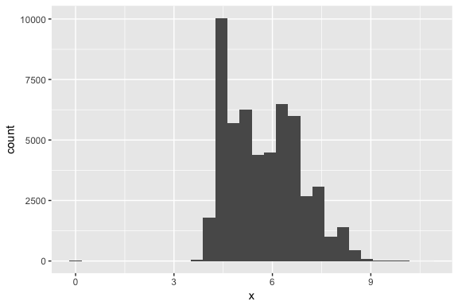<!-- -->

```r
ggplot(diamonds, aes(y)) +
  geom_histogram()
```

```
## `stat_bin()` using `bins = 30`. Pick better value with `binwidth`.
```

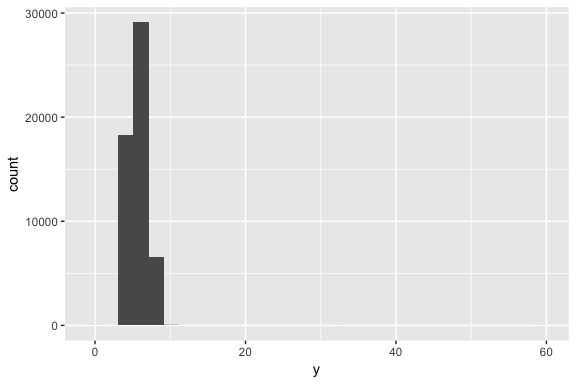<!-- -->

```r
ggplot(diamonds, aes(z)) +
  geom_histogram()
```

```
## `stat_bin()` using `bins = 30`. Pick better value with `binwidth`.
```

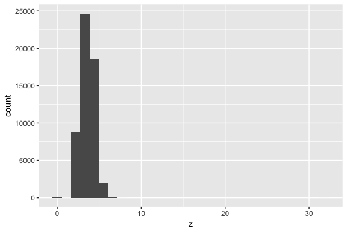<!-- -->

2. Explore the distribution of price. Do you discover anything unusual or surprising? (Hint: Carefully think about the binwidth and make sure you try a wide range of values.)


```r
# default binwidth
ggplot(diamonds, aes(price)) +
  geom_histogram()
```

```
## `stat_bin()` using `bins = 30`. Pick better value with `binwidth`.
```

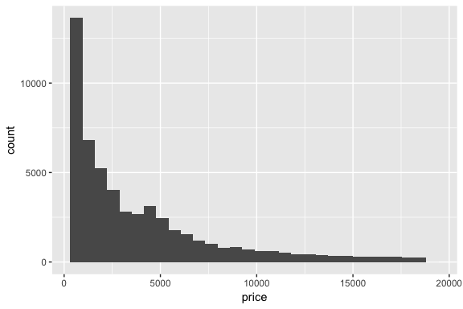<!-- -->

```r
# binwidth = 100
ggplot(diamonds, aes(price)) +
  geom_histogram(binwidth = 100) +
  scale_x_continuous(breaks = seq(0, 20000, by = 1000))
```

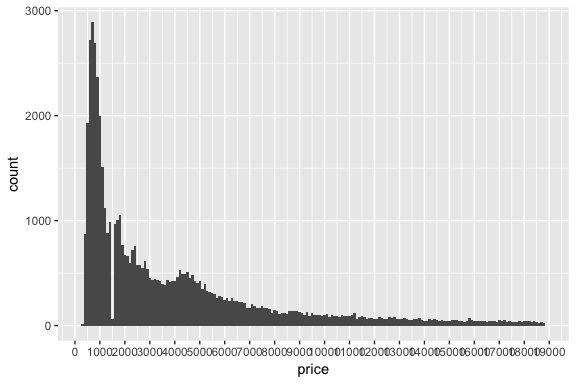<!-- -->

There are far fewer diamonds priced at $1500 compared to other price points. This is not apparent using the default number of bins.

3.How many diamonds are 0.99 carat? How many are 1 carat? What do you think is the cause of the difference?


```r
ggplot(diamonds, aes(carat)) +
  geom_histogram(binwidth = .01) +
  coord_cartesian(xlim = c(.97, 1.03))
```

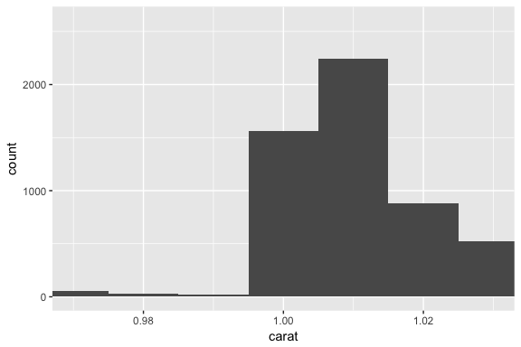<!-- -->

More 1.00 carat diamonds than .99 diamonds. As it doesn't make much sense to buy a .99 carat diamond if you can get a 1.00 carat diamond for a little bit more money.

4. Compare and contrast coord_cartesian() vs xlim() or ylim() when zooming in on a histogram. What happens if you leave binwidth unset? What happens if you try and zoom so only half a bar shows?


```r
# full plot
ggplot(diamonds, aes(carat, price)) +
  geom_point() +
  geom_smooth()
```

```
## `geom_smooth()` using method = 'gam'
```

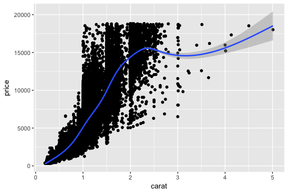<!-- -->

```r
# xlim
ggplot(diamonds, aes(carat, price)) +
  geom_point() +
  geom_smooth() +
  xlim(1, 3)
```

```
## `geom_smooth()` using method = 'gam'
```

```
## Warning: Removed 34912 rows containing non-finite values (stat_smooth).
```

```
## Warning: Removed 34912 rows containing missing values (geom_point).
```

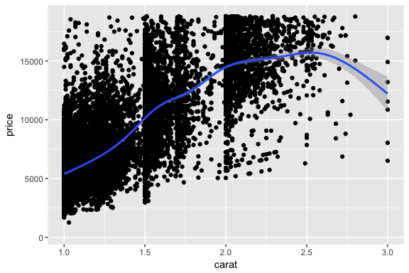<!-- -->

```r
# coord_cartesian
ggplot(diamonds, aes(carat, price)) +
  geom_point() +
  geom_smooth() +
  coord_cartesian(xlim = c(1, 3))
```

```
## `geom_smooth()` using method = 'gam'
```

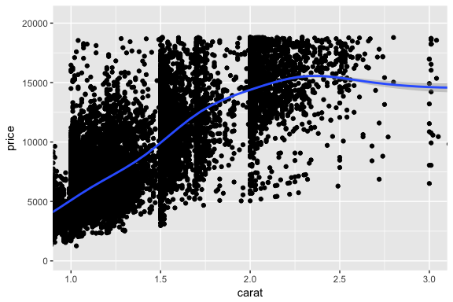<!-- -->

By using xlim() or ylim(), you remove all observations which exceed these values so they are not used to generate the plot. By using coord_cartesian(), those values are used to generate the plot and are merely cut off when zooming in. Note the change in the smoothing line in the xlim() example because it doesn’t have all the data points to calculate the line.

## 7.4 Missing values

Recommend replacing unusual values with missing values. Easiest way to do it is to use `mutate()` and `ifelse()`.


```r
diamonds2 <- diamonds %>% 
  mutate(y = ifelse(y < 3 | y > 20, NA, y))
```

What does `na.rm = TRUE` do in `mean()` and `sum()`?

It strips missing values before computing the statistic.

## 7.5 Covariation

### 7.5.1.1 Exercises

1. Use what you’ve learned to improve the visualisation of the departure times of cancelled vs. non-cancelled flights.


```r
# original chart
flights %>% 
  mutate(
    cancelled = is.na(dep_time),
    sched_hour = sched_dep_time %/% 100,
    sched_min = sched_dep_time %% 100,
    sched_dep_time = sched_hour + sched_min / 60
    ) %>%
  ggplot(mapping = aes(sched_dep_time)) + 
  geom_freqpoly(mapping = aes(colour = cancelled), binwidth = 1/4)
```

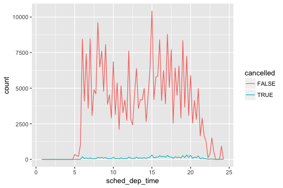<!-- -->

```r
# revised chart
flights %>% 
  mutate(
    cancelled = is.na(dep_time),
    sched_hour = sched_dep_time %/% 100,
    sched_min = sched_dep_time %% 100,
    sched_dep_time = sched_hour + sched_min / 60
    ) %>%
  ggplot(aes(x = sched_dep_time, y = ..density.., color = cancelled)) + 
  geom_freqpoly(binwidth = 1/4)
```

<!-- -->

2. What variable in the diamonds dataset is most important for predicting the price of a diamond? How is that variable correlated with cut? Why does the combination of those two relationships lead to lower quality diamonds being more expensive?


```r
ggplot(diamonds, aes(carat, price)) +
  geom_point() +
  geom_smooth()
```

```
## `geom_smooth()` using method = 'gam'
```

<!-- -->

```r
ggplot(diamonds, aes(cut, carat)) +
  geom_boxplot()
```

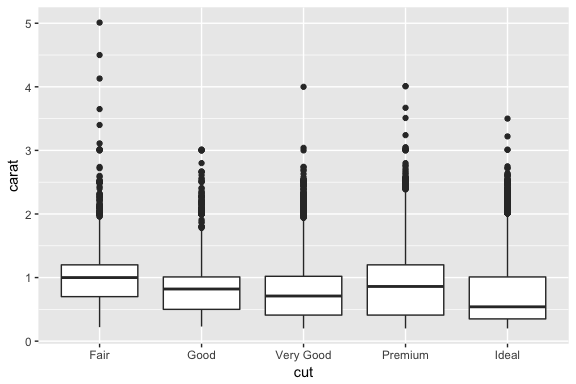<!-- -->

Carat size is the most important predictor of price. On avg, fair and good cut diamonds are larger than premium and ideal cuts.

3. Install the ggstance package, and create a horizontal boxplot. How does this compare to using coord_flip()?

To create a horizontal layer in ggplot2 with coord_flip(), you have to supply aesthetics as if they were to be drawn vertically:


```r
ggplot(diamonds, aes(cut, carat)) +
  geom_boxplot() +
  coord_flip()
```

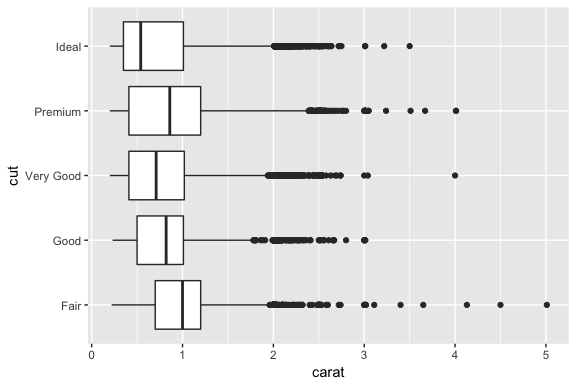<!-- -->

```r
# In ggstance, you supply aesthetics in their natural order
library(ggstance)
```

```
## 
## Attaching package: 'ggstance'
```

```
## The following objects are masked from 'package:ggplot2':
## 
##     geom_errorbarh, GeomErrorbarh
```

```r
ggplot(diamonds, aes(carat, cut)) +
  geom_boxploth()
```

<!-- -->

4. One problem with boxplots is that they were developed in an era of much smaller datasets and tend to display a prohibitively large number of “outlying values”. One approach to remedy this problem is the letter value plot. Install the lvplot package, and try using geom_lv() to display the distribution of price vs cut. What do you learn? How do you interpret the plots?


```r
# devtools::install_github("hadley/lvplot")
library(lvplot)

# with boxplot
ggplot(diamonds, aes(cut, price)) +
  geom_boxplot()
```

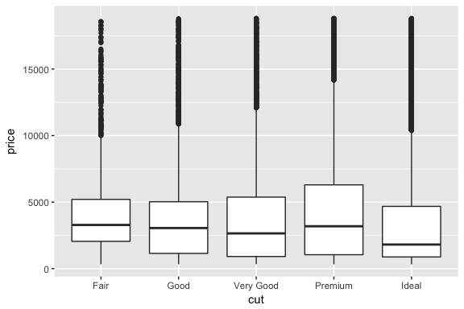<!-- -->

```r
# with lvplot 
ggplot(diamonds, aes(cut, price)) +
  geom_lv()
```

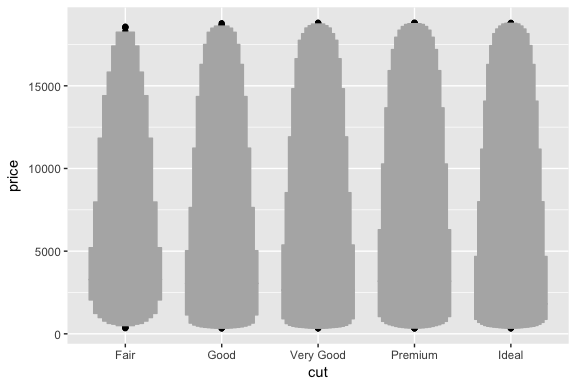<!-- -->

5. Compare and contrast geom_violin() with a facetted geom_histogram(), or a coloured geom_freqpoly(). What are the pros and cons of each method?


```r
# geom_violin
ggplot(diamonds, aes(cut, price)) +
  geom_violin()
```

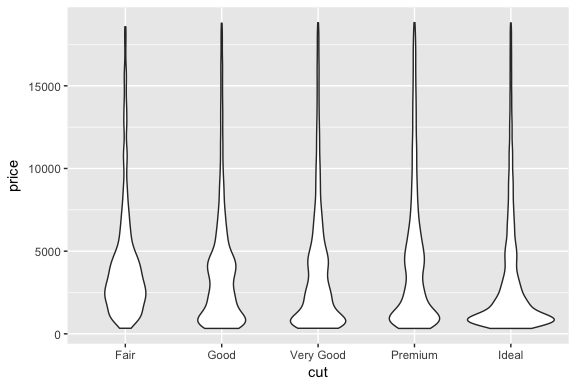<!-- -->

```r
# faceted geom_histogram
ggplot(diamonds, aes(price)) +
  geom_histogram() +
  facet_grid(. ~ cut)
```

```
## `stat_bin()` using `bins = 30`. Pick better value with `binwidth`.
```

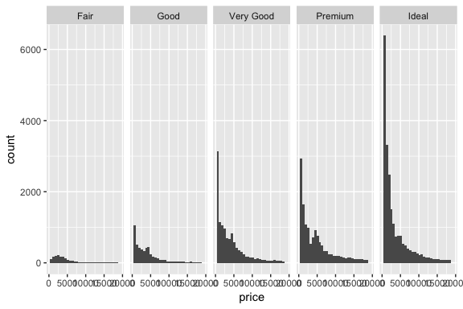<!-- -->

```r
# colored geom_freqpoly
ggplot(diamonds, aes(price, color = cut)) +
  geom_freqpoly()
```

```
## `stat_bin()` using `bins = 30`. Pick better value with `binwidth`.
```

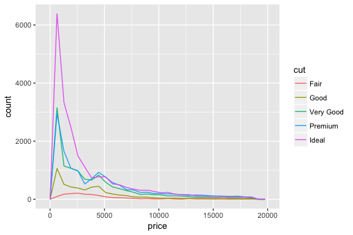<!-- -->
